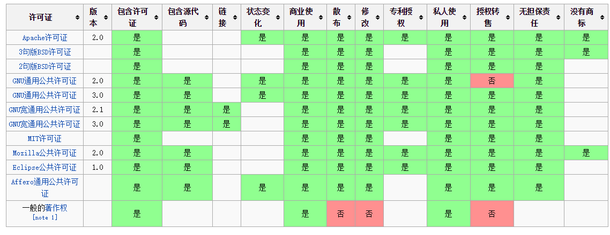
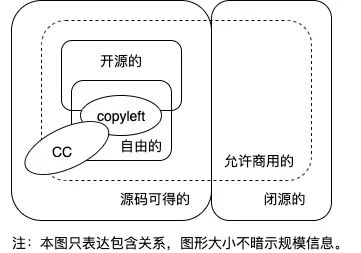
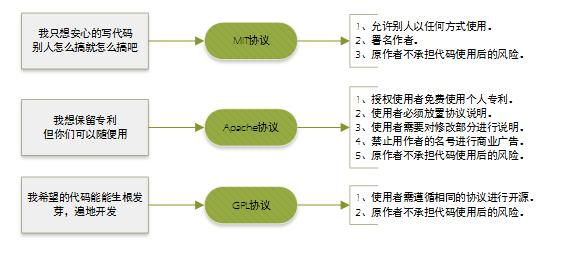
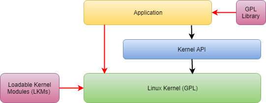

> 以下文本、图片内容中部分来源于网络，侵删

## 开源协议基础

### 什么是开源许可证

开源许可证是一种法律许可。通过它，版权拥有人明确允许，用户可以免费地使用、修改、共享版权软件。

版权法默认禁止共享，也就是说，没有许可证的软件，就等同于保留版权，虽然开源了，用户只能看看源码，不能用，一用就会侵犯版权。所以软件开源的话，必须明确地授予用户开源许可证。

### 开源许可证的种类

目前，国际公认的开源许可证共有[几十种](https://opensource.org/licenses/alphabetical)。它们的共同特征是，都允许用户免费地使用、修改、共享源码，但是都有各自的使用条件。

如果一种开源许可证没有任何使用条件，连保留作者信息都不需要，那么就等同于放弃版权了。这时，软件可以直接声明进入"公共领域"（public domain）。

根据使用条件的不同，开源许可证分成两大类:

- 宽松式（permissive）许可证
- Copyleft 许可证

### 宽松式许可证

#### 特点

宽松式许可证（permissive license）是最基本的类型，对用户几乎没有限制。用户可以修改代码后闭源。

它有三个基本特点:

* 没有使用限制：用户可以使用代码，做任何想做的事情。

* 没有担保：不保证代码质量，用户自担风险。

* 披露要求（notice requirement）：用户必须披露原始作者。

#### 常见许可证

常见的宽松式许可证有四种。它们都允许用户任意使用代码，区别在于要求用户遵守的条件不同。

* BSD（二条款版）：分发软件时，必须保留原始的许可证声明。
* BSD（三条款版）：分发软件时，必须保留原始的许可证声明。不得使用原始作者的名字为软件促销。
* MIT：分发软件时，必须保留原始的许可证声明，与 BSD（二条款版）基本一致。
* Apache 2.0：分发软件时，必须保留原始的许可证声明。凡是修改过的文件，必须向用户说明该文件修改过；没有修改过的文件，必须保持许可证不变。

### Copyleft 许可证

#### Copyleft 的含义

Copyleft 是[理查德·斯托曼](https://www.oschina.net/action/GoToLink?url=http%3A%2F%2Fwww.ruanyifeng.com%2Fblog%2F2005%2F03%2Fpost_112.html)发明的一个词，作为 Copyright （版权）的反义词。

Copyright 直译是"复制权"，这是版权制度的核心，意为不经许可，用户无权复制。作为反义词，Copyleft 的含义是不经许可，用户可以随意复制。

但是，它带有前提条件，比宽松式许可证的限制要多。

- 如果分发二进制格式，必须提供源码
- 修改后的源码，必须与修改前保持许可证一致
- 不得在原始许可证以外，附加其他限制

上面三个条件的核心就是：修改后的 Copyleft 代码不得闭源。

#### 常见许可证

常见的 Copyleft 许可证也有四种（对用户的限制从最强到最弱排序）。

1. Affero GPL (AGPL)：如果云服务（即 SAAS）用到的代码是该许可证，那么云服务的代码也必须开源。
2. GPL：如果项目包含了 GPL 许可证的代码，那么整个项目都必须使用 GPL 许可证。
3. LGPL：如果项目采用动态链接调用该许可证的库，项目可以不用开源。
4. Mozilla（MPL）：只要该许可证的代码在单独的文件中，新增的其他文件可以不用开源。

## 开源协议介绍

世界上的开源许可证（Open Source License）大概有上百种，大致有GPL、BSD、MIT、Mozilla、Apache和LGPL等。

### 总览

#### 开源协议权限

| 协议                                                         | 描述                                                         | 要求                               | 允许                                       | 禁止                                                     |
| ------------------------------------------------------------ | ------------------------------------------------------------ | ---------------------------------- | ------------------------------------------ | -------------------------------------------------------- |
| [Apache](http://choosealicense.com/licenses/apache/)         | 一个较宽松且简明地指出了专利授权的协议。                     | 协议和版权信息、声明变更           | 商用、分发、修改、专利授权、私用、附加协议 | 责任承担（禁止让作者承担责任，可以理解为免责）、商标使用 |
| [GPL](http://choosealicense.com/licenses/gpl-v2/)            | 此协议是应用最为广泛的开源协议，拥有较强的版权自由( copyleft )要求。衍生代码的分发需开源并且也要遵守此协议。此协议有许多变种，不同变种的要求略有不同。 | 公开源码、协议和版权信息、声明变更 | 商用、分发、修改、专利授权、私用           | 责任承担、附加协议                                       |
| [MIT](http://choosealicense.com/licenses/mit/)               | 宽松简单且精要的一个协议。在适当标明来源及免责的情况下，它允许你对代码进行任何形式的使用。 | 协议和版权信息                     | 商用、分发、修改、私用、附加协议           | 责任承担                                                 |
| [Artistic](http://choosealicense.com/licenses/artistic/)     | Perl社区尤为钟爱此协议。要求更改后的软件不能影响原软件的使用。 | 协议和版权信息、声明变更           | 商用、分发、修改、私用、附加协议           | 责任承担、商标使用                                       |
| [BSD](http://choosealicense.com/licenses/bsd/)               | 较为宽松的协议，包含两个变种[BSD 2-Clause](http://choosealicense.com/licenses/bsd) 和[BSD 3-Clause](http://choosealicense.com/licenses/bsd-3-clause)，两者都与MIT协议只存在细微差异。 | 协议和版权信息                     | 商用、分发、修改、私用、附加协议           | 责任承担                                                 |
| [Eclipse](http://choosealicense.com/licenses/eclipse/)       | 对商用非常友好的一种协议，可以用于软件的商业授权。包含对专利的优雅授权，并且也可以对相关代码应用商业协议。 | 公开源码、协议和版权信息           | 商用、分发、修改、专利授权、私用、附加协议 | 责任承担                                                 |
| [LGPL](http://choosealicense.com/licenses/lgpl-v2.1/)        | 主要用于一些代码库。衍生代码可以以此协议发布（言下之意你可以用其他协议），但与此协议相关的代码必需遵循此协议。 | 公开源码、库引用、协议和版权信息   | 商用、分发、修改、专利授权、私用、附加协议 | 责任承担                                                 |
| [Mozilla](http://choosealicense.com/licenses/mozilla/)       | Mozilla Public License(MPL 2.0)是由Mozilla基金创建维护的。此协议旨在较为宽松的BSD协议和更加互惠的GPL协议中寻找一个折衷点。 | 公开源码、协议和版权信息           | 商用、分发、修改、专利授权、私用、附加协议 | 责任承担、商标使用                                       |
| [No license](http://choosealicense.com/licenses/no-license/) | 你保留所有权利，不允许他人分发，复制或者创造衍生物。当你将代码发表在一些网站上时需要遵守该网站的协议，此协议可能包含了一些对你劳动成果的授权许可。比如你将代码发布到GitHub，那么你就必需同意别人可以查看和Fork你的代码。 | 协议和版权信息                     | 商用私用                                   | 分发、修改、附加协议                                     |
| [Public domain dedication](http://choosealicense.com/licenses/unlicense/) | 在许多国家，默认版权归作者自动拥有，所以[Unlicense](http://unlicense.org/)协议提供了一种通用的模板，此协议表明你放弃版权，将劳动成果无私贡献出来。你将丧失对作品的全部权利，包括在MIT/X11中定义的无担保权利。 | N/A                                | 商用、分发、修改、私用                     | 责任承担                                                 |

上方表格中出现的用词的解释：

* 协议和版权信息(License and copyright notice)：在代码中保留作者提供的协议和版权信息
* 声明变更(State Changes)：在代码中声明对原来代码的重大修改及变更
* 公开源码(Disclose Source)：代码必需公开。如果是基于LGPL协议 下，则只需使用的开源代码公开，不必将整个软件源码公开
* 库引用(Library usage)：该库可以用于商业软件中
* 责任承担(Hold Liable)：代码的作者承担代码使用后的风险及产生的后果
* 商标使用(Use Trademark)：可以使用作者的姓名，作品的Logo，或商标
* 附加协议(Sublicensing)：允许在软件分发传播过程中附加上原来没有的协议条款等

#### 开源协议对比

### Apache License

> Apache 和 GPL 3 有一定的兼容性

Apache License（Apache许可证），是Apache软件基金会发布的一个自由软件许可证。

Apache Licence是著名的非盈利开源组织Apache采用的协议。该协议和BSD类似，同样鼓励代码共享和最终原作者的著作权，同样允许源代码修改和再发布。但是也需要遵循以下条件：

- 需要给代码的用户一份Apache Licence。
- 如果修改了代码，需要再被修改的文件中说明。
- 在衍生的代码中（修改和有源代码衍生的代码中）需要带有原来代码中的协议，商标，专利声明和其他原来作者规定需要包含的说明。
- 如果再发布的产品中包含一个Notice文件，则在Notice文件中需要带有Apache Licence。你可以再Notice中增加自己的许可，但是不可以表现为对Apache Licence构成更改。

Apache Licence也是对商业应用友好的许可。使用者也可以再需要的时候修改代码来满足并作为开源或商业产品发布/销售。

使用这个协议的好处是:

- 永久权利 一旦被授权，永久拥有。
- 全球范围的权利 在一个国家获得授权，适用于所有国家。假如你在美国，许可是从印度授权的，也没有问题。
- 授权免费 无版税， 前期、后期均无任何费用。
- 授权无排他性 任何人都可以获得授权
- 授权不可撤消 一旦获得授权，没有任何人可以取消。比如，你基于该产品代码开发了衍生产品，你不用担心会在某一天被禁止使用该代码

### BSD

BSD是"Berkeley Software Distribution"的缩写，意思是"伯克利软件发行版"。

BSD开源协议：是一个给于使用者很大自由的协议。可以自由的使用，修改源代码，也可以将修改后的代码作为开源或者专有软件再发布。 当你发布使用了BSD协议的代码，或则以BSD协议代码为基础做二次开发自己的产品时，需要满足三个条件：

* 如果再发布的产品中包含源代码，则在源代码中必须带有原来代码中的BSD协议。
* 如果再发布的只是二进制类库/软件，则需要在类库/软件的文档和版权声明中包含原来代码中的BSD协议。
* 不可以用开源代码的作者/机构名字和原来产品的名字做市场推广。

BSD代码鼓励代码共享，但需要尊重代码作者的著作权。BSD由于允许使用者修改和重新发布代码，也允许使用或在BSD代码上开发商业软件发布和销售，因此是对商业集成很友好的协议。而很多的公司企业在选用开源产品的时候都首选BSD协议，因为可以完全控制这些第三方的代码，在必要的时候可以修改或者二次开发。

### GPL

> GPL 2.0 GPL3.0

GPL （GNU General Public License） ：GNU通用公共许可协议。

**Linux 采用了 GPL**。

GPL协议和BSD, Apache Licence等鼓励代码重用的许可很不一样。GPL的出发点是代码的开源/免费使用和引用/修改/衍生代码的开源/免费使用，但不允许修改后和衍生的代码做为闭源的商业软件发布和销售。这也就是为什么我们能用免费的各种linux，包括商业公司的linux和linux上各种各样的由个人，组织，以及商业软件公司开发的免费软件了。

#### GPL 2 和 GPL 3

2007年6月29日的GPLv3包含GPLv2的基本意图，是一个带有严格copyleft的开源许可证（→开源软件有哪些类型的许可证,它们有何区别？）但是，许可证文本的语言经过严格修改，在技术和法律变更以及国际许可证交换方面更为全面.

新许可证版本包含一系列条款，用于解决GPL第2版中未涵盖或未充分涵盖的问题。最重要的新规定如下：

1. GPLv3包含兼容性规定，可以比以前更轻松地将GPL代码与在不同许可下发布的代码相结合(→什么是许可兼容性？)。这特别涉及Apache license v.2.0下的代码。
2. 插入了有关数字版权管理的规定，以防止GPL软件随意更改，因为用户呼吁法律法规受到技术保护措施(如DMCA或版权指令)的保护。GPL中的合同法规的实践有效性还有待观察
3. GPLv3包含明确的专利许可，根据该许可，根据GPL许可授权程序的人，无论是否使用他们许可的代码，都必须拥有版权和专利。因此不授予全面的专利许可。此外，新的专利条款试图保护用户免受专利所有人和GPL许可证持有者之间协议的后果，这些协议只会使一些被许可人受益(对应于Microsoft/Novell交易)。被许可人必须确保每个用户都享有这些优势(专利许可或从索赔中释放)，或者没有人可以从中获利
4. 与GPLv2相反，GPLv3明确规定，只要不向客户发送软件副本，就不需要在GPL程序的ASP使用中公开源代码。如果将Copyleft效应扩展到ASP使用(→当独立开发的软件何时必须根据GPL许可？)，必须应用仅与GPLv3不同的Affero通用公共许可证第3版(AGPL)看待。

### LGPL

LGPL是GPL的一个为主要为类库使用设计的开源协议。和GPL要求任何使用/修改/衍生之GPL类库的的软件必须采用GPL协议不同。LGPL允许商业软件通过类库引用(link)方式使用LGPL类库而不需要开源商业软件的代码。这使得采用LGPL协议的开源代码可以被商业软件作为类库引用并发布和销售。

但是如果修改LGPL协议的代码或者衍生，则所有修改的代码，涉及修改部分的额外代码和衍生的代码都必须采用LGPL协议。因此LGPL协议的开源代码很适合作为第三方类库被商业软件引用，但不适合希望以LGPL协议代码为基础，通过修改和衍生的方式做二次开发的商业软件采用。

**GPL/LGPL都保障原作者的知识产权，避免有人利用开源代码复制并开发类似的产品。**

### MIT

MIT是和BSD一样宽范的许可协议,源自麻省理工学院（Massachusetts Institute of Technology, MIT），又称X11协议。作者只想保留版权,而无任何其他了限制。MIT与BSD类似，但是比BSD协议更加宽松，是目前最少限制的协议。这个协议唯一的条件就是在修改后的代码或者发行包包含原作者的许可信息。适用商业软件。使用MIT的软件项目有：jquery、Node.js。

### MPL (Mozilla Public License 1.1)

MPL协议允许免费重发布、免费修改，但要求修改后的代码版权归软件的发起者 。这种授权维护了商业软件的利益，它要求基于这种软件的修改无偿贡献版权给该软件。这样，围绕该软件的所有代码的版权都集中在发起开发人的手中。但MPL是允许修改，无偿使用得。MPL软件对链接没有要求。

### EPL (Eclipse Public License 1.0)

EPL允许Recipients任意使用、复制、分发、传播、展示、修改以及改后闭源的二次商业发布。

使用EPL协议，需要遵守以下规则：

- 当一个Contributors将源码的整体或部分再次开源发布的时候,必须继续遵循EPL开源协议来发布,而不能改用其他协议发布.除非你得到了原"源码"Owner 的授权；
- EPL协议下,你可以将源码不做任何修改来商业发布.但如果你要发布修改后的源码,或者当你再发布的是Object Code的时候,你必须声明它的Source Code是可以获取的,而且要告知获取方法；
- 当你需要将EPL下的源码作为一部分跟其他私有的源码混和着成为一个Project发布的时候,你可以将整个Project/Product以私人的协议发布,但要声明哪一部分代码是EPL下的,而且声明那部分代码继续遵循EPL；
- 4.独立的模块(Separate Module),不需要开源。

### Creative Commons 知识共享协议

CC的创始人是Lawrence Lessig，他认为，`“美国人多少是有些精神分裂的”`，一方面，他们重视自由，鼓励共享，但另一方面，他们却采取极端保护主义的版权法律架构，保护知识的垄断。**copyright动不动all rights reserved，copyleft却几乎all rights released，这都是比较极端的做法，Lessig试图走出一条灵活的、有弹性的中间路线，让作者根据自己的偏好，选择保护“部分权利”。**

他于2001年创立了知识共享组织（Creative Commons），开展CC的维护和推广，目前CC的版本为4.0版本（2013年发布）。

CC一般不用于软件，也不宜用于软件。CC通常用于文字、图像、音乐、视频等。

Creativ e Commons (CC) 许可协议并不能说是真正的开源协议，它们大多是被使用于设计类的工程上。 CC 协议种类繁多，每一种都授权特定的权利。 一个 CC 许可协议具有四个基本部分，这几个部分可以单独起作用，也可以组合起来。下面是这几部分的简介：

- 署名（BY）：作品上必须附有作品的归属。如此之后，作品可以被修改，分发，复制和其它用途。
- 相同方式共享（SA）：作品可以被修改、分发或其它操作，但所有的衍生品都要置于CC许可协议下。如果你演绎了，你修改了，你必须按照本选项组合来共享你的修改。（比如某组合是BY-SA-NC，再分发时也必须是BY-SA-NC）
- 非商业用途（NC）：作品可以被修改、分发等等，但不能用于商业目的。但语言上对什么是"商业"的说明十分含糊不清 (没有提供精确的定义)，所以你可以在你的工程里对其进行说明。例如，有些人简单的解释"非商业"为不能出售这个作品。而另外一些人认为你甚至不能在有广告的网站上使用它们。 还有些人认为"商业"仅仅指你用它获取利益。
- 禁止衍生作品（ND）：不许演绎，也不能修改。

CC 许可协议的这些条款可以自由组合使用。大多数的比较严格的CC协议会声明 "署名权，非商业用途，禁止衍生"条款，这意味着你可以自由的分享这个作品，但你不能改变它和对其收费，而且必须声明作品的归属。这个许可协议非常的有用，它可以让你的作品传播出去，但又可以对作品的使用保留部分或完全的控制。最少限制的CC协议类型当属 "署名"协议，这意味着只要人们能维护你的名誉，他们对你的作品怎么使用都行。

CC 许可协议更多的是在设计类工程中使用，而不是开发类，但没有人或妨碍你将之使用与后者。只是你必须要清楚各部分条款能覆盖到的和不能覆盖到的权利。

#### 注意

ND和SA是不能组合在一起的，因为一个不许修改，一个允许修改。

一般情况下，有这么6种CC可供使用：CC BY、CC BY-NC、CC BY-ND、CC BY-NC-ND、CC BY-SA、CC BY-NC-SA。

在FSF看来，由于NC、ND，是不让商用或不让演绎，所以含有它们的组合不是自由的。所以上面6种组合中只有CC BY和CC BY-SA是自由的，其中，CC BY-SA更是copyleft的。（FSF批准的是4.0版本）

**OSI没有批准任何CC组合。**

除了上面这6种CC，还有一种特殊的叫`CC0`，这个连BY都不要了，此时，作者放弃了一切版权，作品落入`公用领域`（Public Domain），任何人只要不违法，都可以随意使用此作品。（同样地，CC0不建议用于软件。）

虽然公用领域的作品大多没有许可证，但如果你明确说此作品落入公用领域，那是非常好的做法。（比如用unlicense11、CC012、甚至是WTFPL13来说明）一般认为，公用领域是自由的14，部分是开源的。（unlicense是15开源的，CC016因为专利问题导致争议，WTFPL未被认可17）

软件分提供源码的，和不提供源码的；在提供源码的里面，有的是开源软件，有的是自由软件，其余的只能叫源码可得软件；开源软件中的大部分都是自由软件；自由软件中有一类是copyleft的；开源软件和自由软件，都允许被商用；CC通常用于文字、图像、影视、音乐等，根据其选项，有些允许商用，有些不允许；有些是自由的，有些不自由，其中一种组合是copyleft的。

## 开源协议选择

### 图解分析

世界上的开源协议有上百种，很少有人能彻底搞清它们之间的区别，即使在最流行的六种开源协议——GPL、BSD、MIT、Mozilla、Apache 和 LGPL——之中做选择，也很复杂。

#### MIT、Apache、GPL

#### 常用协议分析

乌克兰程序员 Paul Bagwell 画了一张分析图（阮一峰翻译版），说明应该怎么选择开源协议。

#### 哪个开源许可证？

### 协议的选择

> 法律 or 开源精神

#### 项目定性

* 分享->仅署名
* 他人可商用、保留著作权
* 禁止他人闭源，使用者必须开源，copyleft
* 开放社区？允许他人提交修改。**贡献者协议**，此种场景许可尽量开放
* 未来是否有可能修改协议？是否需要盈利？[参考bfe](https://github.com/bfenetworks/bfe)

#### 同公司法律团队沟通

* **第三方资源**：第三方采用哪种协议
* 商业机密
* **专利**
* **商标**
* **隐私**：是否会收集用户隐私等
* 员工贡献策略
* 发布什么
* 合规性
* 管理

#### 个人建议

1. 作为公司的开源项目选择 Apache 协议更合适，即保证开源，又可保证项目的权益。之后如果想更改一些权限，也可与其他协议搭配使用
2. 作为一个第三方的服务框架，如果想被其他公司使用，扩大自己的影响力，最选用权限开放的协议，不要涉及到与 GPL 协议相关的协议。很多公司不愿意把自己的代码开源，有可能不会使用我们的开源项目，就算使用也会采取其他的手段。这样会降低外界对于我们开源项目的好感度
3. 在进行开发时也应避免使用与 GPL 协议相关的代码，我们的协议有可能会被迫变成 GPL 的协议
4. 在开发过程中引入其他开源项目的代码，尽量采用 Apache 协议的要求使用，即使对方是 MIT、BSD 等较为宽泛的协议。要尊重对方的知识成果

#### 开源项目参考

| 开源项目                                            | 许可                                                         | 链接                                                         |
| --------------------------------------------------- | ------------------------------------------------------------ | ------------------------------------------------------------ |
| webrtc                                              | [Apache 2.0 License](https://www.apache.org/licenses/LICENSE-2.0) | https://webrtc.org/support/license                           |
| [nginx](https://github.com/nginx/nginx)             | BSD?                                                         |                                                              |
| [srs](https://github.com/ossrs/srs)                 | [MIT](https://anmoljagetia.mit-license.org/)                 | https://github.com/ossrs/srs/blob/4.0release/LICENSE         |
| [ffmpeg](https://github.com/FFmpeg/FFmpeg)          | GPL混搭风                                                    | https://github.com/FFmpeg/FFmpeg/blob/master/LICENSE.md      |
| [obs](https://github.com/obsproject/obs-studio/)    | [GPL 2.0](https://choosealicense.com/licenses/gpl-2.0/)      | https://github.com/obsproject/obs-studio/blob/master/COPYING |
| [janus](https://github.com/meetecho/janus-gateway/) | [GPL 3.0](https://choosealicense.com/licenses/gpl-3.0/)      | https://github.com/meetecho/janus-gateway/blob/master/COPYING |
| [bfe](https://github.com/bfenetworks/bfe/)          | [Apache 2.0 License](https://www.apache.org/licenses/LICENSE-2.0) | https://github.com/bfenetworks/bfe/blob/develop/LICENSE      |
| [zookeeper](https://github.com/apache/zookeeper)    | [Apache 2.0 License](https://www.apache.org/licenses/LICENSE-2.0) | https://github.com/apache/zookeeper/blob/master/LICENSE.txt  |
| [libevent](https://github.com/libevent/libevent)    | BSD等协议混搭                                                | https://github.com/libevent/libevent/blob/master/LICENSE     |
| [ licode](https://github.com/lynckia/licode)        | [MIT](https://anmoljagetia.mit-license.org/)                 | https://github.com/lynckia/licode/blob/master/LICENSE        |

#### 思考

（1）目前很多的开源项目都是使用 GPL 协议许可，如果不想把 GPL 协议引入到项目中，需要怎么做？

* 采用某些特殊手段？
  * 是否违背开源精神
  * 是否有损公司形象
* 参考开源项目的思路造轮子？
  * 学习成本、开发成本
  * 轮子的效果能否和该开源项目比肩，会不会产生其他的问题

（2）未来引入其他的开源项目，协议产生冲突怎么办？

* 开发时尽量选取兼容性比较好的开源协议
* 开发新的版本，重新选取协议？

（3）未来引入其他的开源项目，如果遇到小众的开源协议或自己创造的开源协议，如何处理？

## 常见问题

### 什么叫分发（distribution）？

除了 Affero GPL (AGPL) ，其他许可证都规定只有在"分发"时，才需要遵守许可证。换言之，如果不"分发"，就不需要遵守。

简单说，分发就是指将版权作品从一个人转移到另一个人。这意味着，如果你是自己使用，不提供给他人，就没有分发。另外，这里的"人"也指"法人"，因此如果使用方是公司，且只在公司内部使用，也不需要遵守许可证。

云服务（SaaS）是否构成"分发"呢？答案是不构成。所以你使用开源软件提供云服务，不必提供源码。但是，Affero GPL (AGPL) 许可证除外，它规定云服务也必须提供源码。

### 开源软件的专利如何处理？

某些许可证（Apache 2 和 GPL v3）包含明确的条款，授予用户许可，使用软件所包含的所有专利。

另一些许可证（BSD、MIT 和 GPL v2）根本没提到专利。但是一般认为，它们默认给予用户专利许可，不构成侵犯专利。

总得来说，除非有明确的"保留专利"的条款，使用开源软件都不会构成侵犯专利。

### 什么是披露要求？

所有的开源许可证都带有"披露要求"（notice requirement），即要求软件的分发者必须向用户披露，软件里面有开源代码。

一般来说，你只要在软件里面提供完整的原始许可证文本，并且披露原始作者，就满足了"披露要求"。

### GPL 病毒是真的吗？

GPL 许可证规定，只要你的项目包含了 GPL 代码，整个项目就都变成了 GPL。有人把这种传染性比喻成"GPL 病毒"。

很多公司希望避开这个条款，既使用 GPL 软件，又不把自己的专有代码开源。理论上，这是做不到的。因为 GPL 的设计目的，就是为了防止出现这种情况。

但是实际上，不遵守 GPL，最坏情况就是被起诉。如果你向法院表示无法履行 GPL 的条件，法官只会判决你停止使用 GPL 代码（法律上叫做"停止侵害"），而不会强制要求你将源码开源，因为《版权法》里面的"违约救济"没有提到违约者必须开源，只提到可以停止侵害和赔偿损失。

### Copyright 与 Copyleft

两种截然相反的版权所有方式：Copyleft(Ɔ)，Copyright(C)

#### Copyright(C)：版权所有，即软件的一切权利归软件作者私有。

* 许可：各种保护软件版权私有的许可。
* 包括：开源软件、免费软件、共享软件、传统商业软件。
* 特点：软件的版权和其它一切权利归软件作者所私有。用户只有使用权，没有其它权利，包括没有复制软件的权利。
* 盈利方式：出售私有软件（包括：出售软件、出售源码、出售编译源码的方法和编译器）的使用权。
* 缺点：
  * 软件版权保护的办法是仿照对书及其印刷的版权保护方法而来的，这种方法并不符合计算机的特点（比如：书的复制需要设备和可观的成本，而计算机文件的复制是不需要增加任何开销的），用保护书的办法来保护软件反而阻碍软件业的发展。
  * 软件制作商容易利用软件的私有权形成商业垄断和知识霸权，谋取暴利，严重侵害用户的利益。

#### Copyleft(Ɔ)：反对软件一切权利归作者私有，保护知识共享、权利共享。

* 许可：GPL。
* 包括：自由软件。
* 特点：软件的版权归原作者所有，其它一切权利归任何人所有。用户和软件的作者享有除版权外的完全同等的权利，包括复制软件和重新发布修改过的软件的权利。唯一不许可的就是任何人也不能将软件拒为私有。
* 盈利方式：与硬件一起销售，提供收费的服务，提供收费的担保等。
* 缺点：对部分传统商业软件制作商（比如：微软公司）有巨大的冲击。

**Copyleft = Copyright + GPL**

因此，区别开源软件与传统商业软件主要是看开不开放源代码，而区别自由软件与开源软件主要是看软件有没有给用户版权以外的一切权利。

使用Linux OS的嵌入式系统开发商，大概是目前最实惠的自由软件受益者，使用GPL许可的自由软件使他们免去了购买专利软件的成本，并增加了产品定制的自由度。

但他们中有相当一部分没有按照GPL许可使用自由软件，不能向用户提供嵌入式产品中自由软件的源码以及修改、编译源码并将目标代码写回嵌入式产品的方法和工具，这样做是违反GPL的，是在以“盗版”的方式使用自由软件。

如果他们向用户提供产品中的源码及工具，让用户可以自己修改嵌入式产品中的软件，可以移植一个嵌入式产品中的自由软件到另一个嵌入式产品中，相信能这样做的产品会更有吸引力。

### 如果使用两个及以上开源项目, 分别以GPLv2 GPLv3, 两个开源协议, 那么 那个传染那个?

GPLv2 和 GPLv3 都是自由软件许可证，也是 copyleft 许可证。但是， GPLv2 本身并不兼容 GPLv3，且GPLv3 也不兼容 GPLv2，即相互不兼容。

不过，如果 GPLv2  软件的许可证用词是 GPLv2 or later 的话，就可以将GPLv2 的代码照 GPLv3 做合理的代码合并。但反之则不行。

如果使用两个及以上开源项目，许可证分别仅是GPLv2 或者GPLv3 ，那他们的代码不能合并。即便有GPLv2 or later 的代码，也只能单向的合并到GPLv3代码中。

## 应用实例

### MariaDB

MariaDB是目前最受关注的MySQL数据库衍生版，由开源社区开发和维护，诞生于Oracle收购MySQL后，目标是成为MySQL的替代品。

MariaDB的服务端使用的是GPL v2许可证，如果软件只是内部使用，并且没有被包含在对外发布的产品中，这种情况不被视为分发，可以自由使用；如果软件用于对外发布，使用了服务端的GPL代码或者通过链接的方式使用了客户端的GPL动态库，或者软件与MariaDB数据库强绑定，即在没有安装MariaDB数据库的情况下，软件无法运行或者只能使用非常少的功能，该软件也必须遵循GPL许可协议；但是如果该软件通过第三方独立框架访问数据库，

MariaDB的C/JAVA/ODBC的客户端动态库使用了LGPL许可证，软件也只需遵循LGPL协议，可以自由使用这些动态库，不存在必须开源的问题。

如果软件通过调用非GPL的连接器与MariaDB数据库进行通信，例如：mysqlnd for PHP, ruby-mysql等，软件只需要遵循该连接器所使用的许可证。如果软件通过第三方独立的框架访问数据库，即使框架中使用了包含GPL许可证的模块，例如：ODBC, JDBC, Perl，PHP PDO等，软件本身并不受其影响，不需要遵循GPL许可证。如果发布的软件除了可以访问MariaDB数据库之外，还可以访问其他数据库，即MariaDB在软件中不属于必须项，在这种情况下该软件可以和MariaDB一起自由发布，同样不需要遵循GPL许可证。

如果软件中必须使用数据库服务端的相关代码，又不希望自己的商业代码遵循GPL许可证，可以考虑以下三种方案：

1. 使用类似MIT/BSD许可证的PostGreSQL作为替代产品。
2. 更换为不使用SQL作为查询语言的NoSQL非关系数据库方案，例如：Cassandra (Apache 2.0), Redis (BSD-3-Clause), 或者 CouchDB (Apache 2.0)等。
3. 付费购买带有商业许可证的软件，如MySQL, MongoDB等。

### Linux Kernel

Linux内核以GPL v2许可证发行，所以任何Linux内核的衍生产品也必须遵循GPL许可证进行发布。如下图所示的应用实例，我们列出其中违反GPL许可证的使用方法（红线所示）。

1. 应用程序通过静态或动态链接的方式使用GPL类库，会导致整个应用也必须以GPL许可证方式发布。规避方法是主程序通过LPC或者RPC间接调用GPL库里的接口，或者改用动态链接LGPL类库的方式。
2. 应用程序通过非标准接口直接访问Linux内核的行为，会导致整个应用也必须以GPL许可证方式发布。规避方法是通过Linux 内核提供的标准接口函数访问Linux内核，用户空间的程序及类库的普通系统调用不被视为Linux内核的衍生产品，应用程序不需要遵循GPL许可证。
3. 可加载内核模块（LKM）是用户编写的软件，它与Linux内核紧密绑定，运行在内核地址空间中，Linux内核开发社区认为LKM程序应该遵循GPL许可证。但是不少硬件厂商出于保护商业机密及知识产权的角度出发，在这一点与Linux内核开发社区一直存在争议，硬件厂商一般都会以二进制目标文件的方式单独发布硬件驱动试图规避GPL风险，但是始终存在潜在的法律风险以及开源带来的的商业影响，降低风险的方法就是同样以GPL或者其他与GPL兼容的许可证发布LKM程序，并且不要把那些不希望开源的的私有代码直接链接到LKM程序。

### 小结

由于GPL严格要求使用了GPL代码或类库的软件产品必须使用GPL协议，所以商业软件最好不要使用GPL许可证的产品。开源许可证既保护代码作者，对他人使用代码产生的风险免责；同时也保护代码使用者，了解使用开源代码的权利及必须履行的义务，规避将来可能的法律风险。

## 参考链接

### 常用开源协议

- [Apache License 2.0 (Apache-2.0)](https://opensource.org/licenses/Apache-2.0)
- [3-clause BSD license (BSD-3-Clause)](https://opensource.org/licenses/BSD-3-Clause)
- [2-clause BSD license (BSD-2-Clause)](https://opensource.org/licenses/BSD-2-Clause)
- [GNU General Public License (GPL)](https://opensource.org/licenses/gpl-license)
- [GNU Lesser General Public License (LGPL)](https://opensource.org/licenses/lgpl-license)
- [MIT license (MIT)](https://opensource.org/licenses/MIT)
- [Mozilla Public License 2.0 (MPL-2.0)](https://opensource.org/licenses/MPL-2.0)
- [Eclipse Public License version 2.0](https://opensource.org/licenses/EPL-2.0)

### 开源协议介绍

* [Open Source Initiative](https://opensource.org/licenses)
* https://choosealicense.com/ by github
* [各种开源协议介绍](https://www.runoob.com/w3cnote/open-source-license.html)
* [各种开源协议](https://blog.csdn.net/wuhenyouyuyouyu/article/details/51941798) by 无痕幽雨
* [主流开源协议之间有何异同？](https://www.zhihu.com/question/19568896/answer/507675584)
* [开源许可证基础知识扫盲](https://www.oschina.net/news/90054/opensource-license-introduction) by 阮一峰
* [开源软件、自由软件、Copyleft、CC都是啥，傻傻分不清楚？](https://my.oschina.net/vigor23/blog/5138356) by oschina
* [开源定义是什么？为什么OSI不接受SSPL？](https://mp.weixin.qq.com/s?__biz=MzAxMDc4NDc5OA==&mid=2649432663&idx=1&sn=99c9196d557f7688b8a8898c74ff5c63&scene=21#wechat_redirect) by 卫剑钒

#### GPL 协议

* [论“GPL就是给软件开发者们准备的坑”](https://my.oschina.net/vigor23/blog/4954734)
* [GPLv2许可证正经人话翻译](https://mp.weixin.qq.com/s?__biz=MzAxMDc4NDc5OA==&mid=2649431692&idx=1&sn=e57152bdc9a5373a1b478456ddd635a0&scene=21#wechat_redirect)

* [人话解读GPLv3](https://my.oschina.net/vigor23/blog/4951596)

### 开源协议选择

* [开源协议选型及对比](https://blog.51cto.com/thinklili/2095244)
* [开源协议的兼容性](https://blog.csdn.net/robertsong2004/article/details/37566789)
* [常见开源许可协议（共享协议）的比较与浅析](https://blog.csdn.net/iteye_11306/article/details/82004541)

### 开源协议相关事件

* [2018 年开源社区十大法律事件](https://zhuanlan.zhihu.com/p/59892331)
* [从“某公司专利”事件，谈谈开源协议与知识产权](https://zhuanlan.zhihu.com/p/27385758)
* [Apache之道在腾讯的探索与实践](https://my.oschina.net/tcos2021/blog/5171661) by 腾源会

####  2021 违反 GPL 事件 

* [科技爱好者周刊（第 176 期）：中国法院承认 GPL 吗？](https://github.com/ruanyf/weekly/blob/master/docs/issue-176.md) by 阮一峰
* [违反开源项目GPL协议，法院判罚了！国内首例](https://jishuin.proginn.com/p/763bfbd65e17) by 码农突围
* [首例！违反 GPL 协议致侵权，被判赔偿 50 万元](https://www.oschina.net/news/159435) by oschina

#### Linux内核撤下所有Android代码

* [Android，开源还是封闭？](http://www.ruanyifeng.com/blog/2010/02/open_android_or_not.html) by 阮一峰
* [再谈Android的许可证](https://www.ruanyifeng.com/blog/2010/02/revisiting_android_licenses.html) by 阮一峰
* [再谈Android的许可证（续）](http://www.ruanyifeng.com/blog/2010/02/revisiting_android_licenses_continued.html) by 阮一峰

#### 其他

* [开源软件指南](https://opensource.guide/zh-hans/)
* [为什么要开源](https://ben.balter.com/2015/11/23/why-open-source/)
* [关于开源](https://blog.gitee.com/category/about-open-source/) by gitee
* [在公司内部感受开源的魔力，内源社区组建经验谈](https://blog.gitee.com/2020/04/26/create-internal-innersource-community/) by gitee

