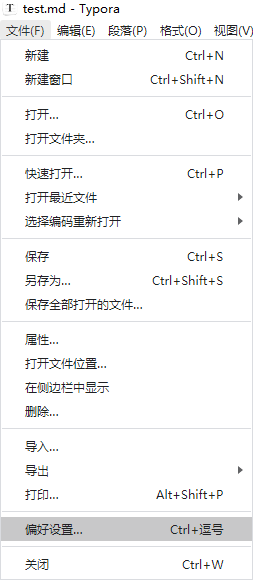
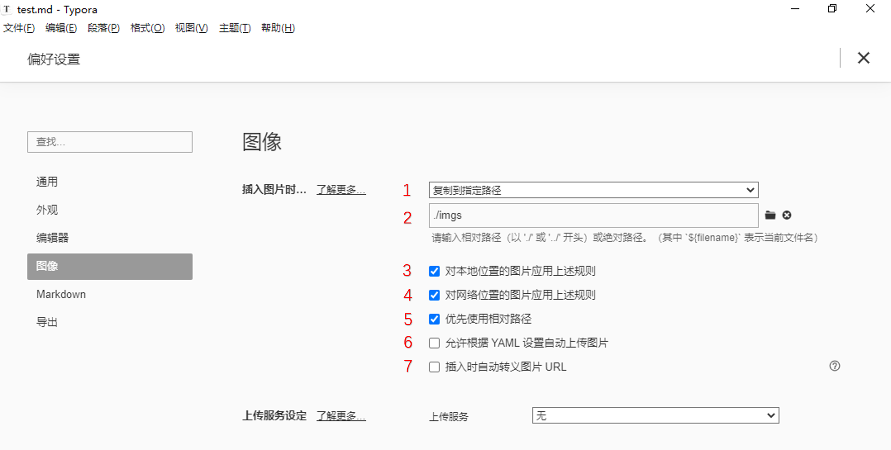

# 快速开始

## 环境准备

* Typora
* git

## 基本流程

1. 将整个文档 clone 到本地
2. 打开文件夹 repo/docs/
3. 可以开始浏览和进行编辑

## 添加新文档

> markdwon 语法可参考[markdown基本语法](http://markdown.p2hp.com/basic-syntax/)

1. 在所属的分类下建立文件夹，该文件夹可包含多个 md 文件
2. 使用 markdown 语法编写文档内容


# 工程结构

## 整体目录结构介绍

```
./
├── deploy              # 部署目录
│   ├── README.md       # 主页面内容
│   ├── _coverpage.md   # 封面内容
│   ├── _navbar.md      # 导航栏内容
│   ├── _sidebar.md     # 侧边栏内容
│   ├── index.html
├── docs                # 文档
│   ├── 相关规范
│   ├── 音视频
│   ├── 编程语言
│   ├── 网络协议
│   ├── 开源框架
│   └── 其他内容
└── scripts             # 部署脚本
```


# 编辑操作与技巧

## 插入图片

> **注意：**图片的命名尽量不要使用过于宽泛、抽象的命名，防止命名冲突

1. 如果在库中直接编辑，在 md 文档同级目录建立 imgs 文件夹
2. 将目标图片保存入 imgs 文件夹
3. 在文档中手动使用相对路径``进行图片引用

## 移动文档
1. 移动包含图片相对路径的 md 文档
2. 依次移动图片到文档所在目录的 imgs 文件夹
3. 查看结果是否正常

## 使用 Typora 功能快速插入图片

> **推荐手动录入**
>
> Typora 添加图片可以使用 **拖拽** 和 **``语法** 等方式。

（1）点击文件 -> 选择“偏好设置”



（2）选择图像 -> 进行个性化设置



1. 选择”复制到指定路径“

2. 输入“imgs”，对应【流程】中【步骤 2】所建立的 imgs 文件夹

3. - [x] 对本地位置的图片应用上述规则。*建议勾选*

   > 选择后，本地任意位置的图片复制到文章中时，都会默认拷贝一份到 imgs 文件夹下。
   >
   > * 如果该图片本是 imgs 中的图片，不会重复拷贝
   > * 如果该图片的文件名和 imgs 下原有图片的文件名有冲突，typora 会默认给该图片加后缀避免冲突。**命名时尽量避免文件名冲突，或冲突后改动**

4. - [x] 对网络位置的图片应用上述规则。*建议勾选*

   > 从网络上直接复制的图片，规则同本地位置的文件一致。

5. - [x] 优先使用相对路径。*建议勾选*

   > imgs 和所编写的文档在同一路径下，所以**不会**在 imgs 前补全成绝对路径。

6. - [ ] 允许根据 YAML 设置自动上传图片。*无需勾选，因未使用网络图床*

7. - [ ] 插入时自动转义图片 URL。*可选*

   > 会将中文图片进行转义，但不会将原图片的命名名改为转义后的内容


# 相关资源

* [Typora 官网链接](https://www.typora.io/)
