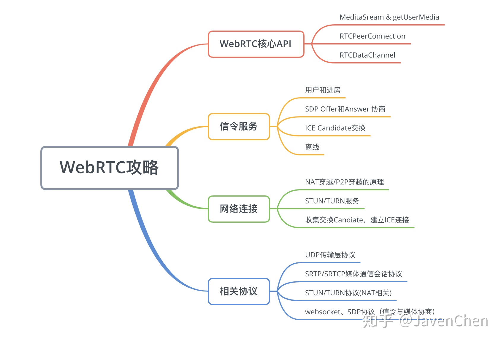
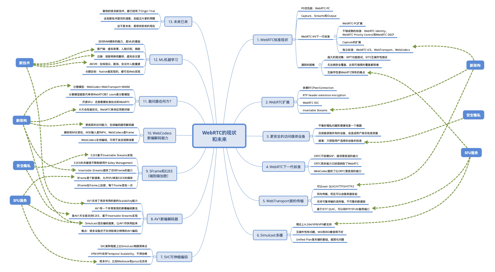
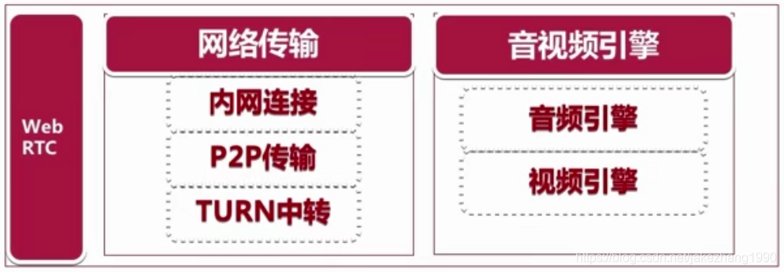
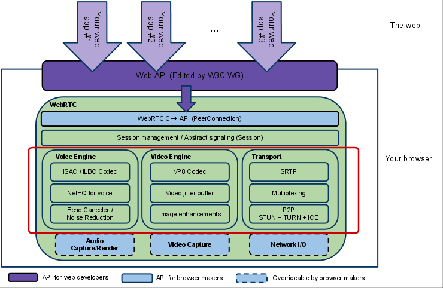
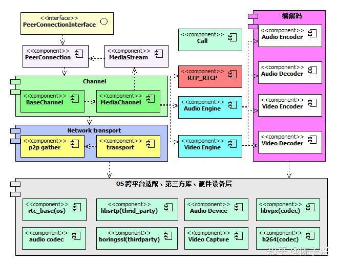

### 参考博客

> [webrtc入门概念介绍、如何学习webrtc](https://blog.csdn.net/jakezhang1990/article/details/104689485)
>
> [Webrtc架构](https://blog.csdn.net/jakezhang1990/article/details/104690022)
>
> [Web前端的WebRTC攻略（一）基础介绍](https://zhuanlan.zhihu.com/p/91055127)






## 什么是 WebRTC

**可以把webrtc简单理解为：音视频处理+及时通讯的开源库。**

### 简介

**WebRTC**，名称源自**网页即时通信**（英语：Web Real-Time Communication）的缩写，是一个支持网页浏览器进行实时语音对话或视频对话的[API](https://baike.baidu.com/item/API)。它于2011年6月1日开源并在[Google](https://baike.baidu.com/item/Google)、[Mozilla](https://baike.baidu.com/item/Mozilla)、[Opera](https://baike.baidu.com/item/Opera)支持下被纳入万维网联盟的W3C推荐标准。

Webrtc是Google花了6千万美金收购GIPS于2011年开源的音视频处理引擎。这个引擎可以在各个平台上编译运行，比如Android，ios，mac，Windows上都可以编译运行。Google的愿景是想把webrtc用于浏览器之间进行音视频实时互动通话这种快速的开发而使用的。Webrtc主要有2个功能：第1个是实时数据传输。实时传输就是在端与端之间选择一条最高效最快的传输通道，这方面webrtc是做的非常优秀的。第2个就是音视频引擎。但是它并不是简简单单的音视频的编解码，还能做各种编解码，都可以加入进去；比如视频方面：H264、vp8/vp9、H265、音频方面：opus、albc、等等。除此之外还包括音视频同步；还包括网络传输可能出现的丢包、抖动等等，做数据的平滑处理与恢复等等。。。这都是音视频引擎需要做的。在这两个方面（实时数据传输、音视频引擎的各种算法）和处理各种极端的情况等等都是webrtc的优势。

**所以，webrtc是Google开源的、跨平台的、主要用于浏览器之间的实时数据传输的音视频引擎。这就是webrtc。**





2010年收购GIPS后做了一些整理于2011年开源。期望浏览器之间可以快速的开发出实时互动的音视频应用，未来的趋势是web浏览器。GIPS在编解码的各种处理比如：回音消除，降噪，网络传输的防抖动防丢包等方面做的很好，所以Google将其收购了并开源。

**Webrtc是一个非常优秀的多媒体框架，能够跨平台。**


#### FFmpeg 与 WebRTC

另外一个处理音视频的库—**FFmpeg**，他们都有各自的侧重点。

FFmpeg 它侧重多媒体文件的编辑、音视频编解码等等这些后处理，对于文件的处理，这是它的优势。

webrtc 的优势是对于整个网络，网络的抖动，网络的丢包，网络的评估这是它的特点，第二个是回音消除，降噪，自动增益，对音频的处理webrtc做的非常出色。


### 适用领域

最主要的就是音视频会议在线教育，这是用的最多的。还有照相机、音乐播放器、共享远程桌面、录制、即时通讯工具、P2P网络加速、文件输出工具、游戏以及实时的人脸识别软件。

比如：

1. 最主要的就是音视频实时互动。应用场景包括音视频会议、在线教育的1:1实时互动、娱乐直播的连麦。
2. 应用于游戏、及时通讯、文件传输等等。这一类主要应用的就是webrtc的传输功能，webrtc的p2p是非常强大的。
3. webrtc是一个传输、音视频处理的百宝箱，在这个多媒体框架里，可以把各个模块单独抽取出来应用在项目中，比如回音消除、降噪功能等等。


Webrtc的愿景就是各浏览器之间可以快速的开发出可以实时互动的音视频的应用产品。浏览器现在已经不再是只能通过服务器获取到运算的结果然后进行渲染的简单事情了。首先是H5出现了，使得浏览器可以像普通客户端一样与服务器进行交互，做更多更重要的事情。需要掌握开发效率高学习成本低的JavaScript语言。

* Webrtc + webgl 可以实现很酷的音乐播放器
* Webrtc + AI 可以进行实时的人脸识别

> 目前支持webrtc的浏览器厂商：google的Chrome、Safari苹果的、FireFox老牌浏览器、Windows的最新的Edge浏览器。目前这些浏览器对webrtc的功能基本都是支持的。


3G时代使得移动音视频通话成为了可能，已经可以进行通话了，虽然通话质量不太好；4G的时代使得音视频通话的质量有了比较好的保障，现在的5G，音视频通话将会是一个必备的产品。


## WebRTC架构



可以简单将这张图分为两大部分：

* 最核心的是绿色的部分：是webrtc库所提供的核心功能。

* 另外在这个方块之外的紫色部分：是浏览器提供的JavaScript的api层。也就是说浏览器对webrtc核心层的C++ API做了一层封装，封装成了JavaScript接口。

上层应用就是这一个个的箭头，一个个的上层应用可以在浏览器中访问浏览器所提供的API，这样，最终就获取到了核心层去获取音频、视频，然后去编解码，通过传输去发送。

### 分层

上图是其整体分层，一个是应用层，一个是核心层。我们需要学习的webrtc库是属于核心层，图中的绿色部分，我们自己去实现应用其实也是参考整个浏览器的这个实现模式，在上层可以实现自己的api，最终调核心层的C++ API，也就是通常说的native api，在内部就会一层层的调用下来，最终，实现音视频的整个逻辑。

这是从大体上看，接下来仔细看看核心层，也是比较复杂的部分。**核心层也是按层级区分的，分为4层**。

#### 第一层

第一层webrtc C++ API(PeerConnection)，是C++ API，也就是提供给外面的api接口，这些api其实并不多，甚至可以说非常少，可以通过它的源码就能知道。**这一层最主要的就是PeerConnection对等连接，也就是连接**。

Webrtc最主要的就是P2P传输。在peerconnection里又包含了很多，包含传输质量、传输质量报告、各种统计数据、各种流，都是封装在这个peerconnection里的。在这个连接之外，还有设备管理、音视频数据的采集、还有普通的非音视频数据的传输，基本上就分为这几类api。

可以看出webrtc设计的非常精巧。对于上层来说，提供的api越简单，对于应用层来说，做起来就越方面，这样，对于开发就降低了难度。但是对于内部来说，这个native api层就比较复杂了。

#### 第二层

第二层Session Management/Abstract signaling(Session)，是session管理层，也就是上下文管理层。包括创建了音频、视频，也就是说应用里创建了音频视频还有非音视频数据传输，都可以在session层去做处理，也就是说在这一层管理这些相关的逻辑，这一层其实也不是很重要，最重要的下一层第三层。

一个抽象的会话层，提供会话建立和管理功能。该层协议留给应用开发者自定义实现。

#### 第三层

第三层包括了音频引擎Voice Engine、视频引擎Video Engine、传输Transport。每一个引擎里又包含了很多模块。稍后再详细介绍。

#### 第四层

最后一层是与硬件相关的，包括音频的采集与渲染【Audio Capture Render】，视频的采集【Video Capture】（这里需要注意的是**在webrtc库的核心层是没有视频的渲染的，所有的渲染都需要应用层或者浏览器自己去做**），最后就是【Network IO】网络IO。

图中所有划虚线的框，表示都是可以重载的，这样就增加了更大的灵活度，当不需要webrtc引用库的某些模块的时候，可以自己去实现一个模块去代替它，浏览器一般都是自己实现了一套，比如Chrome就是自己实现了一套，它使用自己的音频采集与渲染、视频采集与渲染，网络IO还是使用webrtc的网络IO。

通过这4层就可以了解到整个webrtc它的整体轮廓，都包括了那些东西。

### 最复杂的第三层都做了哪些事情

Webrtc采用的这样的设计：将音频、视频、传输，都分开设计就非常棒，非常低的耦合度。传输的时候只关心传输而不需要了解其他的业务逻辑；音频和视频显然应该分开，音频走音频的相关逻辑，视频走视频的逻辑，但是还涉及一个音频与视频的同步，音视频同步实际不是在他的引擎层做的。

#### 音频引擎

首先是编解码。比如iSAC/Ilbc Codec。iSAC是Google收购GIPS前GIPS发明的音频引擎。现在市场上用的最多的是opus。还有其他自己实现的模块，比如AAC模块。目前来说编解码方面主要使用的就是AAC、OPUS这两个编解码器。

第二个是NetEQ，这是一个音频缓冲的Buffer，用于做网络适配的，就是防止抖动的，做一个Buffer防止抖动，这里面涉及很多算法。

第三个Echo Canceler/Noise Reduction就是不太好处理的回音消除/降噪，这里提供了非常成熟的回音消除算法,我们需要做的就是调一些参数。

#### 视频引擎

包括老版本中自带的VP8/VP9 Codec，现在使用的是比较新的AVY Codec这个新的编解码器。还有H264也支持了，包括xH264、openH264,官方的webrtc里是不支持xH264的，若想支持则可以按照openH264的模块进行添加。

第二，视屏有gitterBuffer防止视屏抖动。

第三，包括图像的处理，图像增强，但是webrtc的图像增强相对功能薄弱一些，但是webrtc也预留出了相应的接口，如果想做美颜、P图等等这些图像增强操作的话，可以实现相应的接口。还可以加入人脸识别等。

#### 传输

传输，webrtc底层采用的是UDP传输，在上层用的是RTP。由于浏览器需要非常安全的传输，所以有SRTP(安全RTP，加密后的RTP)，RTP为了控制整个传输，所以又有RTCP可以把相应的发送和接收报告发送给对方，对方就可以做流量控制。

第二Multiplexing，就是复用。可以多个流复用一个通道。

第三，再底层就是P2P相关的，（P2P包括 STUN+TURN+ICE），整个就是P2P的一套协议。

### 总结

通过这个结构图，就对webrtc有了一个整体的了解，它最核心的部分就是第三层引擎层：音频引擎+视频引擎+传输。 所有音频视频的传输与发送，都是通过传输模块去做的，在传输层包括线路的检测，整个网络链路是不是完好的，丢包量，抖动情况等等，通过这些计算去估算网络带宽，由网络带宽然后去进行音视频的传输。

当然不仅仅有音视频数据的传输，还有非音视频数据的传输，包括文件、文本、二进制数据。比如玩游戏的时候，就是传输二进制数据；二进制数据可以通过使用这里的传输模块，去直接传输数据；而对于音频视频数据要想进行传输，则需要通过音频视频引擎的接口去调用传输层的接口，然后才能进行传输。

这样就明白整个webrtc库，是一个分层设计，并且在底层又划分了各个模块（音频模块、视频模块、传输模块），各个模块之间又有相互的调用关系；对于上层来说，需要访问的是webrtc native api这一层。
这以上就是webrtc的整体结构。


## Webrtc源码目录结构

### 前言

WebRTC 源码作为 Chromium 的一部分，更新速度非常快，这得益于 Google 对音视频通信的大力推广。WebRTC 源码的结构也变化很快，主要体现在以下几方面：

- 比较源码版本 m50 和 m66，在编译工具上发生了变化。老版本是通过 GYP 来生成 ninja 文件，新版本是通过 gn 生成 ninja 文件。
- 在目录结构上发生了变化，老版本中支持的一些功能在新版本中删除了。
- 随着 c++11，c++14，c++17 新标准的推出，WebRTC 在新版本中逐渐支持了新标准中的语法功能，使得代码变得更简洁、易维护

以 windows 版本的 m66 版本代码和 linux 版本的 m73 代码，这两个版本在目录结构上差异不大，在实现上有一些差异。比如，m73 版本为 BaseChannel 类抽象了一个 ChannelInterface 接口类。由于 WebRTC 代码下载不是很方便，所以本文后续会交替用 m66 和 m73 版本。

### 整体结构介绍

作者根据自身对 WebRTC 的理解，对 WebRTC 的整体框架做了一个总结。因为源码庞大，只是列出了自己理解的、并且比较关键的模块。具体如下图：



如果按照通常层次化的思维来组织，从下到上，大概分以下几个层次：

- OS 跨平台适配、硬件设备访问、第三方库 Wrapper 层
  包括网络层、操作系统 API 的跨平台封装，音频设备、视频设备封装，音频、视频 codec，DTLS 的第三方实现等。
- 网络传输层
  这里包括 candidate 收集，stun/turn 协议的实现，dtls、rtp 网络连接的建立，sctp 连接的建立等。
- 通道层
  主要包含**传输通道**也就是 BaseChannel 层 和 **媒体通道** 也就是 MediaChannel 层。BaseChannel 是和 PeerConnection、Transport 层对接。MediaChannel 实现其实在音视频引擎里面，是 BaseChannel 和引擎的桥梁。
- RTP_RTCP 主要是流控
- Audio Engine、Video Engine 是音视频引擎层，音视频处理。
- 音视频编解码器，这也是 WebRTC 自己的一个抽象，真正的编解码库还是依赖第三方库。
- PeerConnection、MediaStream 主要是对 jsep 协议的实现。
- PeerConnectionInterface 是一个对外抽象接口类设计。

### 源码目录结构介绍

本节，我们以 m66 版本的代码为例，讲解一下代码的目录结构。

| api             | 提供了对外的接口，音视频引擎层和 Module 直接的接口。         |
| --------------- | ------------------------------------------------------------ |
| audio           | 音频流的一部分抽象，属于引擎的一部分逻辑。                   |
| base            | 这一部分还没有学习到，属于 Chromium 项目的一部分，貌似 WebRTC 中用的并不多。 |
| build           | 编译脚本。这里需要注意的是，不同平台的代码在下载的时候，获取的工具集是不一样的。 |
| build_overrides | 编译工具。                                                   |
| buildtools      | 编译工具链。                                                 |
| call            | 主要是媒体流的接口抽象。为媒体引擎和 codec 层提供桥接。这里说的媒体流是 RTP 流。pc 层也抽象了媒体流，那是编码前、或者解码后。 |
| common_audio    | 音频算法实现，比如 fft。                                     |
| common_video    | 视频算法实现，比如 h264 协议格式。                           |
| data            | 测试数据                                                     |
| examples        | WebRTC 使用的例子。提供了 peerconnection_client、peerconnection_server、stun、turn 的  demo。 |
| help            | 没有学习到。                                                 |
| infra           | 没有学习到。                                                 |
| logging         | WebRTC 的 log 库。                                           |
| media           | 媒体引擎层，包括音频、视频引擎实现。                         |
| modules         | WebRTC 把一些逻辑比较独立的抽象为 Module，利于扩展维护。     |
| ortc            | 媒体描述协议，类似 sdp 协议。                                |
| out             | build 输出目录，这是 webrtc 官方编译指导中示范目录。         |
| p2p             | 主要是实现 candidate 收集，NAT 穿越。                        |
| pc              | 实现 jsep 协议。                                             |
| resources       | 测试数据                                                     |
| rtc_base        | 包括 Socket、线程、锁等 OS 基础功能实现。                    |
| rtc_tools       | 网络监测工具、音视频分析工具。很多工具都是脚本实现。         |
| sdk             | 主要是移动端相关实现。                                       |
| stats           | WebRTC 统计模块实现。                                        |
| style-guide     | 编码规范说明                                                 |
| system_wrappers | OS 相关功能的封装，比如 cpu、clock 等。                      |
| test            | 单元测试代码实现，用 gmock                                   |
| testing         | gmock、gtest等源码，属于整个 Chromium 项目。                 |
| third_party     | 第三方库依赖。比如，boringssl，abseil-cpp，libvpx等          |
| tools           | 公共工具集，整个 Chromium 项目依赖的。                       |
| tools_webrtc    | WebRTC 用到的工具集。比如代码检查 valgrind 的使用。          |
| video           | 视频 RTP 流的抽象接口，属于视频引擎的一部分。                |

上面对源码中的目录做了一个概要介绍，每一个目录又包含了很多功能。下面介绍一下 pc 和 module 目录。

### **PeerConnection**

PeerConnection 的主要实现逻辑就是在 WebRTC 源码的 pc 目录下。

一切都从 PeerConnectionFactory 和 PeerConnection 开始，对外提供 PeerConnectionFactoryInterface 和 PeerConnectionInterface 两个接口类。Factory 类，顾名思义就是创建 PeerConnection 的，下来我们只讨论 PeerConnection。

也许你已经非常熟悉 WebRTC 的 JavaScript 接口。比如，RTCPeerConnection，setLocalDescription、setRemoteDescription、createOffer、createAnswer 等，没错这些。JavaScript 接口的 Native 实现就是在 PeerConnection 中完成的，它也有对应的一套接口。JavaScript 这套接口实现规范是[JSEP](https://link.zhihu.com/?target=https%3A//rtcweb-wg.github.io/jsep/)。 可以说是把这套规范的模型都给实现了。

WebRTC 终端之间的通信协议是 ICE 协议，书包格式采用 SDP 协议。PeerConnection 实现了 SessionDescription 的逻辑。

PeerConnection 抽象了 RtpTransceiver，RtpSender、RtpReceiver 模型，对应了 sdp 中描述的媒体的实现。

### **Module**

WebRTC 将逻辑功能独立、内聚性、复用性强的部分单独抽象为模块。模块在 WebRTC 源码的 modules 目录下，主要是音视频设备、codec、流控等，这里不一一列举了。

Module 抽象了一个接口，源码实现在 modules/include/module.h 中，代码如下：

```cpp
namespace webrtc{
class Module {
 public:

  virtual int64_t TimeUntilNextProcess() = 0;  
  virtual void Process() = 0; 
  virtual void ProcessThreadAttached(ProcessThread* process_thread) {}

 protected:
  virtual ~Module() {}
};
}  // namespace webrtc
```

一共三个函数，相对简单，主要是为那些需要定时处理一些任务的模块提供一个统一的抽象。对于集成了 webrtc::Module 类的模块，使用的时候，需要调用 ProcessThread 的 RegisterModule 和 DeRegisterModule 方法向模块执行线程注册和反注册模块。我相信大家都知道，控制、调度逻辑是最复杂易错的，实现起来也是最枯燥乏味，设计不好，很容易重复实现很多代码。所以 WebRTC 索性都封装起来，实现者只需要被动的实现功能逻辑即可。

### 主目录（其他版本）

| 目录                | 功能                                                         |
| ------------------- | ------------------------------------------------------------ |
| api目录             | 就是webrtc的接口层。比如浏览器、我们自己写的应用程序大多数时候都是直接从webrtc提供的这些api进行调用。如果我们想增加接口或者调整接口，就需要到api目录下去找相应的文件。 |
| call目录            | 数据流的管理层，Call代表同一个端点的所有数据的流入流出，那当有多个端进行流入流出的时候就需要有多个Call。主要是对音频流、视频流的管理，当与对端建立连接之后，同一个端的这些流的管理就是通过call进行管理的。 |
| video目录           | 与视频相关的逻辑。当视频要进行编解码处理等，video目录是一个总的入口点，video的相关逻辑都是在这里的。 |
| audio目录           | 与音频相关的逻辑。                                           |
| common_audio目录    | 音频算法相关。                                               |
| common_video目录    | 视频算法相关。                                               |
| media目录           | 与多媒体相关的逻辑处理，如编解码的逻辑处理。比如什么时候进行编码，什么时候进行解码这些都是在media目录下控制的。 |
| logging目录         | 日志相关。                                                   |
| module目录          | 最重要的目录-----子模块。这个模块非常大，里面有很多子模块，每个子模块都非常重要。 |
| pc目录              | Peer Connection，连接相关的逻辑层。Peer  Connection代表的是与对端的一个连接，在上层有一个连接的概念，在连接下面就有很多的东西了，比如连接的时候有stream流，流里面又有轨track，一个流里面可以有很多轨，包括音频轨、视频轨、桌面轨等等，轨道的概念就可以理解为两个平行的线，是不相交叉，音频、视频都是单独的，这样一个概念。 |
|                     | 通过Peer Connection拿到Stream流，流里能拿到每一个多媒体，也就是音频视频，当然还可以拿到所有的统计信息，比如媒体流的统计信息、传输的统计信息等等。 |
|                     | Peer Connection是一个非常重要的目录，相当于上层接口的一个统一的接口层。 |
| p2p目录             | 端到端相关代码，stun/turn。端到端要进行传输的时候需要看p2p是不是能打通，p2p有很多类型，链接能不能打通，相应的侦测工具都是在这个p2p目录下。相应的协议有STUN协议TURN协议。 |
| rtc_base目录        | 基础代码，如线程、锁相关的统一接口代码。由于webrtc是跨平台的，所以线程、锁这些会有所不同，特别是在Windows和Linux上使用的函数差别特别大，那怎么办呢？如果上层根据每个平台去做不同的处理的话，就需要些很多代码了。但是分层之后，对于上层逻辑来说，只需要统一调用webrtc定义的这个规范，比如线程规范、锁规范，就可以了，具体在rtc_base这个目录下再区分是Windows层的还是Linux层的还是mac层的等等。 |
| rtc_tool目录        | 里面是一些工具，音视频分析相关的工具代码。比如对H264进行分析的话有I帧、B帧、P帧、NALL头等都可以找到相应的分析工具。（音视频相关的专门的测试工具目录） |
| tool_webrtc目录     | webrtc测试相关的工具代码，各种单元测试如网络模拟器，网络的测试，音频的测试，视频的测试都是在这个目录下。（整个webrtc的测试工具目录） |
| system_wrappers目录 | 与具体操作系统相关的代码。如CPU特性，原子操作，锁等。各个平台分别形成一个文件，比如Windows的形成一个文件，Linux的形成一个文件等等。 |
| stats目录           | 存放各种数据统计相关的类。比如，丢包率、抖动时长等等。       |
| sdk目录             | 主要存放Android和iOS层代码。如音频视频的采集，渲染等。       |


### Modules子目录下的目录结构（其他版本）

| 目录                         | 功能                                                         |
| ---------------------------- | ------------------------------------------------------------ |
| audio_coding目录             | 音频编解码器相关代码。在上面的media目录也说到了编解码，media是编解码逻辑相关的，就是什么时候用编解码。这里的audio_coding目录下是编解码器，有opus编解码器，AAC编解码器等等，都是放在这个audio_coding目录下的。 |
| audio_device目录             | 音频采集与音频播放相关的代码。在老版本的webrtc里，所有的设备都放在audio_devices这个目录里，但是新的webrtc把Android和iOS的设备相关代码都放在了sdk目录下，单独摘到了sdk下面了。但是其他的平台比如Windows的，mac的，linux的都是在audio_devices目录下。 |
| audio_mixer目录              | 混音相关的代码。什么是混音呢？就是说同时又多人实时互动，好几个人同时在说话，就需要把声音混在一起，这样在传输的时候就比较方便，减少了音频流。 |
| audio_processing目录         | 音频前后处理的相关代码。对音频的前处理，后处理；比如回音消除，降噪，增益等等，都是在这个目录中，但是这个目录中又有很多的子目录。 |
| bitrate_controller目录       | 码率控制的相关代码。控制码流是500K,1M,还是2M，这个码流的控制就是在这个目录下。想改变码流，想看码流相关的控制，就进入这个目录下即可。 |
| congestion_controller目录    | 流量控相关代码。当检测到网络流量比较高的时候，需要做一些网络流量控制，防止网络包把带宽打死，具体怎么控制就是在这里设置的，想要看流控相关的代码就在这个目录中查看。 |
| desktop_capture目录          | 桌面采集相关。                                               |
| pacing目录                   | 码率探测及平滑处理相关的代码。首先需要检测到音频视频的码率是多少，检测到后做一个平滑的处理，就是不是让数据一下发送出去，需要做平滑处理，比如有时候是10K，有时候是500K，给做一个平均，不能一会儿高一会儿低，而是给做一个平滑处理。 |
| remote_bitrate_estimator目录 | 远端码率估算相关代码。评估远端能接收的带宽是多少，不是我本地的发送的带宽，是远程接收端的估算带宽。不仅仅需要知道发送端单位时间能发送多少，还需要知道对方端单位时间能收多少，所以需要一个远端码率的评估。评估的代码就在这个目录下。 |
| rtp_rtcp目录                 | rtp/rtcp协议相关代码。                                       |
| video_capture目录            | 视频采集相关的代码。捕获视频相关的代码。                     |
| video_coding目录             | 视频编解码器相关的代码。视频的编码器VP8/VP9等等，编码器都是放在这里的。 |
| video_processing目录         | 视频前处理、后处理相关的代码。视频帧的增强，检测，还有如果增加人脸识别就可以放在这个目录下。 |


## Webrtc运行机制

### 轨与流

1. 轨：Track。比如一路音频就是一路轨，一路视频也是一路轨，这里的轨就是采取了轨道的概念，两条轨道是永远不相交的，音频与视频是不相交的，单独存放。两路音频其实也是两路轨，也是不相交的。
2. 媒体流MediaStream。借鉴了传统的媒体流的概念，在传统的媒体流里也包括了音频轨、视频轨、字母轨。这里主要有一个层级的概念。在媒体流里包含了很多轨，这样形成一个层级的概念之后，后续的知识就比较好理解了。

### Webrtc重要类

1. MediaStream类，媒体流。
2. RTCPeerConnection类，是整个webrtc里最重要的一个类，因为这个类是一个大而全的一个类，里面包含了很多的功能。那么这样设计有什么好处呢？对于应用层来说就特别的方便，在应用层只需要创建了一个RTCPeerConnection，也就是创建这一个连接，将MediaStream流塞到这个连接里去就不用管其他的了，其他所有的底层传输、寻路等等，全都会由RTCPeerConnection内部去执行了。所以对于应用层来说非常方便，当然在底层它肯定做了很多的工作。我们知道Webrtc主要采用的是P2P的传输，包括p2p的类型、检测、p2p是否能够打通、是否能够穿透成功，如果穿透不成功还需要通过TURN服务器去进行中转，等等这一系列的操作都是在RTCPeerConnection类里面做完了。所以，这就是为什么去看webrtc源码的时候发现非常复杂，而在应用层去使用的时候反而非常容易非常方便的原因。
   所以在后续看webrtc源码的时候，或者局部逻辑的时候，可以首先从RTCPeerConnection这个类着手进行不断的深入。
3. RTCDataChannel类。这个类是非音视频数据都通过这个RTCDataChannel类进行传输，实际上RTCDataChannel是通过RTCPeerConnection获取的，所以他们之间是有关系的。像文本、二进制文件、二进制数据都可以通过RTCDataChannel进行传输，所以只需要拿到RTCDataChannel这个对象，将数据塞给RTCDataChannel对象，对于上层应用来说已经完成了。RTCDataChannel它在底层又走了很多的逻辑，对于上层应用来说是无需关心的。

所以，总结来说：RTCPeerConnection类是核心，MediaStream类里包含了很多轨，将这些轨添加到这个MediaStream类对象之后，将MediaStream类对象添加到RTCPeerConnection类对象之中去，底层就不用管了，它就会自动的传递到对端去了。

对于普通数据来说，比如传输二进制数据。首先通过RTCPeerConnection类对象获取RTCDataChannel类对象，然后其他也就不用管了，通过这个RTCDataChannel类就可以把非音视频数据的二进制数据传递到对端去了。