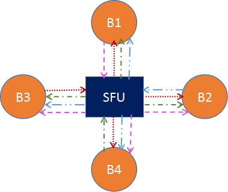

## WebRTC通信模型

WebRTC 本身提供的是 1 对 1 的通信模型，在 STUN/TURN 的辅助下，如果能实现 NAT 穿越，那么两个浏览器是可以直接进行媒体数据交换的；如果不能实现 NAT 穿越，那么只能通过 TURN 服务器进行数据转发的方式实现通信。目前来看，Google 开源的用于学习和研究的项目基本都是基于 STUN/TURN 的 1 对 1 通信。

**如果想要通过 WebRTC 实现多对多通信，该如何做呢？**

其实，基于 WebRTC 的多对多实时通信的开源项目也有很多，综合来看，多方通信架构无外乎以下三种方案。

- Mesh 方案，即多个终端之间两两进行连接，形成一个网状结构。比如 A、B、C 三个终端进行多对多通信，当 A 想要共享媒体（比如音频、视频）时，它需要分别向 B 和 C 发送数据。同样的道理，B 想要共享媒体，就需要分别向 A、C 发送数据，依次类推。这种方案对各终端的带宽要求比较高。
- MCU（Multipoint Conferencing Unit）方案，该方案由一个服务器和多个终端组成一个星形结构。各终端将自己要共享的音视频流发送给服务器，服务器端会将在同一个房间中的所有终端的音视频流进行混合，最终生成一个混合后的音视频流再发给各个终端，这样各终端就可以看到 / 听到其他终端的音视频了。实际上服务器端就是一个音视频混合器，这种方案服务器的压力会非常大。
- SFU（Selective Forwarding Unit）方案，该方案也是由一个服务器和多个终端组成，但与 MCU 不同的是，SFU 不对音视频进行混流，收到某个终端共享的音视频流后，就直接将该音视频流转发给房间内的其他终端。它实际上就是一个音视频路由转发器。

了解了上面几种通信架构后，接下来，我们分别论述一下这几种架构。

### 1 对 1 通信

在多对多架构模型之前，咱们得先回顾一下 WebRTC 1 对 1 通信的模型，因为只有在 1 对 1 通信模型非常清楚的情况下，我们才能知道多对多通信模型的复杂度到底体现在哪儿。

在 1 对 1 通信中，WebRTC 首先尝试两个终端之间是否可以通过 P2P 直接进行通信，如果无法直接通信的话，则会通过 STUN/TURN 服务器进行中转，如下图：

目前对上图已经非常熟悉了。实际上，1 对 1 通信模型设计的主要目标是尽量让两个终端进行直联，这样即可以节省服务器的资源，又可以提高音视频的服务质量。

如果端与端之间可以直接通信，那么上图中的 STUN/TURN 服务器的作用就只是用于各终端收集 reflx 类型的 Candidate 。而如果端与端之间无法直接进行通信的话，那么 STUN/TURN 服务器就变成了中继服务器，可以利用它进行端与端之间数据的中转。

### Mesh 方案

1 对 1 通信模型下，两个终端可以互相连接，那么我们是否可以让多个终端互相连接起来，从而实现多人通信呢？

理论上这是完全可行的。Mesh 方案的结构如下图所示：

在上图中，B1、B2、B3、B4 分别表示 4 个浏览器，它们之间两两相连，同时还分别与 STUN/TURN 服务器进行连接（此时的 STUN/TURN 服务器不能进行数据中转，否则情况会变得非常复杂），这样就形成了一个网格拓扑结构。

当某个浏览器想要共享它的音视频流时，它会将共享的媒体流分别发送给其他 3 个浏览器，这样就实现了多人通信。

这种结构的优势有：

- 不需要服务器中转数据，STUN/TUTN 只是负责 NAT 穿越，这样利用现有 WebRTC 通信模型就可以实现，而不需要开发媒体服务器。
- 充分利用了客户端的带宽资源。
- 节省了服务器资源，因为服务器带宽往往是专线，价格昂贵，所以这种方案可以很好地控制成本。

当然，有优势自然也有不足之处，主要表现在：

- 共享端共享媒体流的时候，需要给每一个参与人都转发一份媒体流，这样对上行带宽的占用很大。参与人越多，占用的带宽就越大。除此之外，对 CPU、Memory 等资源也是极大的考验。一般来说，客户端的机器资源、带宽资源往往是有限的，资源占用和参与人数是线性相关的。这样导致多人通信的规模非常有限，通过实践来看，这种方案在超过 4 个人时，就会有非常大的问题。
- 另一方面，在多人通信时，如果有部分人不能实现 NAT 穿越，但还想让这些人与其他人互通，就显得很麻烦，需要做出更多的可靠性设计。

### MCU方案

Multipoint Conferencing Uint硬件的方案，通过软件的方式代替硬件。(EasyRTC-MCU版使用的就是这个方案)

#### 方案特点

- 多个用户互动时，首先将多路视频进行混频操作，比如3路视频，每个人只拿1路。但是CPU混频的时候，非常耗费CPU。如果有多个会议在开的时候，消耗资源更大；
- 因为对于用户来说只有一路数据，所以对于带宽影响小；
- 因为都是混频后的一路数据，没办法对数据进行操作，对于客户端灵活性比较差，因为没办法进行放大某一个房间等操作；
- 该方案对带宽的占用率低，对服务器端的压力大，适用于小规模企业用户使用。

#### 主要处理逻辑

MCU 主要的处理逻辑是：接收每个共享端的音视频流，经过解码、与其他解码后的音视频进行混流、重新编码，之后再将混好的音视频流发送给房间里的所有人。

MCU 技术在视频会议领域出现得非常早，目前技术也非常成熟，主要用在硬件视频会议领域。不过我们今天讨论的是软件 MCU，它与硬件 MCU 的模型是一致的，只不过一个是通过硬件实现的，另一个是通过软件实现的罢了。MCU 方案的模型是一个星形结构，如下图所示：

我们来假设一个条件，B1 与 B2 同时共享音视频流，它们首先将流推送给 MCU 服务器，MCU 服务器收到两路流后，分别将两路流进行解码，之后将解码后的两路流进行混流，然后再编码，编码后的流数据再分发给 B3 和 B4。

对于 B1 来说，因为它是其中的一个共享者，所以 MCU 给它推的是没有混合它的共享流的媒体流，在这个例子中就是直接推 B2 的流给它。同理，对于 B2 来说 MCU 给它发的是 B1 的共享流。但如果有更多的人共享音视频流，那情况就更加复杂。

**MCU 主要的处理逻辑如下：**

#### 优缺点

那 MCU 的优势有哪些呢？大致可总结为如下几点：

- 技术非常成熟，在硬件视频会议中应用非常广泛。
- 作为音视频网关，通过解码、再编码可以屏蔽不同编解码设备的差异化，满足更多客户的集成需求，提升用户体验和产品竞争力。
- 将多路视频混合成一路，所有参与人看到的是相同的画面，客户体验非常好。

同样，MCU 也有一些不足，主要表现为：

- 重新解码、编码、混流，需要大量的运算，对 CPU 资源的消耗很大。
- 重新解码、编码、混流还会带来延迟。
- 由于机器资源耗费很大，所以 MCU 所提供的容量有限，一般十几路视频就是上限了。

### SFU方案

直接进行数据转发流，不需要进行解码转码操作，所有的视频的控制全部由客户端控制。(EasyRTC-SFU是这种方案)。相对于MCU来说，传输的数据就多了，带宽不够的情况下，很容易影响软件。

#### 方案特点

- 由于是数据包直接转发，参与人观看多路视频的时候可能会出现不同步。相同的视频流，不同的参与人看到的画面也可能不一致。
- 参与人同时观看多路视频，在多路视频窗口显示、渲染等会带来很多麻烦，尤其对多人实时通信进行录制，多路流也会带来很多回放的困难。总之，整体在通用性、一致性方面比较差。
- SFU是两种架构方案中优势最明显而劣势又相对较少的一种架构方案。无论是从灵活性上，还是音视频的服务质量、负载情况等方面上，相较MCU方案，SFU都有明显的优势，因此这种方案也被大多数厂商广泛采用，适用于大型会议现场使用。

SFU 像是一个媒体流路由器，接收终端的音视频流，根据需要转发给其他终端。SFU 在音视频会议中应用非常广泛，尤其是 WebRTC 普及以后。支持 WebRTC 多方通信的媒体服务器基本都是 SFU 结构。SFU 的拓扑机构和功能模型如下图：

在这个图中，B1、B2、B3、B4 分别代表 4 个浏览器，每一个浏览器都会共享一路流发给 SFU，SFU 会将每一路流转发给共享者之外的 3 个浏览器。

 

下面这张图是从 SFU 服务器的角度展示的功能示意图：

相比 MCU，SFU 在结构上显得简单很多，只是接收流然后转发给其他人。然而，这个简单结构也给音视频传输带来了很多便利。比如，SFU 可以根据终端下行网络状况做一些流控，可以根据当前带宽情况、网络延时情况，选择性地丢弃一些媒体数据，保证通信的连续性。

目前许多 SFU 实现都支持 SVC 模式和 Simulcast 模式，用于适配 WiFi、4G 等不同网络状况，以及 Phone、Pad、PC 等不同终端设备。

#### 优缺点

SFU 的优势有哪些呢？：

- 首先 由于是数据包直接转发，不需要编码、解码，对 CPU 资源消耗很小。
- 其次是 直接转发也极大地降低了延迟，提高了实时性。
- 最后 带来了很大的灵活性，能够更好地适应不同的网络状况和终端类型。

同样，SFU 有优势，也有不足，主要表现是：

由于是数据包直接转发，参与人观看多路视频的时候可能会出现不同步；相同的视频流，不同的参与人看到的画面也可能不一致。

参与人同时观看多路视频，在多路视频窗口显示、渲染等会带来很多麻烦，尤其对多人实时通信进行录制，多路流也会带来很多回放的困难。总之，整体在通用性、一致性方面比较差。

通过上面的分析和比较，综合它们各自的优劣情况，我们可以得出 ，SFU 是三种架构方案中优势最明显而劣势又相对较少的一种架构方案。

无论是从灵活性上，还是音视频的服务质量、负载情况等方面上，相较其他两种方案，SFU 都有明显的优势，因此这种方案也被大多数厂商广泛采用。

#### 视频模式对SFU的影响

另外，在上面介绍 SFU 方案时，我们还提到了视频的 Simulcast 模式和 SVC 模式，他们是什么呢，又对 SFU 架构来说都带来了哪些好处呢。

##### Simulcast 模式

所谓 Simulcast 模式就是指视频的共享者可以同时向 SFU 发送多路不同分辨率的视频流（一般为三路，如 1080P、720P、360P）。而 SFU 可以将接收到的三路流根据各终端的情况而选择其中某一路发送出去。例如，由于 PC 端网络特别好，给 PC 端发送 1080P 分辨率的视频；而移动网络较差，就给 Phone 发送 360P 分辨率的视频。

Simulcast 模式对移动端的终端类型非常有用，它可以灵活而又智能地适应不同的网络环境。下图就是 Simulcast 模式的示意图：

##### SVC 模式

SVC 是可伸缩的视频编码模式。与 Simulcast 模式的同时传多路流不同，SVC 模式是在视频编码时做“手脚”。

它在视频编码时将视频分成多层——核心层、中间层和扩展层。上层依赖于底层，而且越上层越清晰，越底层越模糊。在带宽不好的情况下，可以只传输底层，即核心层，在带宽充足的情况下，可以将三层全部传输过去。

如下图所示，PC1 共享的是一路视频流，编码使用 SVC 分为三层发送给 SFU。SFU 根据接收端的情况，发现 PC2 网络状况不错，于是将 0、1、2 三层都发给 PC2；发现 Phone 网络不好，则只将 0 层发给 Phone。这样就可以适应不同的网络环境和终端类型了。

### 小结

三种多方通信的架构，分别是 Mesh、MCU 和 SFU。

整体来看，由于各方面限制，Mesh 架构在真实的应用场景中几乎没有人使用，一般刚学习 WebRTC 会考虑使用这种架构来实现多方通信。

MCU 架构是非常成熟的技术，在硬件视频会议中应用非常广泛。像很多做音视频会议的公司之前都会购买一套 MCU 设备，这样一套设备价格不菲，最低都要 50 万，但随着互联网的发展以及音视频技术越来越成熟，硬件 MCU 已经逐步被淘汰。

当然现在也还有公司在使用软 MCU，比较有名的项目是 FreeSWITCH，但正如我们前面所分析的那样，由于 MCU 要进行解码、混流、重新编码的操作，这些操作对 CPU 消耗是巨大的。如果用硬件 MCU 还好，但软 MCU 这个劣势就很明显了，所以真正使用软 MCU 架构方案的公司也不多。

SFU 是最近几年流行的新架构，目前 WebRTC 多方通信媒体服务器都是 SFU 架构。从上面的介绍中你也可以了解到 SFU 这种架构非常灵活，性能也非常高，再配上视频的 Simulcast 模式或 SVC 模式，则使它更加如虎添翼，因此各个公司目前基本上都使用该方案。

 

目前实测sfu架构的多对多视频会议，发现每定阅一路流，服务器网络流量就行相应添加，说明视频与音频数据都是经过了服务器的。服务器相当于一个流媒体转发器(media server)。当公网带宽有限时，还是支持不了太多Client一起视频会议。不过现在大多数开会都只有两个会场，虽是多人会议, 其实只有两个Client，sfu架构或是p2p就能完全满足了!