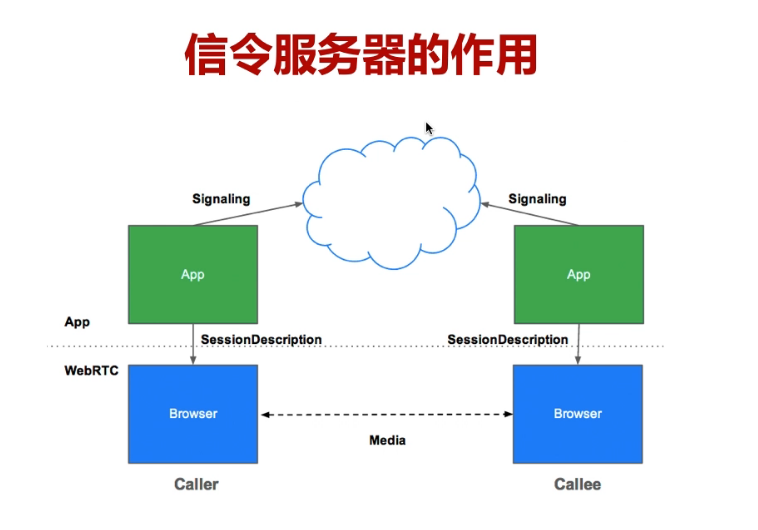
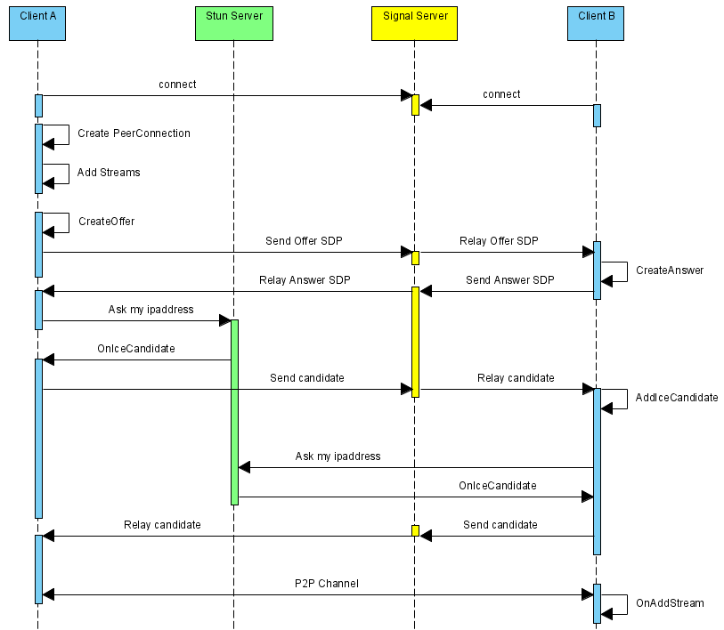

## WebRTC信令服务

### 信令服务器的作用

没有信令服务器，各个WebRTC之间是没办法通信的。
传递媒体数据有两个信息，必须经过信令服务器进行交换。

如下图是信令服务器担任的角色：



如果我们没有信令服务器，WebRTC之间是肯定不能通信的，我们来看一下上图，这张图就表达了信令服务器在整个通话过程中它起到的作用。

我们要实现p2p直接的通信，需要交换几个信息：媒体信息，网络信息，具体业务。

* 媒体信息
  * 通过SDP来表示，如编解码器是什么？是否支持音频视频？编码方式是什么？等这些信息是通过SDP协议描述出来，通过信令服务器中转的

* 网络信息
  * 两个WebRTC客户端会尽可能选择P2P进行连接，那么进行连接前是如何发现对方的？就是通过信令服务器。
  * 首先将你所有网络相关信息传到信令服务器，服务器帮你交换到对端，对端拿到你的信息后，
    若在同一局域网内，直接通过P2P传输；若不在，首先进行P2P穿越，看是否能打通，打通则传输，打不通则中转等。

* 具体业务
  * 还有一点也需要信令服务器进行传输，比如加入房间，离开房间，禁言等功能

那么我们下面详细分析一下上图信令服务器需要处理的事情：

1. 首先我们先看下面蓝色的发起端和接受端，这个发起端和接受端如果想传递媒体数据的时候 ，它有两个信息是必须要经过信令服务器交换之后才能进行通信的，这个两个信息。第一个就是媒体信息，它是通过SDP来表述。可以简单的理解，我们双方要通信，你的编解码的器是什么，比如说我现在可以进行视频传输，我的编码是H264，那么对方也要告诉我你的编解码器能不能支持H264的码，比如我们给你传过去H264的码，你说只能解H265的，那肯定双方之间就没法通信了。所有这个信息是必须要传递的。
2. 此外你是否支持视频是否支持音频，你们的编码方式是什么，这些信息是通过SDP给它描述出来，通过信令服务器，首先客户端要将这个SDP信息发送到服务端 ，服务端再中转，中转到另一端，大家已经知道了为什么要通过信令服务器进行中转，因为这个时候相互之间还没有进行连接，相互之间还不知道对方的存在。那这是第一个要传递的信息，
3. 第二个要传递的信息是网络信息，大家知道WebRTC最终之间尽可能通过P2P进行传输，那在他们连接之前，他们如何发现对方呢？也是通过信令服务器，首先你要将所有网络相关的信息传到服务器，那么这个服务器在帮你交换到对端，那对端拿到你的信息之后，才知道我们是在同一个局域网内，那就直接通过P2P就传输好了。那如果不在同一个网络内，那我要通过P2P穿越 ，看看之间能不能打通，这里面又分了好几种类型，对于对称是肯定打通不了，对于非对称的那就可以尝试打通，打通之后，他们之间才能进行通信。如果打通不了，还要通过服务端进行中转。所以这个信令服务器最基础的要传输媒体相关的信息进行交换，第二个是网络相关的信息要进行交换，
4. 再有第三个就是你的具体的业务，加入房间，离开房间，禁言，将对方禁止发言，或者给对方权限让他发言等等有很多信令，可以根据自己的业务模型去设置。

这个就是信令服务器在整个WebRTC在整个WebRTC通讯中的作用，所以这是WebRTC中必须要有的信令服务器。


### 信令服务的实现

为什么WebRTC中不提供信令服务：

1. WebRTC是没有将信令服务纳入到整个的规范中，更多的是规范了客户端这边的所有的过程，那为什么没有将信令服务器放到规范中，各个公司它的业务模型都是不一样的，很难将每个公司的信令都统一订成一套规范。所有与其这个不如让他们各自自己去定义。
2. 只有是我必须的这些信息的交换可以实现，其他的业务你可以自己去定义，这个比较灵活，各个公司也比较容易接受这套方案。
3. 这个对整个WebRTC的推广其实是有好处的。


### WebRTC信令交互流程

WebRTC是HTML5支持的重要特性之一，有了它，不再需要借助音视频相关的客户端，直接通过浏览器的Web页面就可以实现音视频对聊功能。

而且WebRTC是开放的音视频通信标准，我们可以借助WebRTC源码快速构建自己的音视频对聊功能。

无论是使用前端JS的WebRTC API接口，还是在WebRTC源码上构建自己的对聊框架，都需要遵循以下执行流程：



上述序列中，**WebRTC并不提供Stun服务器和Signal服务器**，服务器端需要自己实现。Stun服务器可以用google提供的实现stun协议的测试服务器（stun:stun.l.google.com:19302），Signal服务器则完全需要自己实现了，它需要在ClientA和ClientB之间传送彼此的SDP信息和candidate信息，ClientA和ClientB通过这些信息建立P2P连接来传送音视频数据。

由于网络环境的复杂性，并不是所有的客户端之间都能够建立P2P连接，这种情况下就需要有个relay服务器做音视频数据的中转，本文本着源码剖析的态度，这种情况就不考虑了。这里说明一下， stun/turn、relay服务器的实现在WebRTC源码中都有示例，真是个名副其实的大宝库。

上述序列中，标注的场景是ClientA向ClientB发起对聊请求，调用描述如下：

- ClientA首先创建PeerConnection对象，然后打开本地音视频设备，将音视频数据封装成MediaStream添加到PeerConnection中。
- ClientA调用PeerConnection的CreateOffer方法创建一个用于offer的SDP对象，SDP对象中保存当前音视频的相关参数。ClientA通过PeerConnection的SetLocalDeion方法将该SDP对象保存起来，并通过Signal服务器发送给ClientB。
- ClientB接收到ClientA发送过的offer SDP对象，通过PeerConnection的SetRemoteDeion方法将其保存起来，并调用PeerConnection的CreateAnswer方法创建一个应答的SDP对象，通过PeerConnection的SetLocalDeion的方法保存该应答SDP对象并将它通过Signal服务器发送给ClientA。
- ClientA接收到ClientB发送过来的应答SDP对象，将其通过PeerConnection的SetRemoteDeion方法保存起来。
- 在SDP信息的offer/answer流程中，ClientA和ClientB已经根据SDP信息创建好相应的音频Channel和视频Channel并开启Candidate数据的收集，Candidate数据可以简单地理解成Client端的IP地址信息（本地IP地址、公网IP地址、Relay服务端分配的地址）。
- 当ClientA收集到Candidate信息后，PeerConnection会通过OnIceCandidate接口给ClientA发送通知，ClientA将收到的Candidate信息通过Signal服务器发送给ClientB，ClientB通过PeerConnection的AddIceCandidate方法保存起来。同样的操作ClientB对ClientA再来一次。
- 这样ClientA和ClientB就已经建立了音视频传输的P2P通道，ClientB接收到ClientA传送过来的音视频流，会通过PeerConnection的OnAddStream回调接口返回一个标识ClientA端音视频流的MediaStream对象，在ClientB端渲染出来即可。同样操作也适应ClientB到ClientA的音视频流的传输。

## socket.io 简介

### socket.io 优势
要实现一个信令服务器，有很多种方式，我们可以使用最原始的套机制通信，也可以用第三方开源库，我们这里使用的是socket.io，主要是因为它有几个优点：

#### socket.io是WebSocket超集

1. socket.io它本身就有WebSocket功能，我们都知道在整个音视频传输的时候，一般有两种协议，TCP和UDP，底层协议里面UDP主要用于流媒体的传输，比如音频、视频、文本可以通过 UDP进行传输，UDP的问题在于它是不可靠的传输，也就是说我是可以丢包的，对于音频视频来说这是没有任何问题的。当我网络不好的时候，我丢了音频数据，它顶多就卡一下，它还能继续运行，不太影响我们正常的通话。
2. 如果对于信令来说就不一样了，信令一般就使用TCP，叫做可靠性连接，我的包是要必须保证到达的，否则我就断开连接了，因为网络就不能支持我的整个业务运转。所以它要么就必须达到，我们就甭玩了。就这两种状况，所以我们的信令在传输的过程中是必须要到达的。
3. 如果我们的媒体信息和网络信息不能交换的话，那肯定就是不能工作的，所以对于 信令来说我们一般使用TCP，websocket底层使用的就是TCP，所以socket.io底层使用的也是 TCP。

#### socket.io有房间的概念

1. socket.io有房间的概念，socket.io两个人或者多个人进行通讯的时候，首先我要进入到 一个房间里，这是很自然的一个逻辑，我们 要上课 或者开会，首先大家要聚集在一起，有一个虚拟的逻辑的概念，就是大家要在一个房间里，大家在这个房间大家就可以相互通信了。
2. 我们可以看webrtc官方提供的例子，实际上他有三种服务器，分别是房间服务器，信令服务器，流媒体中转服务器，我们这里用了socket.io我们这里就不用单独写一个房间服务器了，也就是说房间服务器和信令服务器是在同一个服务器上。

#### socket.io跨平台、跨终端、跨语言

socket.io跨平台、跨终端、跨语言，这样就方便我们在各个端上去实现信令的各个端，去与我们的服务端进行连接，所以特别方便，这就是使用socket来实现socket.io来实现信令服务器的根本原因。


### socket.io 工作原理


如上图所示，socket.io的工作原理其实非常简单，socket.io其他它是一个js库，它是基于node.js 的Server的，这个和我们的技术选项有关，我们之前选择web服务器的时候选择的是nodeJS，在这个nodeJS的服务器上 我们在增加这个socket.io，那么我们整个服务器端就完成了，非常简单。

但是如果我们单独写一套的话，那要花很长很长时间，在我们现有的nodeJS， web服务器上我们只有增加了socket.io，简简单单的修改几行代码，我们就实现了一个服务器端。

其实光有服务器它还是不能工作的，所以还有客户端。

在网页端也好，在安卓或者IOS也好，在任何终端都可以引入socket.io这个client lib客户端的库，那么客户端这个库我们就可以连接到NodeJS 的socket.io的这个服务上，这样就建立了连接。

建立了连接之后，我们才可以创建房间或者加入到房间里，那么在整个房间内的用户就可以相互通信了，这块的逻辑非常的简单。

此外这个socket.io它是可以横向扩展的，还可以级联部署很多个socket.io服务，还可以串到一起，这时当我去发送信息的时候，它是可以在各个socket.io上传输的。
比如有两个用户，第一个用户在北京那个节点上，有一个 用户是上海这个节点上，没关系在它上层也就是它服务端可以串在一起的，那么北京的用户首先将你的信息发送到北京的服务端，北京的服务端通过整个网络曾然后传到上海的节点，上海的节点最终找到上海的用户，最后发送出去，这样他们之间就实现了通信。


### socket.io 提供的api

#### 给本次链接发送消息 socket.emit() 

这表示客户端发送了一个消息给服务端 ，服务端收到这个消息之后给了一个callback. 也就是一个返回，比如说我要加入房间，当我加入之后他给我回一个已经加入成功。只是给我本人发的。我收到加入成功之后，我就可以做后面的逻辑处理了。这样就形成了一个异步的操作。

#### 给某个房间内所有人发消息 io.in(room).emit()

1. 这相当于是一个广播了，所有人就包括我自己，我发的这个消息我自己也要知道。比如还以加入房间为例，其实他要给房间中的每一个人都要发送一个消息，这个用户已经加入房间了。当然有的业务就不需要，他只是给你发送者回了“你已经加入成功了”。
2. 还有就是各个端都要维护一个用户列表，那谁来了谁出去了，我都要清楚，这个时候就要每一个人都收到这个消息，对于发送者来说，我收到这个消息，就可以做后面的逻辑处理，做音视频的采集等。
3. 对于其他用户来说，当我收到用户已经加入的消息的时候，就更新 一个我的用户列表，将这个用户添加到我的用户列表当中去，这是给某个房间内的所有人发消息。
4. io就代表整个节点，我们部署的socket节点里，上面的所有的人都包含在内，room就代表某个具体的房间，也就是说房间内的所有人要发送 。

#### 除本连接外，给某个房间内所有人发消息 socket.broadcast.emit() :

这个是除本人外，给所有人发消息，在一个IO节点里，可能有很多个房间，比如10个或者20个房间，那么这个broadcast就是广播，我要给除我之外的所有人（整个站点的所有人）发消息。比如我发了一个通知，将节点中的所有用户都切掉，就是都要断掉去连另外的节点，然后你可以通过超级管理员的用户，给所有人发消息。

#### 发送action命令

* 发送action命令：

```cpp
S: socket.emit('action');
C: socket.on('action',function(){...});
```

当S(server端)发送一个消息action，也就是一个动作，那么C(client端)要监听这个动作，通过socket.on监听这个action，它处理的时候后面带了一个函数，后面是一个具体的逻辑。

* 发送了一个action命令，还有data数据:

```cpp
S: socket.emit('action', data);
C: socket.on('action', function(data){...});
```

* 发送了一个action, 还有两个数据:

```cpp
S: socket.emit(action, arg1, arg1);
C: socket.on('action', function(arg1,arg2){...});
```

* 发送了一个action命令，在emit方法中包含回调函数:

```cpp
S: socket.emit('action',data,function(arg1,arg2){});
C: socket.on('action',function(data,fn){fn('a','b');});
```

