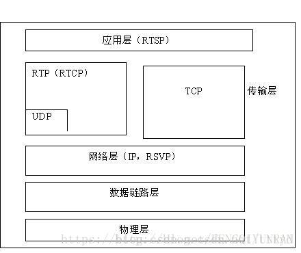

参考文档

> [一篇文章读懂流媒体传输协议RTP、RTCP、RTSP、SRTP&SRTCP](https://www.itread01.com/content/1541922003.html)
>
> [RTCP协议](https://winddoing.github.io/post/32277.html)

* 以太网最大的传输单元是1500字节
* TCP是按字节传输的，所以是流式的
* RTP也有序列号，RTP是按包传输的


一句话：RTSP发起/终结流媒体、RTP传输流媒体资料、RTCP对RTP进行控制，同步。
因为CTC标准里没有对RTCP进行要求，因此在标准RTSP的程式码中没有看到相关的部分。而在私有RTSP的程式码中，有关控制、同步等，是在RTP Header中做扩充套件定义实现的。另外，[RFC3550(datatracker)](https://datatracker.ietf.org/doc/rfc3550/)可以看作是[RFC1889](https://tools.ietf.org/html/rfc1889)的升级文件，只看[RFC3550](https://tools.ietf.org/html/rfc3550)/ [RFC3551](https://tools.ietf.org/html/rfc3551)即可。

## RTP

### RTP简介

RTP(Real Time Transport Protocol)是针对Internet上多媒体资料流的一个传输协议,由IETF(Internet工程任务组)作为**RFC1889**释出。RTP被定义为在一对一或一对多的传输情况下工作，其目的是提供时间资讯和实现流同步。RTP的典型应用建立在UDP上，但也可以在TCP或ATM等其他协议之上工作。RTP本身只保证实时资料的传输，并不能为按顺序传送资料包提供可靠的传送机制，也不提供流量控制或拥塞控制，它依靠RTCP提供这些服务。

### RTP工作机制

多媒体资料传输的一个尖锐的问题就是不可预料资料到达时间。但是流媒体的传输是需要资料的适时的到达用以播放和回放。rtp协议就是提供了时间标签,序列号以及其它的结构用于控制适时资料的流放。在流的概念中”时间标签”是最重要的资讯。传送端依照即时的取样在资料包里隐蔽的设定了时间标签。在接受端收到资料包后,就依照时间标签按照正确的速率恢复成原始的适时的资料。不同的媒体格式调时属性是不一样的。但是rtp本身并不负责同步，rtp只是传输层协议，为了简化运输层处理，提高该层的效率。将部分运输层协议功能（比如流量控制）上移到应用层完成。同步就是属于应用层协议完成的。它没有运输层协议的完整功能，不提供任何机制来保证实时地传输资料，不支援资源预留，也不保证服务质量。rtp报文甚至不包括长度和报文边界的描述。同时rtp协议的资料报文和控制报文的使用相邻的不同埠，这样大大提高了协议的灵活性和处理的简单性。
 rtp协议和udp二者共同完成运输层协议功能。udp协议只是传输资料包，不管资料包传输的时间顺序。rtp的协议资料单元是用udp分组来承载的。在承载rtp资料包的时候，有时候一帧资料被分割成几个包具有相同的时间标签，则可以知道时间标签并不是必须的。而udp的多路复用让rtp协议利用支援显式的多点投递，可以满足多媒体会话的需求。
 rtp协议虽然是传输层协议但是它没有作为osi体系结构中单独的一层来实现。rtp协议通常根据一个具体的应用来提供服务，rtp只提供协议框架，开发者可以根据应用的具体要求对协议进行充分的扩充套件。

### RTP协议报文结构


```cpp
struct RTP_Header {
	unsigned __int16 csrc_count:4;
	unsigned __int16 extension:1;
	unsigned __int16 padding:1;
	unsigned __int16 version:2;
	unsigned __int16 payloadtype:7;
	unsigned __int16 marker:1;
 
	unsigned __int16 seq;
	unsigned __int32 timestamp;
	unsigned __int32 ssrc;
};
```


开始12个八进位制出现在每个RTP包中，而CSRC标识列表仅出现在混合器插入时。各段含义如下： 
**①版本（V）** 
version (V): 2 bits 2位，标识RTP版本,协议初始版本为0，RFC3550中规定的版本号为2。。 

**②填充标识（P）** 

padding (P): 1 bit 1位，如设定填充位，在包末尾包含了额外的附加资讯，它不属于有效载荷。附加资讯的最后一个位元组表示额外附加资讯的长度（包含该位元

组本身）。该栏位之所以存在是因为某些加密演算法需要固定大小的填充字，或为在底层协议资料单元中携带几个RTP包。 

**③扩充套件（X）** 

extension (X): 1 bit 1位，如果该位被设定，则在固定的头部后存在一个扩充套件头部，格式定义在RFC3550 5.3.1节。 

扩展头都是tlv（type length value）格式的数据，每个type的含义是信令层传输的

**④CSRC计数（CC）** 

CSRC count (CC): 4 bits 4位，CSRC计数包括紧接在固定头后标识CSRC个数。 

**⑤标记（M）** 

marker (M): 1 bit 1位，标记解释由设定定义，目的在于允许重要事件在包流中标记出来。设定可定义其他标示位，或通过改变位数量来指定没有标记位，该位的功能依赖于profile的定义。profile可以改变该位的长度，但是要保持marker和payload type总长度不变（一共是8 bit）。。 

**⑥载荷型别（PT）** 

payload type (PT): 7 bits 7位，记录后面资料使用哪种Codec ， receiver端找出相应的decoder解码出来，该位标记着RTP packet所携带资讯的型别，标准型别列出在RFC3551中。如果接收方不能识别该型别，必须忽略该packet。 

**⑦系列号** 

sequence number:16 bits 16位，系列号随每个RTP资料包传送后而增加1，接收方可以根据该序列号重新排列资料包顺序，或者探测包损失。系列号初值是随机的，使对加密的文字攻击更加困难。 

**⑧时标** 
timestamp: 32 bits 32位，时标反映RTP资料包中第一个八进位制数的取样时刻，取样时刻必须从单调、线性增加的时钟汇出，以允许同步与抖动计算。时标可以让receiver端知道在正确的时间将资料播放出来。 

  由上图可知，如果只有系列号，并不能完整按照顺序的将data播放出来，因为如果data中间有一段是没有资料的，只有系列号的话会造成错误，需搭配上让它知道在哪个时间将data正确播放出来，如此我们才能播放出正确无误的资讯。 

同一个帧时间戳是一样的

**⑨SSRC** 

SSRC: 32 bits 32位，SSRC段标识同步源。此标识不是随机选择的，目的在于使同一RTP包连线中没有两个同步源有相同的SSRC标识，也就是在一个RTP Session其间每个资料流都应该有一个不同的SSRC。尽管多个源选择同一个标识的概率很低，所有RTP实现都必须探测并解决冲突。如源改变源传输地址，也必须选择一个新SSRC标识以避免插入成环行源。 

**⑩CSRC列表** 
CSRC list: 0 to 15 items bits0到15项，每项32位。CSRC列表表示包内的对载荷起作用的源。标识数量由CC段给出。如超出15个作用源，也仅标识15个。CSRC标识由混合器插入，采用作用源的SSRC标识。只有存在Mixer的时候才有效。如一个将多声道的语音流合并成一个单声道的语音流，在这里就列出原来每个声道的SSRC。

从RTP资料报的格式不难看出，它包含了传输媒体的型别、格式、序列号、时间戳以及是否有附加资料等资讯，这些都为实时的流媒体传输提供了相应的基础。RTP协议的目的是提供实时资料（如互动式的音讯和视讯）的端到端传输服务，因此在RTP中没有连线的概念，它可以建立在底层的面向连线或面向非连线的传输协议之上；RTP也不依赖于特别的网路地址格式，而仅仅只需要底层传输协议支援组帧（Framing）和分段（Segmentation）就足够了；另外RTP本身还不提供任何可靠性机制，这些都要由传输协议或者应用程式自己来保证。在典型的应用场合下，RTP一般是在传输协议之上作为应用程式的一部分加以实现的


## RTCP

### RTCP简介

   RTCP(Real Time Contorl Protocol)负责管理传输质量在当前应用程序之间交换控制资讯。在RTP会话期间，各参与者周期性地传送RTCP包，包中含有已传送的资料包的数量、丢失的资料包的数量等统计资料。因此，伺服器可以利用这些资讯动态地改变传输速率，甚至改变有效载荷型别。RTP和RTCP配合使用，能以有效的反馈和最小的开销使传输效率最佳化，故特别适合传送网上的实时资料。

### RTCP工作机制

当应用程式开始一个rtp会话时将使用两个埠：一个给rtp，一个给rtcp。rtp本身并不能为按顺序传送资料包提供可靠的传送机制，也不提供流量控制或拥塞控制，它依靠rtcp提供这些服务。在rtp的会话之间周期的发放一些rtcp包以用来传监听服务质量和交换会话使用者资讯等功能。rtcp包中含有已传送的资料包的数量、丢失的资料包的数量等统计资料。因此，伺服器可以利用这些资讯动态地改变传输速率，甚至改变有效载荷型别。rtp和rtcp配合使用，它们能以有效的反馈和最小的开销使传输效率最佳化，因而特别适合传送网上的实时资料。根据使用者间的资料传输反馈资讯，可以制定流量控制的策略，而会话使用者资讯的互动，可以制定会话控制的策略。
   RTCP协议将控制包**周期传送**给所有连线者，应用与资料包相同的分布机制。低层协议提供资料与控制包的复用，如使用单独的UDP埠号。RTCP执行下列四大功能：
  主要是提供资料释出的质量反馈。是作为RTP传输协议的一部分，与其他传输协议的流和阻塞控制有关。反馈对自适应编码控制直接起作用，但IP组播经验表明，从传送者收到反馈对诊断发送错误是致关重要的。给所有参加者传送接收反馈报告允许问题观察者估计那些问题是区域性的，还是全域性的。诸如IP组播等释出机制使网路服务提供商类团体可能接收反馈资讯，充当第三方监控者来诊断网路问题。反馈功能由RTCP传送者和接收者报告执行。
   RTCP带有称作规范名字（CNAME）的RTP源持久传输层标识。如发现冲突，或程式重新启动，既然SSRC标识可改变，接收者需要CNAME跟踪参加者。接收者也需要CNAME与相关RTP连线中给定的几个资料流联络
   前两种功能要求所有参加者传送RTCP包，因此，为了RTP扩充套件到大规模数量，速率必须受到控制。让每个参加者给其它参加者传送控制包，就大独立观察参加者数量。该数量用语计算包传送的速率。
   第四个可选功能是传送最小连线控制资讯，如参加者辨识。最可能用在"松散控制"连线，那里参加者自由进入或离开，没有成员控制或引数协调，RTCP充当通往所有参加者的方便通道，但不必支援应用的所有控制通讯要求。在IP组播场合应用RTP时，前3个功能是必须的，推荐用于所有情形。RTP应用设计人员必须避免使用仅在单播模式下工作的机制，那将导致无法扩充套件规模。


#### RTCP头部

```
0                   1                   2                   3
  0 1 2 3 4 5 6 7 8 9 0 1 2 3 4 5 6 7 8 9 0 1 2 3 4 5 6 7 8 9 0 1
 +-+-+-+-+-+-+-+-+-+-+-+-+-+-+-+-+-+-+-+-+-+-+-+-+-+-+-+-+-+-+-+-+
 |V=2|P|   FMT   |       PT      |          length               |
 +-+-+-+-+-+-+-+-+-+-+-+-+-+-+-+-+-+-+-+-+-+-+-+-+-+-+-+-+-+-+-+-+
 |                  SSRC of packet sender                        |
 +-+-+-+-+-+-+-+-+-+-+-+-+-+-+-+-+-+-+-+-+-+-+-+-+-+-+-+-+-+-+-+-+
 |                  SSRC of media source                         |
 +-+-+-+-+-+-+-+-+-+-+-+-+-+-+-+-+-+-+-+-+-+-+-+-+-+-+-+-+-+-+-+-+
 :            Feedback Control Information (FCI)                 :
 :                                                               :
```


```cpp
struct RTCP_Header {
	unsigned __int16 csrc_count:5;
	unsigned __int16 padding:1;
	unsigned __int16 version:2; //1 char
	unsigned __int16 payloadtype:8; //2 char
	unsigned __int16 length; //3,4 char
 
	unsigned __int32 ssrc; //5,6,7,8 char
};
```

- version (V), 2bits : 标识当前 RTP 版本 2
- padding (P), 1bit : 填充位标识
- Feedback message type (FMT), 5bits : 标识反馈消息的类型
- Payload type (PT), 8 bits : rtcp 包的类型
- Length, 16 bits :


RTCP资料报
在RTCP通讯控制中，RTCP协议的功能是通过不同的RTCP资料报来实现的，主要有如下几种型别：
**①SR** :传送端报告，所谓传送端是指发出RTP资料报的应用程式或者终端，传送端同时也可以是接收端。
**②RR** :接收端报告，所谓接收端是指仅接收但不传送RTP资料报的应用程式或者终端。
**③SDES** :源描述，主要功能是作为会话成员有关标识资讯的载体，如使用者名称、邮件地址、电话号码等，此外还具有向会话成员传达会话控制资讯的功能。
**④BYE** :通知离开，主要功能是指示某一个或者几个源不再有效，即通知会话中的其他成员自己将退出会话。
**⑤APP** :由应用程式自己定义，解决了RTCP的扩充套件性问题，并且为协议的实现者提供了很大的灵活性。

RTCP 有两个最重要的报文：RR 和 SR 。通过这两个报文的交换，各端就知道自己的网络质量到底如何了。


**SDES:源描述RTCP包**
SDES包为三层结构，由头与资料块组成，资料块可以没有，也可有多个，组成项描述块所表明的源。项描述如下：
版本（V）、填充（P）、长度：如SR包中所描述。
包型别（PT）： 8位，包含常数202，识别RTCP SDES包。
源计数（SC）： 5位，包含在SDES包中的SSRC/CSRC块数量，零值有效，但没有意义。
源描述项内容如下：
CNAME:规范终端标识SDES项CNAME标识属性如下：
    如发生冲突或重启程式，由于随机分配的SSRC标识可能发生变化，需要CNAME项提供从SSRC标识到仍为常量的源标识的系结。象SSRC标识，CNAME标识在RTP连线的所有参加者中应是唯一的。为了提供一套相关RTP连线中某个参加者所采用的跨多媒体工具间的系结，CNAME应固定为那个参加者。为方便第三方监控，CNAME应适合程式或人员定位源。
NAME：使用者名称称SDES项
**BYE：断开RTCP包**
   如混合器接收到一个BYE包，混合器转发BYE包，而不改变SSRC/CSRC标识。如混合器关闭，它也应该发出一个BYE包，列出它所处理的所有源，而不只是自己的SSRC标识。作为可选项，BYE包可包括一个8位八进位制计数，后跟很多八进位制文字，表示离开原因，如："camera malfunction"或"RTP loop detected"。字串具有同样的编码，如在SDES中所描述的。如字串填充包至下32位边界，字串就不以空结尾；否则，BYE包以空八进位制填充。
**APP：定义应用的RTCP包**
APP包用于开发新应用和新特征的实验，不要求注册包型别值。带有不可识别名称的APP包应被忽略掉。测试后，如确定应用广泛，推荐重新定义每个APP包，而不用向IANA注册子型别和名称段。


#### RTCP分类

| 类型 |               缩写               |    用途    |
| :--: | :------------------------------: | :--------: |
| 200  |       SR（Sender Report）        | 发送端报告 |
| 201  |      RR（Receiver Report）       | 接收端报告 |
| 202  | SDES（Source Description Items） |  源点描述  |
| 203  |               BYE                |  结束传输  |
| 204  |               APP                |  特定应用  |

#### RTCP 的扩展

| 类型 |            缩写            |       用途       |                    所在 RFC                     |
| :--: | :------------------------: | :--------------: | :---------------------------------------------: |
| 195  | 1J(Extended Jitter Report) | 扩展 Jitter 报告 |                    RFC 5450                     |
| 205  |    RTPFB(Transport FB)     |    传输层反馈    | [RFC 4585](https://tools.ietf.org/html/rfc4585) |
| 206  | PSFB(Payload-specific FB)  |   负载相关反馈   |                    RFC 5104                     |
| 207  |    XR(Exteneded Report)    |     扩展报告     |                    RFC 3611                     |

#### FMT 报文子类型

| 类型 | 子类型 |     缩写     |                        用途                         |
| :--: | :----: | :----------: | :-------------------------------------------------: |
| 205  |   1    | Generic NACK |                    RTP 丢包重传                     |
|  -   |   3    |    TMMBR     |   Temporary Maximum Media Stream Bitrate Request    |
|  -   |   4    |    TMMBN     | Temporary Maximum Media Stream Bitrate Notification |
| 206  |   1    |     PLI      |               Picture Loss Indication               |

#### 通用NACK

> 通用NACK消息由`PT=RTPFB`和标识`FMT=1`。

消息语法:

```
0                   1                   2                   3
  0 1 2 3 4 5 6 7 8 9 0 1 2 3 4 5 6 7 8 9 0 1 2 3 4 5 6 7 8 9 0 1
 +-+-+-+-+-+-+-+-+-+-+-+-+-+-+-+-+-+-+-+-+-+-+-+-+-+-+-+-+-+-+-+-+
 |            PID                |             BLP               |
 +-+-+-+-+-+-+-+-+-+-+-+-+-+-+-+-+-+-+-+-+-+-+-+-+-+-+-+-+-+-+-+-+
```

- PID：数据包ID（PID）：16位
  - 丢失 RTP 包的 ID
- BLP：后续丢失数据包的位掩码（BLP）：16位
  - 从 PID 开始接下来 16 个 RTP 数据包的丢失情况，一个 NACK 报文可以携带多个 RTP 序列号，NACK 接收端对这些序列号逐个处理。


### RTCP 主要完成四个功能服务：

1. RTCP 提供数据分发质量反馈信息。这是 RTP 作为传输协议的部分功能并且它涉及到了其它传输协议的流控制和拥塞控制。
2. RTCP 为 RTP 源携带一个持久性传输层标识符，称为规范名或 CNAME 。由于一旦发现冲突或程序重启时， SSRC 标识符会随之改变，所以接收方需要 CNAME 来跟踪每一个参与者。同时接收方还要求 CNAME 能够与一组相关 RTP 会话中来自于给定参与者的多重数据流相关联，例如同步视频和音频。
3. 上述前两个功能要求所有的参与者都要发送 RTCP 包，因此必须控制速率以便 RTP 按比例增加大量的参与者。通过每一个参与者发送各自的控制包给其它所有参与者，每一个参与者能够独立观察到参与者数量，该数量可用来计算控制包的发送速率。
4. OPTIONAL 功能用于传送最少会话控制信息，例如在用户界面显示参与者标识。这对于“松散受控”会话（在没有成员控制或阐述协商的情况下，参与者可以加入或退出该会话）是非常有用的。

上述功能 1 － 3 适用于所有环境，尤其是 IP 组播环境。 RTP 应用程序设计者应该避免设计只能工作于单播模式并且不能增加到大量数量的机制。在某些情况下如单向链接中，不可能有来自接收方的反馈，所以 RTCP 的传输就可能由发送方和接收方分别独立控制。

## RTSP

### RTSP简介

是由Real Networks和Netscape共同提出的。该协议定义了一对多应用程式如何有效地通过IP网路传送多媒体资料。RTSP提供了一个可扩充套件框架，使实时资料，如音讯与视讯的受控、点播成为可能。资料来源包括现场资料与储存在剪辑中的资料。该协议目的在于控制多个数据传送连线，为选择传送通道，如UDP、多播UDP与TCP提供途径，并为选择基于RTP上传送机制提供方法。RTSP参考文件[RFC2336](https://tools.ietf.org/html/rfc2326)

RTSP（Real Time Streaming Protocol）是用来控制声音或影像的多媒体串流协议，并允许同时多个串流需求控制，传输时所用的网路通讯协定并不在其定义的范围内，伺服器端可以自行选择使用TCP或UDP来传送串流内容，它的语法和运作跟HTTP 1.1类似，但并不特别强调时间同步，所以比较能容忍网路延迟。而前面提到的允许同时多个串流需求控制（Multicast），除了可以降低伺服器端的网路用量，更进而支援多方视讯会议（Video Conference）。因为与HTTP1.1的运作方式相似，所以代理伺服器《Proxy》的快取功能《Cache》也同样适用于RTSP，并因RTSP具有重新导向功能，可视实际负载情况来转换提供服务的伺服器，以避免过大的负载集中于同一伺服器而造成延迟。

RTSP协议以客户伺服器方式工作，它是一个多媒体播放控制协议，用来使使用者在播放从因特网下载的实时资料（音讯和视讯流）时能够进行控制，如：暂停/继续、后退、前进等。因此RTSP 又称为“因特网录影机遥控协议”。

 要实现RTSP 的控制功能，不仅要有协议，而且要有专门的媒体播放器(media player)和媒体伺服器(media server)。媒体伺服器与媒体播放器的关系是伺服器与客户的关系。媒体伺服器与普通的全球资讯网伺服器的最大区别就是媒体伺服器支援流式音讯和视讯的传送，因而在客户端的媒体播放器可以边下载边播放（需要先快取一小段时间的节目） 。但从普通全球资讯网伺服器下载多媒体节目时，是先将整个档案下载完毕，然后再进行播放。RTSP 仅仅是使媒体播放器能控制多媒体流的传送。因此，RTSP 又称为带外协议，而多媒体流是使用RTP 在带内传送的。


### RTSP协议特点

* 可扩充套件性：新方法和引数很容易加入RTSP。
* 易解析：RTSP可由标准HTTP或MIME解析器解析。
* 安全：RTSP使用网页安全机制。
* 独立于传输：RTSP传输通道，可使用不可靠资料包协议（UDP）或可靠资料包协议（RDP），如要实现应用级可靠，可使用诸如TCP的可靠流协议。
* 记录装置控制：协议可控制记录和回放装置。
* 适合专业应用：通过SMPTE时标，RTSP支援帧级精度，允许远端数字编辑。
* 演示描述中立：协议未强加特殊演示或元档案，可传送所用格式型别；然而，演示描述至少需包含一个RTSP URI。
* 代理与防火墙友好：协议可由应用和传输层防火墙处理。防火墙需要理解SETUP方法，为UDP媒体流开启一个“缺口”。
* 适当的伺服器控制：如使用者启动一个流，则也可以停止一个流。
* 传输协调：实际处理连续媒体流前，使用者可协调传输方法。
* 效能协调：如基本特征无效，则必须有一些清理机制让使用者决定那种方法不生效。这允许使用者提出适合自己的介面。

### RTSP与HTTP

RTSP在功能上与HTTP有重叠，最明显的交叉是在流媒体内容的释出上——----大多是通过网页进行的。目前的协议规范同时允许网页伺服器和流媒体伺服器支援RTSP实现。例如，演示描述可通过HTTP或RTSP获取，这样减少了基于浏览器情况下的往返传递时间，同时也支援独立的RTSP伺服器与不依赖HTTP的客户端通讯。
但是，RTSP与HTTP的本质差别在于以下五个方面

* RTSP和HTTP是两个不同的协议，它们**采用不同的方法和协议标志符**。
*  RTSP**协议的资料传送不占用协议频宽，并且以不同的协议传送**。
*  HTTP是一个**不对称协议**，客户端发出请求，伺服器应答。在RTSP中，客户端和伺服器都可发出请求，且请求是有状态的。
*  HTTP是一个**无状态协议**，而RTSP在任何情况下，必须保持一定状态，以便在请求确认后的很长时间内，仍可设定引数，控制媒体流。
*  RTSP使用ISO 10646（UTF-8）定义，而不使用ISO 8859-1定义，保持与当前的HTML一致。

虽然大多数实时媒体采用RTP作为传输协议，但RTSP并不系结RTP。重用HTTP的功能至少在两个方面有好处:安全和代理。由于要求非常接近，因此在快取、代理和授权上采用HTTP功能是有价值的。

HTTP与RTSP传输的差别。概括的讲，RTSP被许多公司防火墙拒绝，而HTTP可以作为一个普通的档案通过；RTSP适合于大资料量、高可用性的流，如直播事件、长事件或大型档案；HTTP更适合于较小的资料传输和互动；当终端使用者正在观看时，RTSP允许使用者在伺服器有效的回放媒体，HTTP更象下载一段媒体并在客户机上播放。从终端使用者观点来看，RTSP看起来像是档案从中心位置播放，有点象广播，而HTTP感觉更象时从视讯库中取视讯，并在家里的机器上播放。从服务质量的观点上看，对于流，RTSP有更好的体验，RTSP提供类似于VCR的媒体控制，如暂停、快进、倒退和绝对定位。使用HTTP传输，只能在整个流下载完成后，播放器软体再模拟该过程。虽然，RTSP能够使用TCP或UDP，但是RTSP控制经常与RTP联合使用，以最好的服务质量传送实际的媒体资料。

###  RTSP 报文结构

RTSP有两类报文：**请求报文**和**响应报文**。 
   请求报文是指从客户向伺服器传送请求报文，响应报文是指从伺服器到客户的回答。由于RTSP是面向正文的(text-oriented)，因此在报文中的每一个栏位都是一些ASCII码串，因而每个栏位的长度都是不确定的。RTSP报文由三部分组成，即**开始行、首部行和实体主体**。在请求报文中，开始行就是请求行，RTSP请求报文的结构


RTSP请求报文的方法包括：**OPTIONS**（获得伺服器提供的可用方法）、**DESCRIBE**（得到会话描述资讯）、**SETUP**（客户端提醒伺服器建立会话，并确定传输模式）、**TEARDOWN**（客户端发起关闭请求）、**ANNOUNCE** (更新会话描述）**、PLAY**（客户端传送播放请求）、**PAUSE（**临时停止流，而不释放伺服器资源**）**、**GET_PARAMETER（**取得流控制引数，可能某些伺服器不支援**）**和**SET_PARAMETER （**设定流控制引数，可能某些伺服器不支援**）。**响应报文的开始行是状态行，RTSP响应报文的结构如图所示。


### RTSP互动过程

C表示RTSP客户端，S表示RTSP服务端 
① C->S: OPTION request //询问S有哪些方法可用 
  S->C: OPTION response //S回应资讯中包括提供的所有可用方法 
② C-> S: DESCRIBE request //要求得到S提供的媒体初始化描述资讯 
  S->C: DESCRIBE response //S回应媒体初始化描述资讯，主要是sdp 
③ C->S: SETUP request //设定会话属性，以及传输模式，提醒S建立会话 
  S->C: SETUP response //S建立会话，返回会话识别符号及会话相关资讯 
④ C->S: PLAY request //C请求播放 
  S->C: PLAY response //S回应请求资讯 
  S->C:传送流媒体资料 
⑤ C->S: TEARDOWN request //C请求关闭会话 
  S->C: TEARDOWN response //S回应请求 
上述的过程是标准的RTSP流程，其中第3步和第4步是必需的。 

http和rtsp在功能上有相似重叠的地方，RTSP采用了HTTP/1.1大多数的状态码，并且增加了RTSP特定的状态码。 
HTTP协议定义了8种可能的请求方法： 
———————————— 
GET检索URI中标识资源的一个简单请求 
HEAD与GET方法相同，伺服器只返回状态行和头标，并不返回请求文件 
POST伺服器接受被写入客户端输出流中的资料的请求 
PUT伺服器储存请求资料作为指定URI新内容的请求 
DELETE伺服器删除URI中命名的资源的请求 
OPTIONS关于伺服器支援的请求方法资讯的请求 
TRACE Web伺服器反馈Http请求和其头标的请求 
CONNECT已文件化但当前未实现的一个方法，预留做隧道处理 
———————————— 
rtsp和http的协议规范分别在[RFC2326](https://tools.ietf.org/html/rfc2326)和[RFC2616](https://datatracker.ietf.org/doc/rfc2616/)有详细描述 
mms协议为微软的私有协议，未公开协议。采用私有自定义控制结构体来发送命令，而不是像http，rtsp协议采用传送文字命令控制

> RTP/RTSP/RTCP的区别用一句简单的话总结：**RTSP发起/终结流媒体、RTP传输流媒体资料、RTCP对RTP进行控制，同步。**

### RTSP与RTP

RTP不象http和ftp可完整的下载整个影视档案，它是以固定的资料率在网路上传送资料，客户端也是按照这种速度观看影视档案，当影视画面播放过后，就不可以再重复播放，除非重新向伺服器端要求资料。

   RTSP与RTP最大的区别在于：RTSP是一种双向实时资料传输协议，它允许客户端向伺服器端传送请求，如回放、快进、倒退等操作。当然，RTSP可基于RTP来传送资料，还可以选择TCP、UDP、组播UDP等通道来发送资料，具有很好的扩充套件性。它时一种类似与http协议的网路应用层协议。目前碰到的一个应用：伺服器端实时采集、编码并发送两路视讯，客户端接收并显示两路视讯。由于客户端不必对视讯资料做任何回放、倒退等操作，可直接采用UDP+RTP+组播实现。



RTP传输音讯/视讯资料，如果是PLAY，Server传送到Client端，如果是RECORD，可以由Client传送到Server 
整个RTP协议由两个密切相关的部分组成：RTP资料协议和RTP控制协议（即RTCP） 。


RTSP的请求主要有DESCRIBE,SETUP,PLAY,PAUSE,TEARDOWN,OPTIONS等，顾名思义可以知道起对话和控制作用 
RTSP的对话过程中SETUP可以确定RTP/RTCP使用的埠，PLAY/PAUSE/TEARDOWN可以开始或者停止RTP的传送

### RTSP其他

 RTSP在制定时较多地参考了HTTP/1.1协议，甚至许多描述与HTTP/1.1完全相同。RTSP之所以特意使用与HTTP/1.1类似的语法和操作，在很大程度上是为了相容现有的Web基础结构，正因如此，HTTP/1.1的扩充套件机制大都可以直接引入到RTSP中。由RTSP控制的媒体流集合可以用表示描述（Presentation Description）来定义，所谓表示是指流媒体伺服器提供给客户机的一个或者多个媒体流的集合，而表示描述则包含了一个表示中各个媒体流的相关资讯，如资料编码/解码演算法、网路地址、媒体流的内容等。虽然RTSP伺服器同样也使用识别符号来区别每一流连线会话（Session），但RTSP连线并没有被系结到传输层连线（如TCP等），也就是说在整个RTSP连线期间， RTSP使用者可开启或者关闭多个对RTSP伺服器的可靠传输连线以发出RTSP 请求。此外，RTSP连线也可以基于面向无连线的传输协议（如UDP等）。

 RTSP协议目前支援以下操作： 检索媒体：允许使用者通过HTTP或者其它方法向媒体伺服器提交一个表示描述。如表示是组播的，则表示描述就包含用于该媒体流的组播地址和埠号；如果表示是单播的，为了安全在表示描述中应该只提供目的地址。邀请加入：媒体伺服器可以被邀请参加正在进行的会议，或者在表示中回放媒体，或者在表示中录制全部媒体或其子集，非常适合于分散式教学。新增媒体：通知使用者新加入的可利用媒体流，这对现场讲座来讲显得尤其有用。与HTTP/1.1类似，RTSP请求也可以交由代理、通道或者快取来进行处理。

## SRTP & SRTCP

参考 **[RFC3711](https://link.jianshu.com/?t=https://www.rfc-editor.org/info/rfc3711)**
  安全实时传输协议（Secure Real-time Transport Protocol或SRTP）是在实时传输协议（Real-time Transport Protocol或RTP）基础上所定义的一个协议，旨在为单播和多播应用程式中的实时传输协议的资料提供加密、讯息认证、完整性保证和重放保护。它是由David Oran（思科）和Rolf Blom（爱立信）开发的，并最早由IETF于2004年3月作为RFC3711释出。
  由于实时传输协议和可以被用来控制实时传输协议的会话的实时传输控制协议（RTP Control Protocol或RTCP）有着紧密的联络，安全实时传输协议同样也有一个伴生协议，它被称为安全实时传输控制协议（Secure RTCP或SRTCP）；安全实时传输控制协议为实时传输控制协议提供类似的与安全有关的特性，就像安全实时传输协议为实时传输协议提供的那些一样。
  在使用实时传输协议或实时传输控制协议时，使不使用安全实时传输协议或安全实时传输控制协议是可选的；但即使使用了安全实时传输协议或安全实时传输控制协议，所有它们提供的特性（如加密和认证）也都是可选的，这些特性可以被独立地使用或禁用。唯一的例外是在使用安全实时传输控制协议时，必须要用到其讯息认证特性。


## 相关协议的头部结构

**IP 包头结构:**


**TCP 包头结构:**


**UDP 包头结构:** 


**RTP 包头结构:**


**RTCP 包头结构:**

```
0                   1                   2                   3
  0 1 2 3 4 5 6 7 8 9 0 1 2 3 4 5 6 7 8 9 0 1 2 3 4 5 6 7 8 9 0 1
 +-+-+-+-+-+-+-+-+-+-+-+-+-+-+-+-+-+-+-+-+-+-+-+-+-+-+-+-+-+-+-+-+
 |V=2|P|   FMT   |       PT      |          length               |
 +-+-+-+-+-+-+-+-+-+-+-+-+-+-+-+-+-+-+-+-+-+-+-+-+-+-+-+-+-+-+-+-+
 |                  SSRC of packet sender                        |
 +-+-+-+-+-+-+-+-+-+-+-+-+-+-+-+-+-+-+-+-+-+-+-+-+-+-+-+-+-+-+-+-+
 |                  SSRC of media source                         |
 +-+-+-+-+-+-+-+-+-+-+-+-+-+-+-+-+-+-+-+-+-+-+-+-+-+-+-+-+-+-+-+-+
 :            Feedback Control Information (FCI)                 :
 :                                                               :
```


**RTCP 包头结构（SR）:**


**RTCP 包头结构（RR）:**

```
0                   1                   2                   3
      0 1 2 3 4 5 6 7 8 9 0 1 2 3 4 5 6 7 8 9 0 1 2 3 4 5 6 7 8 9 0 1
     +-+-+-+-+-+-+-+-+-+-+-+-+-+-+-+-+-+-+-+-+-+-+-+-+-+-+-+-+-+-+-+-+
header |V=2|P|    RC   |   PT=RR=201   |             length            |
     +-+-+-+-+-+-+-+-+-+-+-+-+-+-+-+-+-+-+-+-+-+-+-+-+-+-+-+-+-+-+-+-+
     |                     SSRC of packet sender                     |
     +=+=+=+=+=+=+=+=+=+=+=+=+=+=+=+=+=+=+=+=+=+=+=+=+=+=+=+=+=+=+=+=+
report |                 SSRC_1 (SSRC of first source)                 |
block  +-+-+-+-+-+-+-+-+-+-+-+-+-+-+-+-+-+-+-+-+-+-+-+-+-+-+-+-+-+-+-+-+
1    | fraction lost |       cumulative number of packets lost       |
     +-+-+-+-+-+-+-+-+-+-+-+-+-+-+-+-+-+-+-+-+-+-+-+-+-+-+-+-+-+-+-+-+
     |           extended highest sequence number received           |
     +-+-+-+-+-+-+-+-+-+-+-+-+-+-+-+-+-+-+-+-+-+-+-+-+-+-+-+-+-+-+-+-+
     |                      interarrival jitter                      |
     +-+-+-+-+-+-+-+-+-+-+-+-+-+-+-+-+-+-+-+-+-+-+-+-+-+-+-+-+-+-+-+-+
     |                         last SR (LSR)                         |
     +-+-+-+-+-+-+-+-+-+-+-+-+-+-+-+-+-+-+-+-+-+-+-+-+-+-+-+-+-+-+-+-+
     |                   delay since last SR (DLSR)                  |
     +=+=+=+=+=+=+=+=+=+=+=+=+=+=+=+=+=+=+=+=+=+=+=+=+=+=+=+=+=+=+=+=+
report |                 SSRC_2 (SSRC of second source)                |
block  +-+-+-+-+-+-+-+-+-+-+-+-+-+-+-+-+-+-+-+-+-+-+-+-+-+-+-+-+-+-+-+-+
2    :                               ...                             :
     +=+=+=+=+=+=+=+=+=+=+=+=+=+=+=+=+=+=+=+=+=+=+=+=+=+=+=+=+=+=+=+=+
     |                  profile-specific extensions                  |
     +-+-+-+-+-+-+-+-+-+-+-+-+-+-+-+-+-+-+-+-+-+-+-+-+-+-+-+-+-+-+-+-+
```


## RTMP

> [RTMP推流方案总结](https://www.cnblogs.com/linuxAndMcu/p/12538915.html)

### 简介

RTMP(Real Time Messaging Protocol) 实时消息传送协议是 Adobe Systems 公司为 Flash 播放器和服务器之间音频、视频和数据传输开发的私有协议。

它有三种变种：

* 工作在 TCP 之上的明文协议，使用端口 1935；
* RTMPT 封装在 HTTP 请求之中，可穿越防火墙；

* RTMPS 类似 RTMPT，但使用的是 HTTPS 连接；

RTMP 协议就像一个用来装数据包的容器，这些数据可以是 AMF 格式的数据,也可以是 FLV 中的视/音频数据。一个单一的连接可以通过不同的通道传输多路网络流。这些通道中的包都是按照固定大小的包传输的。


### RTMP服务器

RTMP 服务器，现成的开源方案有以下几种推荐：

#### 1. nignx

Nginx("engine x") 是一款是由俄罗斯的程序设计师 Igor Sysoev 所开发高性能的 Web 和反向代理 服务器，也是一个 IMAP/POP3/SMTP 代理服务器。在高连接并发的情况下，Nginx 是 Apache 服务器不错的替代品。

我们这里使用的是 Nginx 的 rtmp 插件实现实时流推送，具体实现可以参考我的另一篇博客：[Windows 搭建 nginx RTMP 服务器](https://www.cnblogs.com/linuxAndMcu/p/12517787.html)


#### 2. srs

[SRS](http://ossrs.net/)(Simple RTMP Server) 是国人写的一款非常优秀的开源流媒体服务器软件，使用 C++ 开发，可用于直播/录播/视频客服等多种场景，其定位是运营级的互联网直播服务器集群。SRS 提供了丰富的接入方案将 RTMP 流接入 SRS，包括推送 RTMP 到 SRS、推送 RTSP/UDP/FLV 到 SRS、拉取流到 SRS。SRS 还支持将接入的 RTMP 流进行各种变换，譬如将 RTMP 流转码、流截图、转发给其他服务器、转封装成 HTTP-FLV 流、转封装成 HLS、转封装成 HDS、录制成 FLV。GitHub 源码链接为：https://github.com/ossrs/srs


#### 3. crtmpserver c++

crtmpserver 是一个由 C++ 语言编写的开源的 RTMP 流媒体服务器，与其对应的商业产品自然是 Adobe 公司的 FMS。与 FMS 相比，从功能上来说crtmpserver 只能称为 FMS 的简化版本，其功能并没有 FMS 那么完善甚至是远远没有达到。其与 flash player 的兼容性自然也比不上官方的 FMS 了。但是 crtmpserver 提供了最常见的 RTMP 实现。作为开源的高性能 RTMP 流媒体服务器，不仅可以用在 x86 平台的 linux 服务器，windows 服务器，还可以被用在 arm 等嵌入式平台上。crtmpserver 的代码结构良好，类的继承体系清楚，代码效率高。是学习 RTMP 协议和服务器端编程的好例子。GitHub 源码链接为：https://github.com/shiretu/crtmpserver

crtmpserver 源码依赖 openssl，所以不管是在 Linux 还是 Windows 平台下，都需要先编译 openssl 库，具体编译请参考：[crtmpserver系列(二)：搭建简易流媒体直播系统](https://www.cnblogs.com/wangqiguo/p/6014519.html)


#### 4. livego

[Go](https://golang.org/)（又称Golang，[wiki](https://en.wikipedia.org/wiki/Go_(programming_language)) [中文](https://zh.wikipedia.org/wiki/Go)）是Google开发的一种静态强类型、编译型、并发型，并具有垃圾回收功能的开源编程语言（[github](https://github.com/golang/go)），支持windows、linux、macOS等操作系统。

livego 是基于 go 语言的 rtmp 直播服务器。go 语言为服务器性能而生，开发效率远远高过 C/C++。GitHub 源码链接为：https://github.com/gwuhaolin/livego

**为什么基于golang?**

go 在语言基本支持多核 CPU 均衡使用，支持海量轻量级线程，提高其并发量。当前开源的缺陷：

- srs 只能运行在一个单核下，如果需要多核运行，只能启动多个 srs 监听不同的端口来提高并发量；
- ngx-rtmp 启动多进程后，报文在多个进程内转发，需要二次开发，否则静态推送到多个子进程，效能消耗大；

go 在语言级别解决了上面多进程并发的问题。具体请参考：[默默前行的livego--基于go语言的rtmp直播服务器](https://www.cnblogs.com/runner42/p/7248974.html)


#### 5. node-rtsp-rtmp-server

Node.js 是一个基于 Chrome V8 引擎的 JavaScript 运行环境。 Node.js 使用了一个事件驱动、非阻塞式 I/O 的模型。

node-rtsp-rtmp-server 是使用 Node.js 实现的 rtmp 服务器。GitHub 源码链接为：https://github.com/iizukanao/node-rtsp-rtmp-server


#### 测试

测试的话下载个推流工具，建议使用[大牛直播](https://www.daniulive.com/index.php/sdk-demo下载/)提供的推流工具，也可以使用 FFmpeg 推流。


### 为什么直播用RTMP而不用RTSP

**主要是因为**浏览器不支持rtsp，flash不支持rtsp，面向广播的直播，基本都是rtmp，因为cdn对rtmp支持好，对要是即时通讯的，更多的是rtp。udp的包频率太高也可能会被通讯节点限流。

rtsp的能量在UDP传输这块，实际上公网环境下大量的UDP包，容易被防火墙block住，相对靠谱的模式，是rtsp over http tunnel，如果需要web端播放rtsp流的话，需要写插件，而且对浏览器也很挑剔。另外一个方面，**目前的CDN都是基于RTMP的**。


**rtmp兴起的原因是flash。以前**网页要想直播只能flash而不是html5。比如国内网页直播始祖douyutv前身acfun生放送，那时候要想网页直播只能flash，所以rtmp是最好选择。

但，**rtsp其实比rtmp更复杂**，rtsp需要两个连接，一个信令一个rtp数据，更多操心的地方，代码量其实更大。

**rtmp看似复杂，其实在流媒体直播里面更科学，**比如分chunk，可以让音频包不会被大包视频发送所阻塞，但是大部分代码都是一个视频包一次发完，所以这个功能没用上。**虽然rtmp有一些冗余设计，但是总规来说rtmp是目前直播协议的最广泛选择。**

rtsp的udp不适合外网传输，所以在外网下，不存在理论的rtsp比rtmp更快。

**rtmp如何更低延迟？**

**推送端编码低延迟**：h264编码是需要设置为低延迟编码的，如若默认，h264从编码到解码本来的延迟就非常非常大。比如x264，ultrafast zerolatency这些都是实时音视频会议用的。

**服务器低延迟：**等待gop,如果一个服务器在一个新连接上来后，不发送缓存gop而是直接等待，等待下一个gop开始，这样就能到达超低延迟。

**客户端处理：**客户端也需要优化低延迟播放。


未来可能有协议替代rtmp，但还需要时间，毕竟obs只支持rtmp。可能未来出现的是udp之上的可靠协议，比如现在已经出现的srt。


## NTP

### 前言

NTP(Network Time Protocol）网络时间协议基于UDP，用于网络时间同步的协议，使网络中的计算机时钟同步到UTC，再配合各个时区的偏移调整就能实现精准同步对时功能。提供NTP对时的服务器有很多，比如微软的NTP对时服务器，利用NTP服务器提供的对时功能，可以使我们的设备时钟系统能够正确运行。


### NTP报文格式


NTP报文格式如上图所示，它的字段含义参考如下：

* LI 闰秒标识器，占用2个bit
* VN 版本号，占用3个bits，表示NTP的版本号，现在为3
* Mode 模式，占用3个bits，表示模式
* stratum（层），占用8个bits
* Poll 测试间隔，占用8个bits，表示连续信息之间的最大间隔
* Precision 精度，占用8个bits，，表示本地时钟精度
* Root Delay根时延，占用8个bits，表示在主参考源之间往返的总共时延
* Root Dispersion根离散，占用8个bits，表示在主参考源有关的名义错误
* Reference Identifier参考时钟标识符，占用8个bits，用来标识特殊的参考源    
* 参考时间戳，64bits时间戳，本地时钟被修改的最新时间。
* 原始时间戳，客户端发送的时间，64bits。
* 接受时间戳，服务端接受到的时间，64bits。
* 传送时间戳，服务端送出应答的时间，64bits。
* 认证符（可选项）


抛开复杂的协议报文，我们来理解一下NTP客户端与服务器的交互过程，进而理解参考时间戳、原始时间戳、接受时间戳、传送时间戳的关系。如图，客户端和服务端都有一个时间轴，分别代表着各自系统的时间，当客户端想要同步服务端的时间时，客户端会构造一个NTP协议包发送到NTP服务端，客户端会记下此时发送的时间t0，经过一段网络延时传输后，服务器在t1时刻收到数据包，经过一段时间处理后在t2时刻向客户端返回数据包，再经过一段网络延时传输后客户端在t3时刻收到NTP服务器数据包。特别声明，t0和t3是客户端时间系统的时间、t1和t2是NTP服务端时间系统的时间，它们是有区别的。对于时间要求不那么精准设备，直接使用NTP服务器返回t2时间也没有太大影响。但是作为一个标准的通信协议，它是精益求精且容不得过多误差的，于是必须计算上网络的传输延时。客户端与服务端的时间系统的偏移定义为θ、网络的往返延迟定义为δ，基于此，可以对t2进行精确的修正，已达到相关精度要求，它们的计算公式如下：


式中：

* t0是请求数据包传输的客户端时间戳
* t1是请求数据包回复的服务器时间戳
* t2是响应数据包传输的服务器时间戳
* t3是响应数据包回复的客户端时间戳

对此，我们只需将NTP服务端返回的时间t2加上网络延时δ的一半就可以了（t2+δ/2）。


### NTP请求样例（code）

```cpp
#include <sys/types.h>  
#include <sys/stat.h> 
#include <sys/ioctl.h> 
#include <sys/socket.h>
#include <sys/wait.h> 
#include <sys/time.h>
#include <netdb.h>
#include <netinet/in.h>
#include <arpa/inet.h>
#include <unistd.h> 
#include <stdio.h>  
#include <stdlib.h>
#include <string.h>  
#include <pthread.h>   
#include <dirent.h> 
#include <time.h>
#include <fcntl.h> 
#include <errno.h>
 
#define debugprintf 1
#ifdef debugprintf
	#define debugpri(mesg, args...) fprintf(stderr, "[NetRate print:%s:%d:] " mesg "\n", __FILE__, __LINE__, ##args) 
#else
	#define debugpri(mesg, args...)
#endif
 
#define JAN_1970     		0x83aa7e80
#define NTPFRAC(x) (4294 * (x) + ((1981 * (x))>>11))
#define USEC(x) (((x) >> 12) - 759 * ((((x) >> 10) + 32768) >> 16))
#define Data(i) ntohl(((unsigned int *)data)[i])
#define LI 0
#define VN 3
#define MODE 3
#define STRATUM 0
#define POLL 4 
#define PREC -6
struct NtpTime 
{
	unsigned int coarse;
	unsigned int fine;
};
 
void sendPacket(int fd)
{
	unsigned int data[12];
	struct timeval now;
 
	if (sizeof(data) != 48) 
	{
    	fprintf(stderr,"size error\n");
    	return;
	}
 
	memset((char*)data, 0, sizeof(data));
	data[0] = htonl((LI << 30) | (VN << 27) | (MODE << 24) | (STRATUM << 16) | (POLL << 8) | (PREC & 0xff));//构造协议头部信息
	data[1] = htonl(1<<16);
	data[2] = htonl(1<<16);
	gettimeofday(&now, NULL);
	data[10] = htonl(now.tv_sec + JAN_1970);//构造传输时间戳
	data[11] = htonl(NTPFRAC(now.tv_usec));
	send(fd, data, 48, 0);
}
//获取NTP服务器返回的时间
void getNewTime(unsigned int *data,struct timeval *ptimeval)
{
	struct NtpTime trantime;
	trantime.coarse = Data(10);
	trantime.fine   = Data(11);
	
	ptimeval->tv_sec 	= trantime.coarse - JAN_1970;
	ptimeval->tv_usec 	= USEC(trantime.fine);
}
 
int getNtpTime(struct hostent* phost,struct timeval *ptimeval)
{
	if(phost == NULL)
	{
		debugpri("err:host is null!\n");
		return -1;
	}
	int sockfd;
	struct sockaddr_in addr_src,addr_dst;
	fd_set fds;
	int ret;
	int recv_len;
	unsigned int buf[12];
	memset(buf,0,sizeof(buf));
	int addr_len;
	int count = 0;
	
	struct timeval timeout;
 
	addr_len = sizeof(struct sockaddr_in);
 
	memset(&addr_src, 0, addr_len);
	addr_src.sin_family = AF_INET;
	addr_src.sin_addr.s_addr = htonl(INADDR_ANY);
	addr_src.sin_port = htons(0);
 
	memset(&addr_dst, 0, addr_len);
	addr_dst.sin_family = AF_INET;
	memcpy(&(addr_dst.sin_addr.s_addr), phost->h_addr_list[0], 4);
	addr_dst.sin_port = htons(123);//ntp默认端口123
 
	if(-1==(sockfd = socket(AF_INET,SOCK_DGRAM,IPPROTO_UDP)))//创建UDP socket
	{		
		debugpri("create socket error!\n");
		return -1;
	}
 
	ret = bind(sockfd, (struct sockaddr*)&addr_src, addr_len);//bind
	if(-1==ret)	
	{		
		debugpri("bind error!\n");		
		close(sockfd);		
		return -1;
	}
	
	ret = connect(sockfd, (struct sockaddr*)&addr_dst, addr_len);//连接NTP服务器
	if(-1==ret)	
	{		
		debugpri("connect error!\n");		
		close(sockfd);		
		return -1;
	}
	sendPacket(sockfd);	//发送请求包
	while (count < 50)//轮询请求
	{
		FD_ZERO(&fds);
		FD_SET(sockfd, &fds);
 
		timeout.tv_sec = 0;
		timeout.tv_usec = 100000;
		ret = select(sockfd + 1, &fds, NULL, NULL, &timeout);
		if (0 == ret)
		{
			count++;
			debugpri("ret == 0\n");
			sendPacket(sockfd);
			usleep(100*1000);
			continue;
		}
		if(FD_ISSET(sockfd, &fds))
		{
			recv_len = recvfrom(sockfd, buf, sizeof(buf), 0, (struct sockaddr *)&addr_dst, (socklen_t*)&addr_len);
			if(-1==recv_len)		
			{			
				debugpri("recvfrom error\n");			
				close(sockfd);			
				return -1;
			}
			else if(recv_len > 0)
			{
				debugpri("receiv data\n");
				getNewTime(buf,ptimeval);
				debugpri("sec = %d usec = %d",ptimeval->tv_sec ,ptimeval->tv_usec);//打印输出NTP服务器返回的时间
				break;
			}
		}
		else
		{
			debugpri("count %d \n",count);
			usleep(50*1000);
			count ++;
		}
	}
	if(count >=50)
	{
		debugpri("getNewTime   timeout fail \n");
		close(sockfd);
		return -1;
	}
	close(sockfd);
	return 0;
}
 
int main(int argc, char** argv)
{
	struct timeval TimeSet;
	static struct hostent *host = NULL;
	
	host = gethostbyname(argv[1]);
	memset(&TimeSet ,0 ,sizeof(TimeSet));
	getNtpTime(host,&TimeSet);
	return 0;
}
```


### 常用的NTP服务端站点

time.windows.com

time.nist.gov

s1a.time.edu.cn

s1c.time.edu.cn

time-nw.nist.gov

time-a.nist.gov

time-b.nist.gov

s1b.time.edu.cn

nist1.aol-ca.truetime.com


## 相关协议


