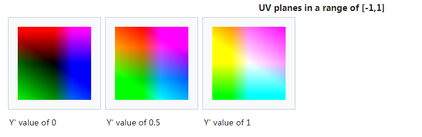

>参考文档：
>
>[如何理解YUV](https://zhuanlan.zhihu.com/p/85620611)
>
>[YUV 格式详解，只看这一篇就够了](https://www.jianshu.com/p/538ee63f4c1c)
>
>[对颜色空间YUV、RGB的理解](https://blog.csdn.net/asahinokawa/article/details/80596655)
>
>http://www.realrace.cn/

## RGB简介

RGB，Red, Green, Blue, 每一种颜色值的范围是0~255，所以每一个颜色用1个字节=8个bit便可完全在计算机内部表示出来。而R， G,  B不同的组合几乎产生了所有的颜色，当然自然界中的颜色比这些要远远丰富很多，采用R, G, B的方式，如果以24色深表示的话，在计算机中可表示的颜色数量有2^8* 2 ^8 * 2 ^8 = 16777216中颜色，虽没有自然界丰富，但也足以表示这个世界了。

### 加法三原色和减法三原色

**颜料三原色**（CMYK）：品红、黄、青(天蓝)、黑  。色彩三原色可以混合出所有颜料的颜色，同时相加为黑色，黑白灰属于无色系。

**光学三原色**（RGB）：红、绿、蓝(靛蓝)。光学三原色混合后，组成显示屏显示颜色，三原色同时相加为白色，白色属于无色系（黑白灰）中的一种。


​	

对RGB，并不陌生，从初中开始接触的色光的三原色，告诉我们我们可以看到的光可以由这三种颜色按一定的比例去混合得到；后来在HTML以及Android开发中设置元素/控件的颜色时，可以通过一串数字，得到某个特定的颜色。这就是RGB的应用。


​	RGB 模型是目前常用的一种彩色信息表达方式，它使用红、绿、蓝三原色的亮度来定量表示颜色。该模型也称为加色混色模型，是以RGB三色光互相叠加来实现混色的方法，因而适合于显示器等发光体的显示。

​	RGB 颜色模型可以看做三维直角坐标颜色系统中的一个单位正方体。任何一种颜色在RGB 颜色空间中都可以用三维空间中的一个点来表示。在RGB 颜色空间上，当任何一个基色的亮度值为零时，即在原点处，就显示为黑色。当三种基色都达到最高亮度时，就表现为白色。在连接黑色与白色的对角线上，是亮度等量的三基色混合而成的灰色，该线称为灰色线。

**BGR**

与RGB类似，只是存储时B位与R位的位置进行调换。

#### 互补色


色彩中的互补色有**红色与青色互补，蓝色与黄色互补，绿色与品红色互补**。在光学中指两种色光以适当的比例混合而能产生白光时，则这两种颜色就称为“互为补色”。补色并列时，会引起强烈对比的色觉，会感到红的更红、绿的更绿。

如果三原色光中某一种色光与某一种三原色光以外的色光等量相加后形成白光，则称这两种色光为互补色光。互补色光之间，能够形成相互阻挡的效果。于是可知以下三对互补色光：黄光与蓝光、红光与青光、绿光与品红光。

色彩中的互补色相互调和会使色彩纯度降低，变成灰色。一般作画的时候不用补色调和。

不过在两种颜色互为补色的时候，一种颜色占的面积远大于另一种颜色的面积的时候，就可以增强画面的对比，使画面能够很显眼。

**调色：**

* 减某个颜色等于加某个颜色的互补色
* 加某个颜色就等于减某个颜色的互补色

#### 对比色


对比色是人的视觉感官所产生的一种生理现象，是视网膜对色彩的平衡作用。指在24色相环上相距120度到180 度之间的两种颜色，称为对比色。
两种可以明显区分的色彩，叫对比色。包括色相对比、明度对比、饱和度对比、冷暖对比、补色对比、色彩和消色的对比等。是构成明显色彩效果的重要手段，也是赋予色彩以表现力的重要方法。其表现形式又有同时对比和相继对比之分。

比如黄和蓝、紫和绿、红和青，任何色彩和黑、白、灰，深色和浅色，冷色和暖色，亮色和暗色都是对比色关系。

补色是指在色谱中一原色和与其相对应的间色间所形成的互为补色关系。原色有三种，即红、黄、蓝，它们是不能再分解的色彩单位。三原色中每两组相配而产生的色彩称之为间色，如红加黄为橙色，黄加蓝为绿色，蓝加红为紫色，橙、绿、紫称为间色。

红与绿、橙与蓝、黄与紫就是互为补色的关系。由于补色有强烈的分离性，故在色彩绘画的表现中，在适当的位置恰当地运用补色，不仅能加强色彩的对比，拉开距离感，而且能表现出特殊的视觉对比与平衡效果。

### RGB格式

RGB在计算机中的表示主要分为两大类，一种是索引形式，一种是像素形式：

* **索引**：如RGB1，RGB4，RGB8，分别表示每个像素用1个bit，4个bit，8个bit来表示。这些 bit 存储的并非是实际的R，G，B值，而是对应点的像素在调色板中的索引。

  > 调色板，可以简单理解为通过编号映射到颜色的一张二维表。如01索引，表示红色。采用索引格式的RGB，红色的像素对应存储的值便是索引01。

* **像素**：如RGB565，RGB555，RGB24，RGB32，ARGB32，这些格式，存储的是每一个像素点的R，G，B值。比如RGB24，分别用8个bit去表示R, G, B。

#### RGB索引格式

* RGB1

每个像素用1个bit表示，可表示的颜色范围为双色，即最传统的黑和白。1个bit只能表示0，1两种值。需要调色板，不过调色板只包含两种颜色。

* RGB4

每个像素用4个bit表示，4个bit所能够表示的索引范围是0-15，共16个。也就是可以表示16种颜色。即调色板中包含16中颜色。

* RGB8

每个像素用8个bit表示。8个bit所能够表示的索引范围是0-255，共256个。也就是可以表示256中颜色。即调色板中包含256中颜色。

#### RGB16 格式

`RGB16`数据格式主要有二种：`RGB565`和`RGB555`。

- **RGB565**

> 每个像素用16比特位表示，占2个字节，RGB分量分别使用5位、6位、5位。
>
> 0xF800，0x07E0，0x001F是 RGB565 的 bit mask（位屏蔽），每种格式的bit mask不同。


```cpp
//获取高字节的5个bit
R = color & 0xF800;
//获取中间6个bit
G = color & 0x07E0;
//获取低字节5个bit
B = color & 0x001F;
```

```cpp
#define RGB565_MASK_RED 0xF800
#define RGB565_MASK_GREEN 0x07E0
#define RGB565_MASK_BLUE 0x001F
R = (wPixel & RGB565_MASK_RED) >> 11; // 取值范围0-31
G = (wPixel & RGB565_MASK_GREEN) >> 5; // 取值范围0-63
B = wPixel & RGB565_MASK_BLUE; // 取值范围0-31
#define RGB(r,g,b) (unsigned int)( (r << 11) | (g << 6) | b )
```

- **RGB555**

> 每个像素用16比特位表示，占2个字节，RGB分量都使用5位(最高位不用)。


```java
//获取高字节的5个bit
R = color & 0x7C00;
//获取中间5个bit
G = color & 0x03E0;
//获取低字节5个bit
B = color & 0x001F;
```

```cpp
#define RGB555_MASK_RED 0x7C00
#define RGB555_MASK_GREEN 0x03E0
#define RGB555_MASK_BLUE 0x001F
R = (wPixel & RGB555_MASK_RED) >> 10; // 取值范围0-31
G = (wPixel & RGB555_MASK_GREEN) >> 5; // 取值范围0-31
B = wPixel & RGB555_MASK_BLUE; // 取值范围0-31
#define RGB(r,g,b) (unsigned int)( (r << 10) | (g << 5) | b )
```

#### RGB24格式

> BGR888和RGB888**待考证**

`RGB24图像`每个像素用`8比特位`表示，占`1个字节`，注意：`在内存中RGB各分量的排列顺序为：BGR BGR BGR ......`。


```cpp
R  =  color & 0x000000FF; 
G  =  color & 0x0000FF00;
B  =  color & 0x00FF0000;
```

```cpp
typedef struct tagRGBTRIPLE {
	BYTE rgbtBlue; // 蓝色分量
	BYTE rgbtGreen; // 绿色分量
	BYTE rgbtRed; // 红色分量
} RGBTRIPLE;
```

#### RGB32格式

`RGB32图像`每个像素用`32比特位`表示，占`4个字节`，`R，G，B`分量分别用8个bit表示，存储顺序为`B，G，R`，最后`8个字节`保留。注意：`在内存中RGB各分量的排列顺序为：BGRA BGRA BGRA ......`。

- **ARGB32**（ARGB8888）

> 本质就是带`alpha通道`的`RGB24`，与`RGB32`的区别在与，保留的`8个bit`用来表示透明，也就是`alpha`的值。

在内存中的分量排列顺序如下：


```java
R = color & 0x0000FF00;
G = color & 0x00FF0000;
B = color & 0xFF000000;
A = color & 0x000000FF;
```

```cpp
typedef struct tagRGBQUAD {
	BYTE rgbBlue; // 蓝色分量
	BYTE rgbGreen; // 绿色分量
	BYTE rgbRed; // 红色分量
	BYTE rgbReserved; // 保留字节（用作Alpha通道或忽略）
} RGBQUAD;
```

* RGB32

与ARGB32相比缺少Alpha通道，最后8bit保留，不使用。

#### 其他格式

* ALPHA_8

> 每个像素占四位，只有透明度，没有颜色。

* ARGB_4444

> 每个像素占四位，即A=4，R=4，G=4，B=4，那么一个像素点占4+4+4+4=16位

在API level 13之后，ARGB_4444由于图片效果较差等原因，在以该种格式操作图片时，会被ARGB_8888，默认替代，ARGB_4444中每个像素也占用了4个字节。使用时注意。

* RGB1555
* RGB888
* RGB8888

### RGB常见格式互相转换

#### RGB565 <---> RGB888

> RGB565相比于RGB888缺少精度

RGB565 ---> RGB888

> 将RGB565中r、g、b都提取出来补成1字节，进一步处理便可转成RGB888

```cpp
#define R565(p) ( (BYTE) ( (p>>11) <<3) )
#define G565(p) ( (BYTE) ( ((p&0x07E0)>>5) <<2) )
#define B565(p) ( (BYTE) ( (p&0x1F) <<3) )

//Color 为 short
R = (unsigned char)((Color & 0xF800) >> 8);
G = (unsigned char)((Color & 0x07E0) >> 3);
B = (unsigned char)((Color & 0x1F) << 3);
```

RGB888 ---> RGB565

```cpp
//COLOR 为 int
//将RGB888中r、g、b都提取出来去掉末尾多余的精度，进一步处理便可转成RGB565
R = (unsigned char)((Color & 0xFF0000) >> 19);
G = (unsigned char)((Color & 0xFF00) >> 10);
B = (unsigned char)((Color & 0xFF) >> 3);

// r、g、b分别从RGB888中提取出来，再使用RGB16(r, g, b)便可转换完成
#define RGB16(r, g, b) ( ((r>>3)<<11) | ((g>>2)<<5) | (b>>3) ) // 5:6:5 mode
```

ARGB8888 -> ARGB1555

```cpp
#define ARGB1555(a,r,g,b) ( (a<<15) | ((r>>3)<<10) | ((g>>3)<<5) | (b>>3) )
```

ARGB8888 -> ARGB4444

```cpp
#define ARGB4444(a,r,g,b) ( ((a>>4)<<12) | ((r>>4)<<8) | ((g>>4)<<4) | (b>>4) )
```


## YUV

正如几何上用坐标空间来描述坐标集合，色彩空间用数学方式来描述颜色集合。常见的3 个基本色彩模型是[RGB](https://baike.baidu.com/item/RGB)，[CMYK](https://baike.baidu.com/item/CMYK)和[YUV](https://baike.baidu.com/item/YUV)。

Y’UV、YUV、YCbCr、YPbPr 几个概念其实是一回事儿。由于历史关系，Y’UV、YUV 主要是用在彩色电视中，用于模拟信号表示。YCbCr 是用在数字视频、图像的压缩和传输，如 MPEG、JPEG。今天大家所讲的 YUV 其实就是指 YCbCr。Y 表示亮度（luma），CbCr 表示色度（chroma）。

luminance 亮度，luma 是在视频编码系统中指**亮度值**；chrominance 色度，chroma 是在视频编码系统中指**色度值**。

Y’UV 设计的初衷是为了使彩色电视能够兼容黑白电视。对于黑白电视信号，没有色度信息也就是(UV)，那么在彩色电视显示的时候指显示亮度信息。

Y’UV 不是 Absolute Color Space（绝对色彩空间），只是一种 RGB 的信息编码，实际的显示还是通过 RGB 来显示。Y’，U，V 叫做不同的 component（零件）

### YCbCr简介

> 相关内容：	
>
> ​	YCbCr 是在世界数字组织视频标准研制过程中作为ITU - R BT.601 建议的一部分，其实是YUV经过缩放和偏移的翻版。其中Y与YUV 中的Y含义一致,Cb,Cr 同样都指色彩，只是在表示方法上不同而已。在YUV 家族中，YCbCr 是在计算机系统中应用最多的成员，其应用领域很广泛，[JPEG](https://baike.baidu.com/item/JPEG)、[MPEG](https://baike.baidu.com/item/MPEG)均采用此格式。一般人们所讲的YUV大多是指YCbCr。YCbCr 有许多取样格式，如4∶4∶4，4∶2∶2，4∶1∶1 和4∶2∶0。
>
> ​	4:2:0表示每4个像素有4个亮度分量，2个色度分量 (YYYYCbCr），仅采样奇数扫描线，是便携式视频设备（MPEG-4）以及电视会议（H.263）最常用格式；4：2：2表示每4个像素有4个亮度分量，4个色度分量（YYYYCbCrCbCr），是DVD、数字电视、HDTV 以及其它消费类视频设备的最常用格式；4：4：4表示全像素[点阵](https://baike.baidu.com/item/点阵)(YYYYCbCrCbCrCbCrCbCr），用于高质量视频应用、演播室以及专业视频产品。

​	**YCbCr其中Y是指亮度分量，Cb指蓝色色度分量，而Cr指红色色度分量。**人的肉眼对视频的Y分量更敏感，因此在通过对色度分量进行子采样来减少色度分量后，肉眼将察觉不到的图像质量的变化。主要的子采样格式有 YCbCr 4:2:0、YCbCr 4:2:2 和 YCbCr 4:4:4。

​	**现在的YUV是通常用于计算机领域用来表示使用YCbCr编码的文件。**所以可以粗浅地视YUV为YCbCr。


Y要如何表示亮度呢，下面是Y在不同的情况下的表现：



**与RGB相比，同样是使用三个数来表示某个像素点的颜色，但是这三个数的意义变了。**


### YUV简介

​	人们常用RGB表示三基色，而且 RGB 也可以表示出所有颜色。但视觉心理学研究表明，人眼主要是对光的感知，人的视觉系统对光的感知程度用亮度（luminance）和色度（chrominance）两个属性表示，也就是我们常说的 YUV。**Y 就是亮度感知，而色度感知分为两个属性：色相（hue）和色饱和度（saturation）。色相也就是 U，是由光波的峰值定义的，描述的是光的颜色；色饱和度 V 是光波的谱宽定义的，描述的是光的纯度。**

​	YUV 是一种彩色编码系统，主要用在视频、图形处理流水线中(pipeline)。相对于 RGB 颜色空间，设计 YUV 的目的就是为了编码、传输的方便，减少带宽占用和信息出错。

​	与我们熟知的RGB类似，YUV也是一种颜色编码方法，主要用于电视系统以及模拟视频领域，它将亮度信息（Y）与色彩信息（UV）分离，**没有UV信息一样可以显示完整的图像**（是不是写错了），只不过是黑白的，这样的设计很好地解决了彩色电视机与黑白电视的兼容问题。并且，YUV不像RGB那样要求三个独立的视频信号同时传输，所以用YUV方式传送占用极少的频宽。

​	YUV码流的存储格式其实与其采样的方式密切相关，主流的采样方式有三种，**YUV4:4:4，YUV4:2:2，YUV4:2:0**。

### YUV分类

​	首先，我们可以将 YUV 格式按照数据大小分为三个格式，YUV 420，YUV 422，YUV 444。由于人眼对 Y 的敏感度远超于对 U 和 V 的敏感，所以有时候可以多个 Y 分量共用一组 UV，这样既可以极大得节省空间，又可以不太损失质量。这三种格式就是按照人眼的特性制定的。

- YUV 420，由 4 个 Y 分量共用一套 UV 分量，
- YUV 422，由 2 个 Y 分量共用一套 UV 分量
- YUV 444，不共用，一个 Y 分量使用一套 UV 分量

> 以黑点表示采样该像素点的Y分量，以空心圆圈表示采用该像素点的UV分量。


​	

​	按照多个 Y 分量共用一个 UV 的方式，我们可以把 YUV 分为 420，422，444 三种类型，而在这三种类型之下，我们又可以按照 YUV 的排列储存顺序，将其细分为好多种格式。首先，我们将可以按照 YUV 的排列方式，再次将 YUV 分成两个大类，**Planar**（平面格式）和 **Packed**（打包格式）。平面格式还包括**Semi-Planar** （半平面格式），也可以分为三类。

- Planar YUV 三个分量分开存放
- Semi-Planar Y 分量单独存放，UV 分量交错存放
- Packed YUV 三个分量全部交错存放


#### 具体分类

##### I420（属于 YUV 420 Planar）

​	I420 是 YUV 420 Planar 的一种，YUV 分量分别存放，先是 w * h 长度的 Y，后面跟 w * h * 0.25 长度的 U， 最后是 w * h * 0.25 长度的 V，总长度为 w * h * 1.5。

```cpp
Y Y Y Y Y Y
Y Y Y Y Y Y
Y Y Y Y Y Y
Y Y Y Y Y Y
Y Y Y Y Y Y
Y Y Y Y Y Y
U U U
U U U
U U U
V V V
V V V
V V V
```

##### YV12（属于 YUV 420 Planar）

​	YV12 是 YUV 420 Planar 的一种，YUV 分量分别存放，先是 w * h 长度的 Y，后面跟 w * h * 0.25 长度的 V， 最后是 w * h * 0.25 长度的 U，总长度为 w * h * 1.5。与 I420 不同的是，YV12 是先 V 后 U

```cpp
Y Y Y Y Y Y
Y Y Y Y Y Y
Y Y Y Y Y Y
Y Y Y Y Y Y
Y Y Y Y Y Y
Y Y Y Y Y Y
V V V
V V V
V V V
U U U
U U U
U U U
```

##### NV12（属于 YUV 420 Semi-Planar）

​	NV12 是 YUV 420 Semi-Planar 的一种，Y 分量单独存放，UV 分量交错存放，UV 在排列的时候，从 U 开始。总长度为 w * h * 1.5。

```cpp
Y Y Y Y Y Y
Y Y Y Y Y Y
Y Y Y Y Y Y
Y Y Y Y Y Y
Y Y Y Y Y Y
Y Y Y Y Y Y
U V U V U V
U V U V U V
U V U V U V
```

##### NV21（属于 YUV 420 Semi-Planar）

​	NV21 是 YUV 420 Semi-Planar 的一种，Y 分量单独存放，UV 分量交错存放，与 NV12 不同的是，UV 在排列的时候，从 V 开始。总长度为 w * h * 1.5。

```cpp
Y Y Y Y Y Y
Y Y Y Y Y Y
Y Y Y Y Y Y
Y Y Y Y Y Y
Y Y Y Y Y Y
Y Y Y Y Y Y
V U V U V U
V U V U V U
V U V U V U
```

##### I422（属于 YUV 422 Planar）

​	I422 是 YUV 422 Planar 的一种，YUV 分量分别存放，先是 w * h 长度的 Y，后面跟 w * h * 0.5 长度的 U， 最后是 w * h * 0.5 长度的 V，总长度为 w * h * 2。

```cpp
Y Y Y Y Y Y
Y Y Y Y Y Y
Y Y Y Y Y Y
Y Y Y Y Y Y
Y Y Y Y Y Y
Y Y Y Y Y Y
U U U U U U
U U U U U U
U U U U U U
V V V V V V
V V V V V V
V V V V V V
```

##### YV16（属于 YUV 422 Planar）

​	YV16 是 YUV 422 Planar 的一种，YUV 分量分别存放，先是 w * h 长度的 Y，后面跟 w * h * 0.5 长度的 V， 最后是 w * h * 0.5 长度的 U，总长度为 w * h * 2。与 I422 不同的是，YV16 是先 V 后 U

```cpp
Y Y Y Y Y Y
Y Y Y Y Y Y
Y Y Y Y Y Y
Y Y Y Y Y Y
Y Y Y Y Y Y
Y Y Y Y Y Y
V V V V V V
V V V V V V
V V V V V V
U U U U U U
U U U U U U
U U U U U U
```

##### NV16（属于 YUV 422 Semi-Planar）

​	NV16 是 YUV 422 Semi-Planar 的一种，Y 分量单独存放，UV 分量交错存放，UV 在排列的时候，从 U 开始。总长度为 w * h * 2。

```cpp
Y Y Y Y Y Y
Y Y Y Y Y Y
Y Y Y Y Y Y
Y Y Y Y Y Y
Y Y Y Y Y Y
Y Y Y Y Y Y
U V U V U V
U V U V U V
U V U V U V
U V U V U V
U V U V U V
U V U V U V
```

##### NV61（属于 YUV 422 Semi-Planar）

​	NV61 是 YUV 422 Semi-Planar 的一种，Y 分量单独存放，UV 分量交错存放，UV 在排列的时候，从 V 开始。总长度为 w * h * 2。

```cpp
Y Y Y Y Y Y
Y Y Y Y Y Y
Y Y Y Y Y Y
Y Y Y Y Y Y
Y Y Y Y Y Y
Y Y Y Y Y Y
V U V U V U
V U V U V U
V U V U V U
V U V U V U
V U V U V U
V U V U V U
```

##### YUVY（属于 YUV 422 Interleaved）

​	YUVY 属于 YUV 422 Interleaved 的一种。事实上，Interleaved 是属于 Packed 的，但是在 422 中，用 Interleaved 更加形象一些。在 Packed 内部，YUV 的排列顺序是 Y U V Y，两个 Y 共用一组 UV。

```cpp
Y U V Y   Y U V Y   Y U V Y
Y U V Y   Y U V Y   Y U V Y
Y U V Y   Y U V Y   Y U V Y
Y U V Y   Y U V Y   Y U V Y
Y U V Y   Y U V Y   Y U V Y
Y U V Y   Y U V Y   Y U V Y
```

##### VYUY（属于 YUV 422 Interleaved）

​	VYUY 属于 YUV 422 Interleaved 的一种。在 Packed 内部，YUV 的排列顺序是 VYUY，两个 Y 共用一组 UV。

```cpp
V Y U Y   V Y U Y   V Y U Y
V Y U Y   V Y U Y   V Y U Y
V Y U Y   V Y U Y   V Y U Y
V Y U Y   V Y U Y   V Y U Y
V Y U Y   V Y U Y   V Y U Y
V Y U Y   V Y U Y   V Y U Y
```

##### UYVY（属于 YUV 422 Interleaved）

​	UYVY 属于 YUV 422 Interleaved 的一种。在 Packed 内部，YUV 的排列顺序是 UYVY，两个 Y 共用一组 UV。

```cpp
U Y V Y   U Y V Y   U Y V Y
U Y V Y   U Y V Y   U Y V Y
U Y V Y   U Y V Y   U Y V Y
U Y V Y   U Y V Y   U Y V Y
U Y V Y   U Y V Y   U Y V Y
U Y V Y   U Y V Y   U Y V Y
```

##### I444（属于 YUV 444 Planar）

​	I444 属于 YUV 444 Planar 的一种。YUV 分量分别存放，先是 w * h 长度的 Y，后面跟 w * h 长度的 U， 最后是 w * h 长度的 V，总长度为 w * h * 3。

```cpp
Y Y Y Y Y Y
Y Y Y Y Y Y
Y Y Y Y Y Y
Y Y Y Y Y Y
Y Y Y Y Y Y
Y Y Y Y Y Y
U U U U U U
U U U U U U
U U U U U U
U U U U U U
U U U U U U
U U U U U U
V V V V V V
V V V V V V
V V V V V V
V V V V V V
V V V V V V
V V V V V V
```

##### YV24（属于 YUV 444 Planar）

​	YV24 属于 YUV 444 Planar 的一种。YUV 分量分别存放，先是 w * h 长度的 Y，后面跟 w * h 长度的 V， 最后是 w * h 长度的 U，总长度为 w * h * 3。与 I444 不同的是，YV24 是先排列 V。

```cpp
Y Y Y Y Y Y
Y Y Y Y Y Y
Y Y Y Y Y Y
Y Y Y Y Y Y
Y Y Y Y Y Y
Y Y Y Y Y Y
V V V V V V
V V V V V V
V V V V V V
V V V V V V
V V V V V V
V V V V V V
U U U U U U
U U U U U U
U U U U U U
U U U U U U
U U U U U U
U U U U U U
```

##### NV24（属于 YUV 444 Semi-Planar）

​	NV24 是 YUV 444 Semi-Planar 的一种，Y 分量单独存放，UV 分量交错存放，UV 在排列的时候，从 U 开始。总长度为 w * h * 3。

```cpp
Y Y Y Y Y Y
Y Y Y Y Y Y
Y Y Y Y Y Y
Y Y Y Y Y Y
Y Y Y Y Y Y
Y Y Y Y Y Y
U V U V U V U V U V U V 
U V U V U V U V U V U V 
U V U V U V U V U V U V 
U V U V U V U V U V U V 
U V U V U V U V U V U V 
U V U V U V U V U V U V 
```

##### NV42（属于 YUV 444 Semi-Planar）

​	NV42 是 YUV 444 Semi-Planar 的一种，Y 分量单独存放，UV 分量交错存放，UV 在排列的时候，从 V 开始。总长度为 w * h * 3。

```cpp
Y Y Y Y Y Y
Y Y Y Y Y Y
Y Y Y Y Y Y
Y Y Y Y Y Y
Y Y Y Y Y Y
Y Y Y Y Y Y
V U V U V U V U V U V U
V U V U V U V U V U V U
V U V U V U V U V U V U
V U V U V U V U V U V U
V U V U V U V U V U V U
V U V U V U V U V U V U
```

##### YUV 444 Packed

```cpp
Y U V   Y U V   Y U V   Y U V   Y U V   Y U V
Y U V   Y U V   Y U V   Y U V   Y U V   Y U V
Y U V   Y U V   Y U V   Y U V   Y U V   Y U V
Y U V   Y U V   Y U V   Y U V   Y U V   Y U V
Y U V   Y U V   Y U V   Y U V   Y U V   Y U V
Y U V   Y U V   Y U V   Y U V   Y U V   Y U V
```


### 色度二次采样（subsamping）

​	人眼的视觉特点是对亮度更铭感，对位置、色彩相对来说不铭感。在视频编码系统中为了降低带宽，可以保存更多的亮度信息(luma)，保存较少的色差信息(chroma)。这叫做 chrominance subsamping（色度二次采样）。

原则：在数字图像中

* 每一个图形像素都要包含 luma（亮度）值。
* 几个图形像素共用一个 Cb + Cr 值，一般是 2、4、8 个像素。

> 假设：
>
> 对于一个 w 宽、h 高的像素图，在水平方向，一行有 w 个像素；在垂直方向，一列有 h 个像素，整个图形有 w * h 个像素。我们把这个像素叫做**图形像素**。

如果用 YCbCr 像素格式来表示像素图，那么要搞清楚亮度和图形像素的关系，色度和图形像素的关系。


如上图中所示，左侧一列，每一个小矩形是图形像素表示，黑框矩形是色度像素表示，小黑点是表示色度像素值(Cb+Cr)，表示图形像素和色度像素在水平和垂直方向的比例关系。比如，

4：4：0 水平方向是1/1，垂直方向是1/2，表示一个色度像素对应了两个图形像素。

4：2：2 水平方向是1/2，垂直方向是1/1，表示一个色度像素对应了两个图形像素。

4：2：0 水平方向是1/2，垂直方向是1/2，表示一个色度像素对应了四个图形像素。

右侧一列是**二次采样模式记号**表示, 是` J:a:b `模式，实心黑色圆圈表示包含色度像素(Cb+Cr），空心圆圈表示不包含色度像素。对于` J:a:b` 模式，主要是围绕**参考块**的概念定义的，这个**参考块**是一个 J x 2 的矩形，J 通常是 4。这样，此**参考块**就是宽度有 4 个像素、高度有 2 个像素的矩形。a 表示**参考块**的第一行包含的色度像素样本数，b 表示在**参考块**的第二行包含的色度像素样本数。

4：4：0 参考块第一行包含四个色度样本，第二行没有包含色度样本。

4：2：2 参考块第一行包含两个色度样本，第二行也包含两个色度样本，他们是交替出现。

4：2：0 参考块第一行包含两个色度样本，第二行没有包含色度样本。

现在我们发现 yuv444，yuv422，yuv420 yuv 等像素格式的本质是：每个图形像素都会包含亮度值，但是某几个图形像素会共用一个色度值，这个比例关系就是通过 4 x 2 的矩形**参考块**来定的。这样很容易理解类似 yuv440，yuv420 这样的格式了。


### 平面格式（Planar formats）

平面格式是指用三个不同的数组来表示 YCbCr 的三个 Component，每一个 Component 都是通过不同的平面表示。为此，每一个 Component 会对应一个 plane。

yuv420p 也叫 i420 就是 yuv420 planar 表示。yuv420p 一共有三个平面分别是 Y，U，V，每一个平面都是用 8 bit 二进制数字表示，我们把 8 bit 称作位深度。

根据前面的介绍，如果用 yuv420p 来表示分辨率为 1280 * 720 的图片，需要占用多少存储空间呢？

每一个像素都需要一个 luma 值，即 y。那么总共需要 1280 * 720 = 921600 bytes。

每四个像素需要一个 chroma u 值，那么总共需要 1280 * 720 / 4 = 230400 bytes。

每四个像素需要一个 chroma v 值，那么总共需要 1280 * 720 / 4 = 230400 bytes。

把 y、u、v 三个 plane 加起来就是：921600 + 230400 + 230400 = 1382400 bytes。


### YUV与RGB的转换

BT601 UV 的坐标图（量化后）： （横坐标为u，纵坐标为v，左下角为原点）


通过坐标图我们可以看到UV并不会包含整个坐标系，而是呈一个旋转了一定角度的八边形, U越大蓝色越蓝，V越大，红色越红。

#### 名词解释

量化后:  Y~[16,235]  U ~[16-240]  V~[16-240]   量化就是让通过线性变换让Y 或 U 或V 处于一定的范围内， 比如让Y 【0,1】变到 Y' (16,235)  就这样来实行：  Y' = Y* （235-16）/(1-0)  + 16  即 Y' = 219*Y + 16  

未量化: Y~ [0,1]  U,V~[-0.5,0.5]

YUV ：即 YCbCr  两者是等价的

#### 转换公式

##### 模拟YUV->模拟RGB

1) BT601(标清国际定义)

```cpp
 //*********************BT601***********************************//
 //  Y = 0.299 * R + 0.587 * G + 0.114 * B	        　　　　 //
 // Pb =-0.169 * R - 0.331 * G + 0.500 * B	                //
 // Pr = 0.500 * R - 0.439 * G - 0.081 * B	                //
 //  R = Y + 1.402 * Pr                    　　　　　　　　　　　　　// 
 //  G = Y - 0.344 * Pb  - 0.792 * Pr　　 　　　　　　　　　　　　　　// 
 //  B = Y + 1.772 * Pb                    　　　　　　　　　　　　 // 
 //*********************BT601***********************************//
```

2)BT709(高清)

```cpp
  //*********************BT601***********************************//
  //  Y = 0.213 * R + 0.715 * G + 0.072 * B	        　　　　  //
  // Pb =-0.115 * R - 0.385 * G + 0.500 * B	                 //
  // Pr = 0.500 * R - 0.454 * G - 0.046 * B	                 //
  //  R = Y + 1.402 * Cr                    　　　　　　　　　　　　　// 
  //  G = Y - 0.344 * Cb  - 0.792 * Cr　　 　　　　　　　　　　　　　　// 
  //  B = Y + 1.772 * Cb                    　　　　　　　　　　　　 // 
  //*********************BT601***********************************//
```

##### 数字YUV->数字RGB

1)BT601

```cpp
//*********************BT601***********************************//
//  Y = 16  + 0.257 * R + 0.504 * g + 0.098 * b	               //
// Cb = 128 - 0.148 * R - 0.291 * g + 0.439 * b	               //
// Cr = 128 + 0.439 * R - 0.368 * g - 0.071 * b	               //
//  R = 1.164 *(Y - 16) + 1.596 *(Cr - 128)                    // 
//  G = 1.164 *(Y - 16) - 0.392 *(Cb - 128) - 0.812 *(Cr - 128)// 
//  B = 1.164 *(Y - 16) + 2.016 *(Cb - 128)                    // 
//*********************BT601***********************************//
```

2)BT709

```cpp
//*********************BT709***********************************//
//  Y = 16  + 0.183 * R + 0.614 * g + 0.062 * b	               //
// Cb = 128 - 0.101 * R - 0.339 * g + 0.439 * b	               //
// Cr = 128 + 0.439 * R - 0.399 * g - 0.040 * b	               //
//  R = 1.164 *(Y - 16) + 1.792 *(Cr - 128)                    // 
//  G = 1.164 *(Y - 16) - 0.213 *(Cb - 128) - 0.534 *(Cr - 128)// 
//  B = 1.164 *(Y - 16) + 2.114 *(Cb - 128)                    // 
//*********************BT709***********************************//
```


##### 模拟RGB转YUV的推导公式 ： 

```cpp
Wr + Wg + Wb = 1; UMax = 0.5; VMax = 0.5 
Y  = Wr * R + Wg * G + Wb * B;
Pb = Umax * (B - Y) / (1 - Wb);
Pr = Vmax * (R - Y) / (1 - Wr);
```

##### 数字RGB转YUV的推导公式：

```cpp
Wr + Wg + Wb = 1; Umax = Vmax = 0.5; 
Y = 16 + 219 * (Wr * R  + Wg * G + Wb * B)   / 255;
Cb = 128 + 224 * (Umax * (B - Y) / (1 - Wb)) / 255;
Cr = 128 + 224 * (Vmax * (R - Y) / (1 - Wr)) / 255;
```


BT601 Wr = 0.299 Wg = 0.587 Wb = 0.114

BT709 Wr = 0.2126 Wg = 0.7152 Wb = 0.0722

BT2020 Wr = 0.2627 Wg = 0.678 Wb = 0.0593


## 补充

### 色觉阶段学说

#### 感光


#### 处理


分为三个通道，不是RGB三个通道


### 模糊、虚化

人对于亮度的感知是对数视觉

相机存储的不是每个像素的亮度值，而是其亮度值的平方根


**模糊：**模糊是通过将各像素的亮度值替换为它和周围像素的平均值实现的

但是模糊时大部分电脑手机软件都计算错误，并没有把平方根平方后取平均值再开方，而是直接取平均值，导致变暗。


### 色域范围

BT.601是标清视频使用的色域范围，BT.709和BT.2020分别对应高清和超高清视频的色域。

BT.601 => SDTV

BT.709 => HDTV

BT.2020 => UHDTV