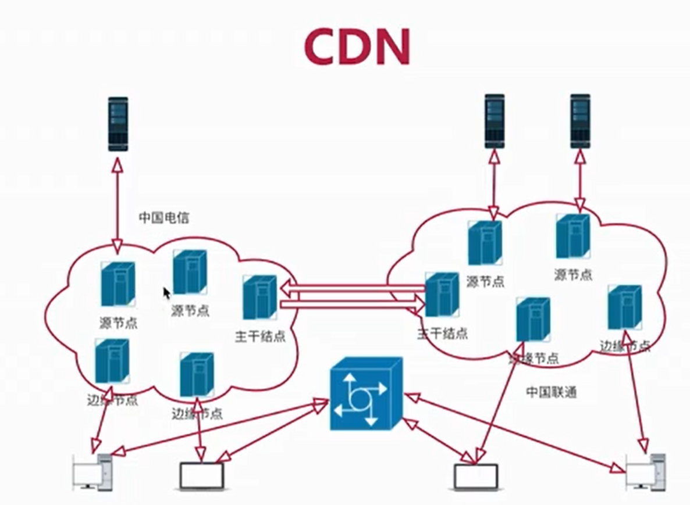

## 1. TCP/UDP

### 1.1 实时传输 TCP/UDP 协议的选择

为保证实时性，一般会选择 UDP ，就要考虑丢包、延迟、乱序的问题，这些问题需要在应用层解决。这也是 webRTC 的优势，webRTC会帮助你解决这些问题（虽然达不到完美，但也难已超越）。

在某些地区不能通过 UDP 进行实时传输时，就需要使用 TCP。

#### 1.1.1 TCP 

超时重传（RTO）时间范围：200ms ~ 120 s

tcp 虽然可以保证包的有序、可靠性到达，但是会牺牲**实时性**。尤其在极端情况下，大量的丢包会造成非常大的延迟。

## 2.CDN

* CDN(Content Delivery Network) 即内容分发网络。
* 最初的目的是解决静态页面的加速问题
* 通过就近接入方法解决用访问网络资源的问题

