# 音视频同步详解

> WebRTC版本：m74
>
> 参考文档：
>
> https://blog.csdn.net/sonysuqin/article/details/107297157

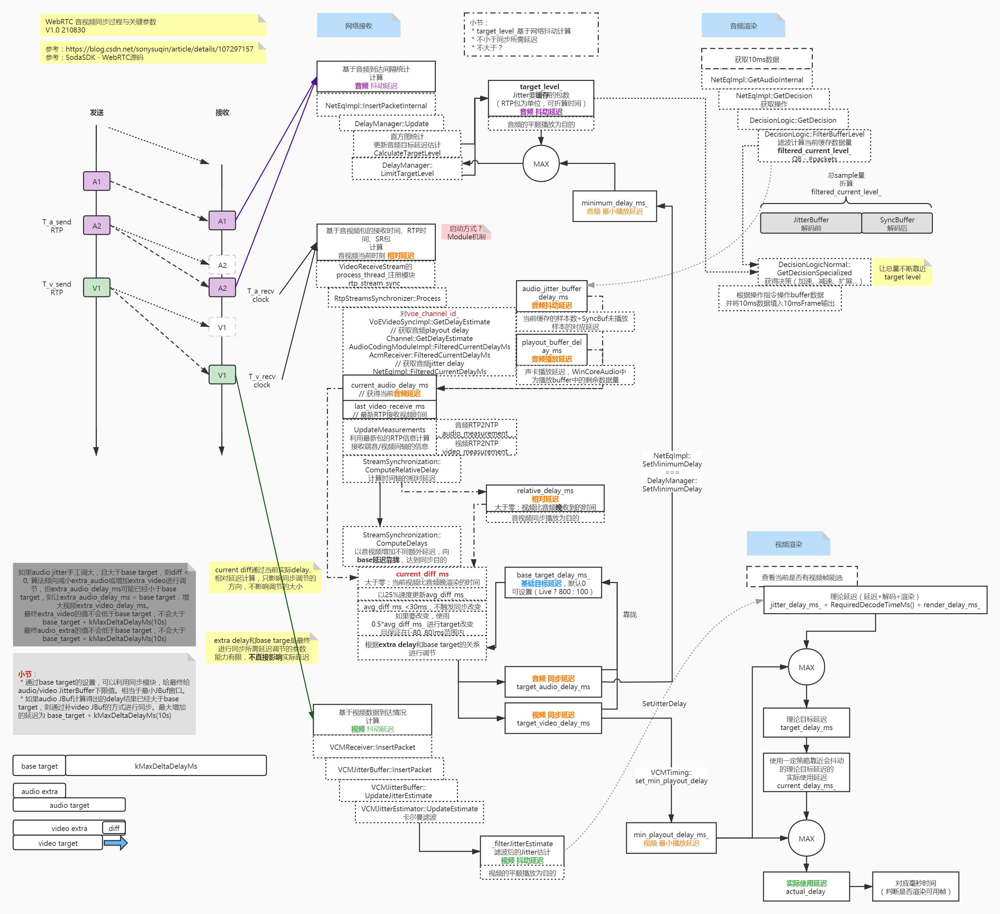

音视频同步是指音视频的rtp时间戳同步. audio/video rtp 时间戳不能自己同步，需要audio/video rtcp同步。


## 时间戳

音视频采样后会给每个音频采样、视频帧打一个时间戳，打包成RTP后放在RTP头中，称为RTP时间戳，RTP时间戳的单位依赖于音视频流各自的采样率。

RTP Header格式如下：

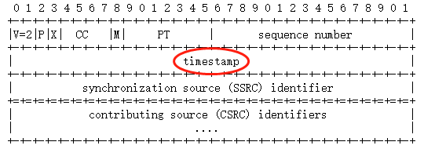

发送端以一定的频率发送RTCP SR(Sender Report)这个包，SR分为视频SR和音频SR，SR包内包含一个RTP时间戳和对应的NTP时间戳，可以用<ntp,rtp>对做音视频同步。（同步过程在后面）

rtcp sr 格式

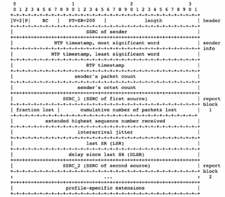


### 视频时间戳

视频时间戳的单位为1/90000秒，但是90000并不是视频的采样率，而只是一个单位，帧率才是视频的采样率。

比如: 25帧，每帧40ms。40ms有多少时间戳的基本单位呢? 40除以1/90k等于3600。

不同打包方式下的时间戳：

* Single Nalu：如果一个视频帧包含1个NALU，可以单独打包成一个RTP包，那么RTP时间戳就对应这个帧的采集时间；
* FU-A：如果一个视频帧的NALU过大(超过MTU)需要拆分成多个包，可以使用FU-A方式来拆分并打到不同的RTP包里，那么这几个包的RTP时间戳是一样的；
* STAP-A：如果某帧较大不能单独打包，但是该帧内部单独的NALU比较小，可以使用STAP-A方式合并多个NALU打包发送，但是这些NALU的时间戳必须一致，打包后的RTP时间戳也必须一致。

### 音频时间戳

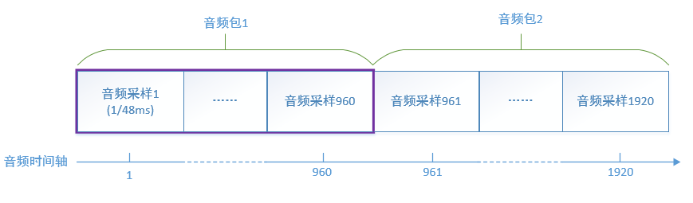

音频时间戳的单位就是采样率的倒数，例如采样率48000，那么1秒就有48000个采样，每个采样1/48ms，每个采样对应一个时间戳。RTP音频包一般打包20ms的数据，对应的采样数为 48000 * 20 / 1000 = 960，也就是说每个音频包里携带960个音频采样，因为1个采样对应1个时间戳，那么相邻两个音频RTP包的时间戳之差就是960。

### NTP时间戳

RTP的标准并没有规定音频、视频流的第一个包必须同时采集、发送，也就是说开始的一小段时间内可能只有音频或者视频，再加上可能的网络丢包，音频或者视频流的开始若干包可能丢失，那么不能简单认为接收端收到的第一个音频包和视频包是对齐的，需要一个共同的时间基准来做时间对齐，这就是NTP时间戳的作用。

RTP是相对时间，NTP是绝对时间。RTP时间戳和NTP时间戳表示的意义是相同的。可以互相转换，RTP=f(NTP)

NTP时间戳是从1900年1月1日00:00:00以来经过的秒数，发送端以一定的频率发送SR(Sender Report)这个RTCP包，分为视频SR和音频SR，SR包内包含一个RTP时间戳和对应的NTP时间戳，接收端收到后就可以确定某个流的RTP时间戳和NTP时间戳的对应关系，这样音频、视频的时间戳就可以统一到同一个时间基准下。

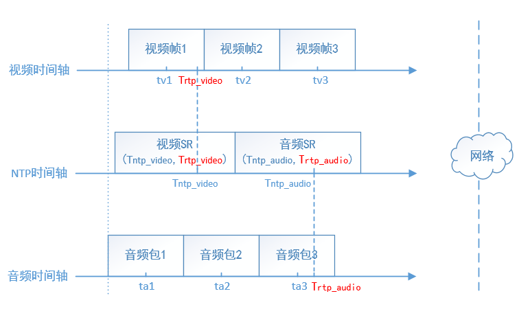

如上图，发送端的音视频流并没有对齐，但是周期地发送SR包，接收端得到音视频SR包的RTP时间戳、NTP时间戳后通过线性回归得到NTP时间戳Tntp和RTP时间戳Trtp时间戳的对应关系：

* T~ntp_audio~ = f(T~rtp_audio~)
* T~ntp_video~ = f(T~rtp_video~)

其中T~ntp~ = f(T~rtp~) = kT~rtp~ + b 为线性函数，这样接收端每收到一个RTP包，都可以将RTP时间戳换算成NTP时间戳，从而在同一时间基准下进行音视频同步。

### 播放时间

rtp时间戳如何转换成pts即显示时间的呢? 

pts= rtp 时间戳 * timebase。

例如：flv封装格式的time_base为{1,1000}，ts封装格式的time_base为{1,90000}。

flv: 

```cpp
pkt_pts=80, pkt_pts_time=80/1000=0.080000;
pkt_pts=120, pkt_pts_time=0.120000;
pkt_pts=160, pkt_pts_time=0.160000;
pkt_pts=200, pkt_pts_time=0.200000;
```

ts:

```cpp
pkt_pts=7200, pkt_pts_time=7200/90000=0.080000;
pkt_pts=10800, pkt_pts_time=0.120000;
pkt_pts=14400, pkt_pts_time=0.160000;
pkt_pts=18000, pkt_pts_time=0.200000;
```

av_rescale_q_rnd 函数用于时间基转换。

总结:

ntp，rtp，pts表示的是同一帧的时间。ntp是绝对时间，rtp是相对时间，pts是播放时间。rtp是用频率表示，pts是用秒表示。

如果音视频都从0同步开始，rtp等于pts。

如果不是同步开始，pts需要rtp 同步加减一个offer。rtp和pts是编解码时间即播放时间，不是传输时间，传输延时与rtp时间戳没关系。

具体实例看：https://blog.csdn.net/fdsafwagdagadg6576/article/details/108717668

### 延迟

视频延迟的单位为ms，对音频来说，由于采样跟时间戳一一对应，所有时间延迟都会被换算成了缓存大小(音频包的个数)，其值为：

```
音频延迟 = 时间延迟 << 8 / 20
```

也就是说，对48000的采样率，960个采样对应一个20ms包，时间延迟 / 20ms等于延迟了几个包，左移8(乘以256)也就是所谓的Q8，是为了用定点数表示一定精度的浮点数。


## 同步

### 一张图看懂音视频同步

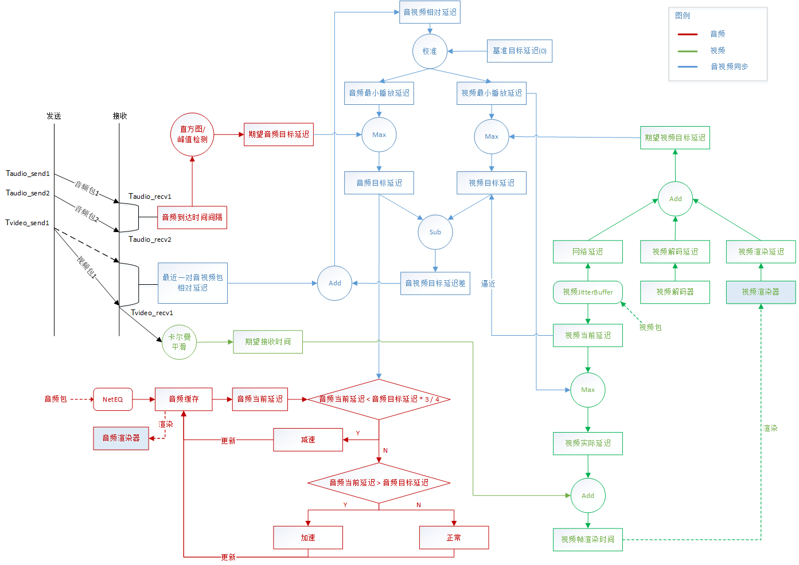

首先接收端需要按照音、视频各自的帧率来解码、渲染，保证流畅地播放，在这个基础上，需要计算音视频两个流目前的相对延迟，分别给音、视频两个流施加一定的延迟，保证音视频的同步。

> 延迟播放，也就意味着在缓存中暂时存放数据，延迟换流畅。

对音频来说，施加的延迟直接影响到音频缓存的大小，音频缓存的大小就体现了音频的播放延迟。

对视频来说，施加的延迟影响到视频帧的渲染时间，通过比较渲染时间和当前时间来决定解码后的视频帧需要等待还是需要立刻渲染。

正确设置好音视频各自的播放延迟后，音视频达到同步的效果。

可以看到，音视频同步中主要需要做到三点：

* 正确计算音视频相对延迟；
* 正确计算音视频各自的网络目标时延；
* 正确设置音视频各自的播放延迟。

### 音视频相对延迟

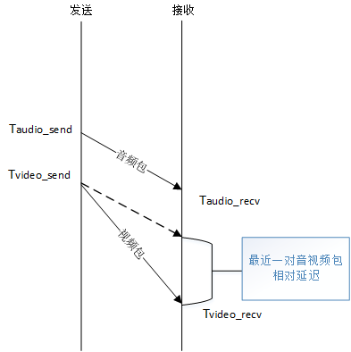

如上图：

最近一对音视频包的相对延迟 = (T~video_recv~ - T~audio_recv~) - (T~video_send~ - T~audio_send~)

其中T~video_recv~、T~audio_recv~分别是接收端收到视频包、音频包记录的本地时间，可以直接获取，而T~video_send~，T~audio_send~作为视频包、音频包的发送时间无法直接获取，因为接收到的RTP包只有RTP时间戳，无法直接作为本地时间来与T~video_recv~、T~audio_recv~进行运算，这时候就需要SR包中携带的NTP时间戳和RTP的对应关系来进行换算。

通过SR包中的NTP时间戳和RTP时间戳做线性回归(通过采样归纳映射关系)得到两者的线性关系：
T~ntp~ = f(T~rtp~) = kT~rtp~ + b

这样RTP时间戳就可以直接转化为NTP时间戳，也就是发送端本地时间。从最近一对音视频包相对延迟的计算公式可以看出，分别对发送端和接收端的时间做运算，两者都在同一时间基准，可以排除NTP时间同步问题的影响。

> stream_synchronization.cc:34
>
> StreamSynchronization::ComputeRelativeDelay


### 期望目标延迟

期望目标延迟就是保证音频流、视频流各自流畅播放的期望延迟。

从音视频同步的图可以看出，对视频来说，期望目标延迟 = 网络延迟 + 解码延迟 + 渲染延迟，对音频来说，期望目标延迟 = 前后两个音频包之间的到达间隔的期望值。在接收时间的基础上，加上各自的期望目标延迟进行播放，可以保证音频、视频流可以按照各自的步调进行流畅无卡顿的播放。

既要流畅播放又要进行同步，这就是为什么在计算音视频流相对延迟的时候要同时考虑最近一对音视频包的相对延迟又要考虑音视频目标延迟差的原因。

> stream_synchronization.cc:34
>
> StreamSynchronization::ComputeRelativeDelay

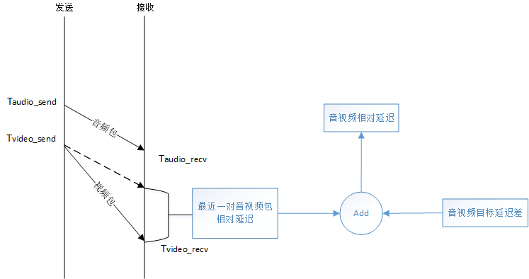

```
当前音视频流相对延迟 = 最近一对音视频包的相对延迟 + 音视频目标延迟之差
```

#### 期望视频目标延迟

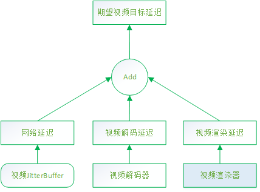

```
期望视频目标延迟 = 网络延迟 + 解码延迟 + 渲染延迟
```

网络延迟其实就是视频JittterBuffer输出的延迟googJitterBufferMs，可以参考文章[《WebRTC视频JitterBuffer详解》](https://blog.csdn.net/sonysuqin/article/details/106629343)7.1节[抖动计算]，简单说就是通过卡尔曼滤波器计算视频帧的到达延迟差(抖动)，作为网络的延迟。

解码时间的统计方法：统计最近最多10000次解码的时间消耗，计算其95百分位数T~decode~，也就是说最近95%的帧的解码时间都小于T~decode~，以之作为解码时间。

视频渲染延迟默认是一个定值：10ms。

> timing.cc:210
>
> VCMTiming::TargetVideoDelay

#### 期望音频目标延迟

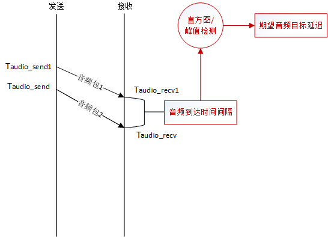

期望音频目标延迟的算法和视频解码时间的算法类似，但是用直方图来存放最近的65个音频包的到达间隔，取95百分位数T~audio_target_delay~，也就是说最近一段时间内，有95%的音频包的到达间隔都小于T~audio_target_delay~。同时考虑到网络突发的可能，增加了峰值检测，去掉异常的时间间隔。

取这个值作为期望目标延迟来影响音频的播放，可以保证绝大多数情况下音频流的流畅。

> neteq_impl.cc:311
>
> NetEqImpl::FilteredCurrentDelayMs


### 音视频同步

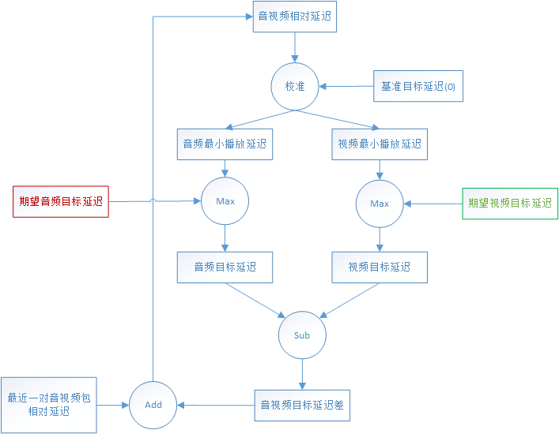

同步器的外部输入有：

* 期望音频目标延迟，以该延迟播放，音频是流畅的；
* 期望视频目标延迟，以该延迟播放，视频是流畅的；
* 最近一对音视频包的相对延迟。

最近一对音视频包的相对延迟与音视频的目标延迟差之和，得到当前时刻的音视频相对延迟，也就是音、视频流目前的时间偏差。

* 当相对延迟 > 0，说明视频比较慢，视频延迟与基准(`base_target_delay_ms_`，默认0)比较：
  * `extra_video_delay_ms` > `base_target_delay_ms_`，减小视频流延迟，设置音频延迟为基准；
  * `extra_video_delay_ms` <= `base_target_delay_ms_`，增大音频流延迟，设置视频延迟为基准；
* 当相对延迟 < 0，说明音频比较慢，音频延迟与基准(`base_target_delay_ms_`，默认0)比较：
  * `extra_audio_delay_ms` > `base_target_delay_ms_`，减小音频流延迟，设置视频延迟为基准；
  * `extra_audio_delay_ms` <= `base_target_delay_ms_`，增大视频流延迟，设置音频延迟为基准。

使用这个算法，可以保证音、频流的延迟都趋向于逼近基准，不会出现无限增加、减小的情况。同时，一次延迟增大、减小的延迟diff_ms被设置为相对延迟的一半，并限制在80ms范围之内，也就是说WebRTC对一次同步的追赶时间做了限制，一次延迟增大、减小最大只能是80ms，因此如果某个时刻某个流发生了较大抖动，需要一段时间另外一个流才能同步。

经过了以上校准之后，输出了同步后音频、视频流各自的最小播放延迟。

```
extra_audio_delay_ms -> 音频最小播放延迟
extra_video_delay_ms -> 视频最小播放延迟
```


理论上将这两个播放延迟分别施加到音、视频流后，这两个流就是同步的，再与音、视频流各自期望目标延迟取最大值，得到音、视频流的最优目标延迟(googTargetDelayMs)，施加在音、视频流上，可以保证做到既同步、又流畅。

> stream_synchronization.cc:64
>
> StreamSynchronization::ComputeDelays


### 渲染时间

#### 视频渲染时间

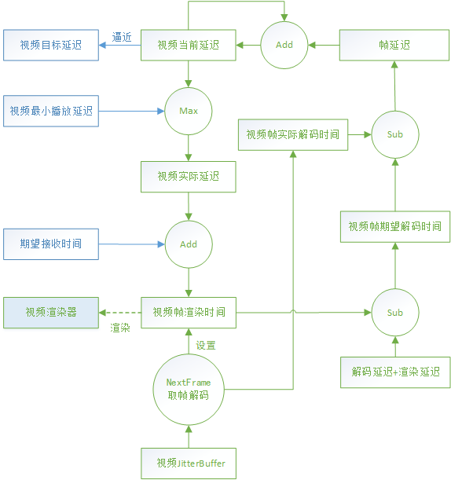

该图是计算视频渲染时间的总体描述图，仍然比较复杂，以下分几个部分描述。

##### 期望接收时间

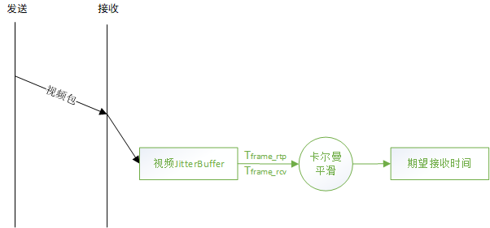

TimestampExtrapolator类负责期望接收时间的产生，视频JitterBuffer(的FrameBuffer)每收到一帧，会记录该帧的RTP时间戳T~frame_rtp~和本地接收时间T~frame_rcv~，其中第一帧的RTP时间戳为T~first_frame_rtp~和本地接收时间T~first_frame_rcv~。

记帧RTP时间戳之差：T~frame_rtp_delta~ = T~frame_rtp~ - T~first_frame_rtp~

帧本地接收时间之差：T~frame_recv_delta~ = T~frame_recv~ - T~first_frame_rcv~

两者为线性关系，期望RTP时间戳之差T~frame_rtp_delta~ = `_w[0]` * T~frame_recv_delta~ + `_w[1]`

通过卡尔曼滤波器得到线性系数`_w[0]`、`_w[1]`，进而得到期望接收时间的值：

T~frame_recv~ = T~first_frame_rcv~ + (T~frame_rtp_delta~ - `_w[1]`) / `_w[0]`

也就是说，卡尔曼滤波器输入视频帧的RTP时间戳和本地接收时间观测值，得到视频帧最优的期望接收时间，用于平滑网络的抖动。

> timestamp_extrapolator.cc:137
>
> TimestampExtrapolator::ExtrapolateLocalTime

##### 视频当前延迟 - googCurrentDelayMs

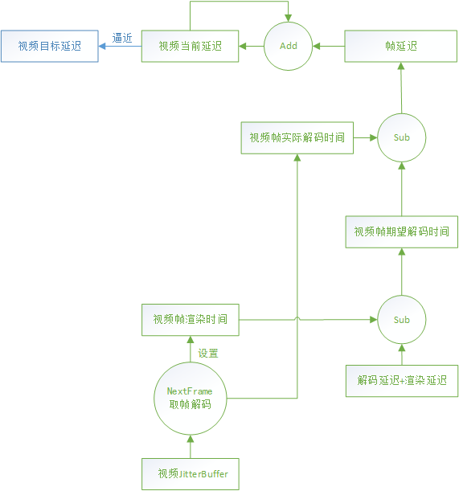

解码器通过视频JitterBuffer的NextFrame方法获取一帧去解码时会设置该帧的期望渲染时间T~expect_render~，以及该帧的实际开始解码时间T~actual_decode~。

该帧的期望开始解码时间为期望渲染时间减去解码、渲染的延迟：

T~expect_decode~ = T~expect_render~ - T~decode_delay~ - T~render_delay~

那么该帧产生的延迟为实际开始解码时间减去期望开始解码时间：

T~frame_delay~ = T~actual_decode~ - T~expect_decode~

该帧延迟和上一个时刻的视频当前延迟叠加，如果仍然小于目标延迟，则增长视频当前延迟。

T~current_delay~ = max(T~current_delay~ + T~frame_delay~, T~target_delay~)

也就是视频当前延迟以目标延迟为上限逼近目标延迟。

> timing.cc:96
>
> VCMTiming::UpdateCurrentDelay

##### 计算渲染时间

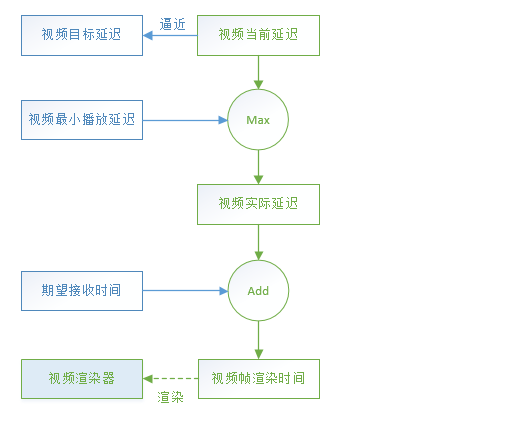

取同步后的延迟作为视频的实际延迟，也就是当前延迟和最小播放延迟的最大者：

T~actual_delay~ = max(T~current_delay~ , T~min_playout_delay~)

至此，当前视频帧的期望接收时间T~frame_recv~和视频实际延迟T~actual_delay~都已经得到，可以计算最终的视频帧渲染时间：

T~render_time~ = T~frame_recv~ + T~actual_delay~

> timing.cc:169
>
> VCMTiming::RenderTimeMs

#### 音频渲染时间

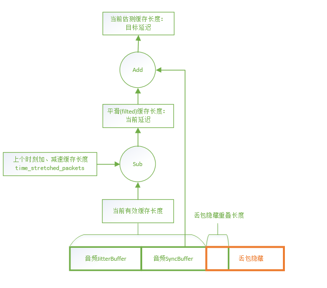

NetEQ中有若干缓存用来暂存数据，主要的是JitterBuffer(PacketBuffer)、SyncBuffer，分别存放解码前和解码后的数据，这些缓存的大小就体现了音频当前的延迟。

NetEQ的BufferLevelFilter类维护音频的当前延迟，音频渲染器每取一次音频数据都根据当前剩余的缓存大小设置一次音频的当前延迟并进行平滑，得到平滑后的当前延迟(googCurrentDelayMs)。

> buffer_level_filter.cc:29
>
> BufferLevelFilter::Update

NetEQ的DecisionLogic类比较下一个音频包的时间戳与SynBuffer中的结尾时间戳，如果不相等，也就是不连续，那么需要进行丢包隐藏(Expand/PLC)或者融合(Merge)；如果相等，也就是连续，则根据当前缓存的大小与目标延迟大小来决定是对音频数据进行加速、减速，或者正常播放。

> decision_logic.cc:100
>
> DecisionLogic::GetDecision

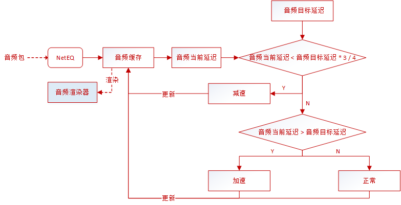

* 如果音频当前延迟 < 3 / 4音频目标延迟，也就是缓存数据较少，需要减速播放等待目标延迟；
* 如果音频当前延迟 > 音频目标延迟，也就是缓存数据过多，需要加速播放追赶目标延迟。

> decision_logic.cc:283
>
> DecisionLogic::ExpectedPacketAvailable

音频就是以缓存长度追赶目标延迟的方式达到延迟一定时间的效果，最终和视频的目标延迟对齐后，实现了音视频同步。
