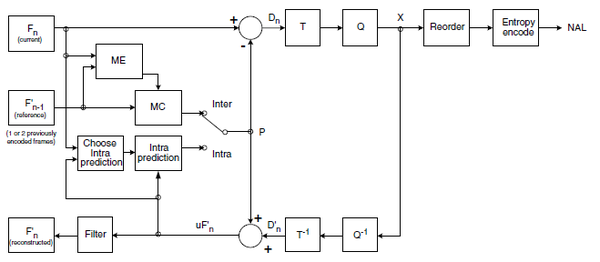
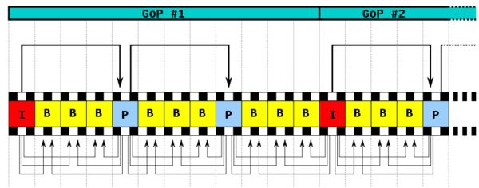
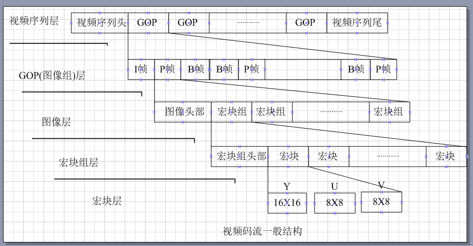
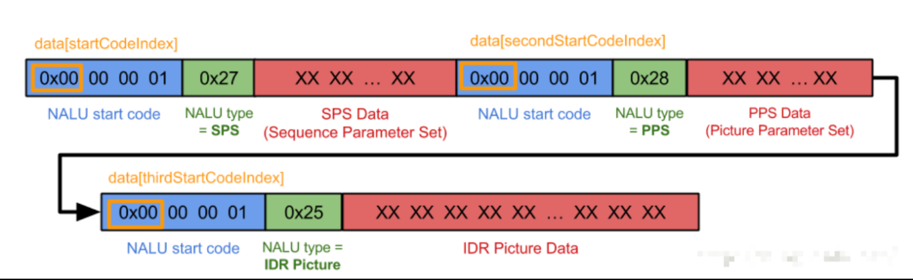

## H264相关概念

>参考文档：
>
>[H.264学习笔记](https://www.cnblogs.com/CoderTian/p/6920306.html)
>
>[H.264学习方法及部分基础知识](https://www.cnblogs.com/xkfz007/archive/2012/07/28/2613110.html)
>
>[H264基本原理](https://zhuanlan.zhihu.com/p/31056455)
>
>[I帧、P帧、B帧、GOP、IDR 和PTS, DTS之间的关系](https://www.cnblogs.com/yongdaimi/p/10676309.html)
>
>[I帧 B帧 P帧 IDR帧的区别](http://blog.csdn.net/sphone89/article/details/8086071)

### 基础概念

H264是新一代的编码标准，以高压缩高质量和支持多种网络的流媒体传输著称，在编码方面，我理解的他的理论依据是：参照一段时间内图像的统计结果表明，在相邻几幅图像画面中，一般有差别的像素只有10%以内的点,亮度差值变化不超过2%，而色度差值的变化只有1%以内。所以对于一段变化不大图像画面，我们可以先编码出一个完整的图像帧X，随后的Y帧就不编码全部图像，只写入与X帧的差别，这样Y帧的大小就只有完整帧的1/10或更小！Y帧之后的Z帧如果变化不大，我们可以继续以参考Y的方式编码Z帧，这样循环下去。这段图像我们称为一个GOP图像组（GOP图像组就是有相同特点的一段数据），也就是对这个图像生成一个完整帧X1，随后的图像就参考X1生成，只写入与X1的差别内容。当某个图像与之前的图像变化很大，无法参考前面的帧来生成，那我们就结束上一个GOP图像组，开始下一段GOP图像组。

在H264协议里定义了三种帧，完整编码的帧叫I帧，参考之前的I帧生成的只包含差异部分编码的帧叫P帧，还有一种参考前后的帧编码的帧叫B帧。

H264采用的核心算法是帧内压缩和帧间压缩，帧内压缩是生成I帧的算法，帧间压缩是生成B帧和P帧的算法。




### 相关概念

#### 帧（frame）

视频的帧其实就是一张图片，足够快的播放这些连续的图片，就成了动画。

#### 帧率（frame rate）

Frames Per Second，缩写为帧/秒。是指每秒钟刷新的图片的帧数，也可以理解为图形处理器每秒钟能够刷新几次。越高的帧速率可以得到更流畅、更逼真的动画。每秒钟帧数(fps)越多，所显示的动作就会越流畅。

就是以多块的速度来播放这些静态图片，即我们经常听到的每秒25帧，每秒60帧等等，一般不同的视频节目有不同的帧率规定。

正常10~12fps以上，人眼就会认为是连贯的。

h5网页视频可采用 18 fps。

#### 关键帧（key frame）

在压缩的视频序列中，一个包含完整帧信息的帧。

#### I帧（intra picture）

**关键帧**。

帧内编码帧，又称intra picture。帧内编码帧是一种自带全部信息的独立帧，无需参考其它图像便可独立进行解码，视频序列中的第一个帧始终都是I帧。

**I帧特点：**

1. 它是一个全帧压缩编码帧。它将全帧图像信息进行H.26L压缩编码及传输(效果全面超越JPEG，逼近甚至超过JPEG2000);

2. 解码时仅用I帧的数据就可重构完整图像;

3. I帧描述了图像背景和运动主体的详情;

4. I帧不需要参考其他画面而生成;

5. I帧是P帧和B帧的参考帧(其质量直接影响到同组中以后各帧的质量);

6. I帧是帧组GOP的基础帧(第一帧)，*在一组中只有一个I帧？*

   > 一个GOP中可能存在I帧

7. I帧不需要考虑运动矢量;

8. I帧所占数据的信息量比较大。


#### P帧（predictive-frame）

**前向预测编码帧**，又称predictive-frame

在针对连续动态图像编码时，将连续若干幅图像分成 P，B，I 三种类型，P帧由在它前面的P帧或者I帧预测而来，它比较与它前面的P帧或者I帧之间的相同信息或数据，也即考虑运动的特性进行帧间压缩。P帧法是根据本帧与相邻的前一帧（I帧或P帧）的不同点来压缩本帧数据。采取P帧和I帧联合压缩的方法可达到更高的压缩且无明显的压缩痕迹。

P帧的预测与重构：P帧是以I帧为参考帧，在I帧中找出P帧“某点”预测值和运动矢量，取预测差值和运动矢量一起传送。在接收端根据运动矢量从I帧中找出P帧“某点”的预测值并与差值相加以得到P帧某点样值，从而可得到完整的P帧。

有的视频序列比较简单，就没有B帧。

**P帧特点:**

1. P帧是I帧后面相隔1~2帧的编码帧;

2. P帧采用运动补偿的方法传送它与前面的I或P帧的差值及运动矢量(预测误差);

3. 解码时必须将I帧中的预测值与预测误差求和后才能重构完整的P帧图像;

4. P帧属于前向预测的帧间编码。它只参考前面最靠近它的I帧或P帧;

5. P帧可以是其后面P帧的参考帧,也可以是其前后的B帧的参考帧;

6. 由于P帧是参考帧,它可能造成解码错误的扩散;

7. 由于是差值传送,P帧的压缩比较高。


#### B帧（bi-directional interpolated prediction frame）

**双向预测内插编码帧**，又称bi-directional interpolated prediction frame

B帧的预测与重构

 	B帧法是双向预测的帧间压缩算法。当把一帧压缩成B帧时，它根据相邻的前一帧、本帧以及后一帧数据的不同点来压缩本帧，也即仅记录本帧与前后帧的差值。只有采用B帧压缩才能达到200：1的高压缩。
 	
 	B帧是以前面的I或P帧和后面的P帧为参考帧，找出B帧“某点”的预测值和两个运动矢量，并取预测差值和运动矢量传送。接收端根据运动矢量在两个参考帧中“找出(算出)”预测值并与差值求和，得到B帧“某点”样值，从而可得到完整的B帧。

**B帧特点：**

1. B帧是由前面的I或P帧和后面的P帧来进行预测的;

2. B帧传送的是它与前面的I或P帧和后面的P帧之间的预测误差及运动矢量;

3. B帧是双向预测编码帧;

4. B帧压缩比最高,因为它只反映丙参考帧间运动主体的变化情况,预测比较准确;

5. B帧不是参考帧,不会造成解码错误的扩散。


#### I、B、P帧压缩率

I、B、P各帧是根据压缩算法的需要，是人为定义的,它们都是实实在在的物理帧。一般来说，I帧的压缩率是7（跟JPG差不多），P帧是20，B帧可以达到50。可见使用B帧能节省大量空间，节省出来的空间可以用来保存多一些I帧，这样在相同码率下，可以提供更好的画质。


#### IDR

> [Easy Tech：什么是I帧、P帧和B帧？](https://mp.weixin.qq.com/s/V3Xb-r1ggSAEHZgwTn0nEg)

Instantaneous Decoding Refresh，即时解码刷新。为将首个I帧和其他I帧区别开，定义首个I帧为IDR帧。

H.264 引入 IDR 图像是为了解码的重同步，当解码器解码到 IDR 图像时，立即将参考帧队列清空，将已解码的数据全部输出或抛弃，重新查找参数集，开始一个新的序列。这样，如果前一个序列出现重大错误，在这里可以获得重新同步的机会。IDR图像之后的图像永远不会使用IDR之前的图像的数据来解码。

##### IDR帧和I帧的关系

IDR帧就是I帧，但是I帧不一定是IDR帧，在一个完整的视频流单元中第一个图像帧是IDR帧，IDR帧是强制刷新帧，在解码过程中，当出现了IDR帧时，要更新sps、pps，原因是防止前面I帧错误，导致sps，pps参考I帧导致无法纠正。

再普及一个概念是GOP，GOP的全称是Group of picture图像组，也就是两个I帧之间的距离，GOP值越大，那么I帧率之间P帧和B帧数量越多，图像画质越精细，如果GOP是120，如果分辨率是720P，帧率是60，那么两I帧的时间就是120/60=2s。


#### GOP

​    Group of Picture，关键帧的周期，也就是两个IDR帧之间的距离，一个帧组的最大帧数，一般而言，每一秒视频至少需要使用 1 个关键帧。增加关键帧个数可改善质量，但是同时增加带宽和网络负载。在一个GOP中，P、B帧是由I帧预测得到的，当I帧的图像质量比较差时，会影响到一个GOP中后续P、B帧的图像质量，直到下一个GOP 开始才有可能得以恢复，所以GOP值也不宜设置过大。

​	**参照一段时间内图像的统计结果表明，在相邻几幅图像画面中，一般有差别的像素只有10%以内的点，亮度差值变化不超过2%，而色度差值的变化只有1%以内。一个序列就是一段内容差异不太大的图像编码后生成的一串数据流**。当运动变化比较少时，一个序列可以很长，因为运动变化少就代表图像画面的内容变动很小，所以就可以编一个I帧，然后一直P帧、B帧了。当运动变化多时，可能一个序列就比较短了，比如就包含一个I帧和3、4个P帧。

​    由于P、B帧的复杂度大于I帧，所以过多的P、B帧会影响编码效率，使编码效率降低。另外，过长的GOP还会影响Seek操作的响应速度，由于P、B帧是由前面的I或P帧预测得到的，所以Seek操作需要直接定位，解码某一个P或B帧时，需要先解码得到本GOP内的I帧及之前的N个预测帧才可以，GOP值越长，需要解码的预测帧就越多，seek响应的时间也越长。





​	GOP说白了就是两个 IDR 帧之间的间隔。比较说GOP为120，如果是720p60的话，那就是2s一次 IDR 帧。**GOP一般设置为帧率的2倍**。

​	关键帧间隔越长，也就是 GOP 越长，理论上画面越高清。但是生成 HLS 直播时，最小切割粒度也是一个 GOP，所以针对交互直播，通常不建议 GOP 设置太长。直播一般 2 个关键帧间隔即可。比如帧率是 24fps， 那么 2 个关键帧的间隔就是 48fps ，这个 GOP 就是2s。

##### 举例

对于一段变化不大图像画面，我们可以先编码出一个完整的图像帧A，随后的B帧就不编码全部图像，只写入与A帧的差别，这样B帧的大小就只有完整帧的1/10或更小！B帧之后的C帧如果变化不大，我们可以继续以参考B的方式编码C帧，这样循环下去。这段图像我们称为一个序列（序列就是有相同特点的一段数据），当某个图像与之前的图像变化很大，无法参考前面的帧来生成，那我们就结束上一个序列，开始下一段序列，也就是对这个图像生成一个完整帧A1，随后的图像就参考A1生成，只写入与A1的差别内容。

##### 注意：

​	在 H.264 中切换画面时，会强制插入一个 IDR 帧，进行强制刷新，所以 GOP 可能不是固定的长度（一般情况下是固定）。


#### DTS、PTS 的概念

DTS、PTS 的概念如下所述：

- DTS（Decoding Time Stamp）：即解码时间戳，这个时间戳的意义在于告诉播放器该在什么时候解码这一帧的数据。
- PTS（Presentation Time Stamp）：即显示时间戳，这个时间戳用来告诉播放器该在什么时候显示这一帧的数据。

需要注意的是：虽然 DTS、PTS 是用于指导播放端的行为，但它们是在编码的时候由编码器生成的。

当视频流中没有 B 帧时，通常 DTS 和 PTS 的顺序是一致的。但如果有 B 帧时，就回到了我们前面说的问题：解码顺序和播放顺序不一致了。

比如一个视频中，帧的显示顺序是：I B B P，现在我们需要在解码 B 帧时知道 P 帧中信息，因此**这几帧在视频流中的顺序可能是：I P B B**，这时候就体现出每帧都有 DTS 和 PTS 的作用了。DTS 告诉我们该按什么顺序解码这几帧图像，PTS 告诉我们该按什么顺序显示这几帧图像。顺序大概如下：

```
PTS:   480   640  560  520  600  800  720  680  760  960 ...
DTS:   400   440  480  520  560  600  640  680  720  760 ...
Stream: I     P    B    B    B    P    B    B    B    P  ...
播放序： 1     5    3    2    4    9    7    6    8   10  ...               
PTS >= DTS
```


#### SPS和PPS

**H.264**引入了参数集的概念，每个参数集包含了相应的编码图像的信息：

序列参数集(SPS)：包含的是针对一连续编码视频序列的参数，如标识符seq_parameter_set_id、帧数及POC的约束、参考帧数目、解码图像尺寸和帧场编码模式选择标识等。

图像参数集(PPS)：对应的是一个序列中某一幅图像或者某几幅图像,其参数如标识符pic_parameter_set_id、可选的seq_parameter_set_id、熵编码模式选择标识、片组数目、初始量化参数和去方块滤波系数调整标识等。

通常，SPS和PPS在片的头信息和数据解码前传送至解码器。每个片的头信息对应一个pic_parameter_set_id,PPS被其激活后一直有效到下一个PPS被激活;类似的,每个PPS对应一个seq_parameter_set_id,SPS被其激活以后将一直有效到下一个SPS被激活。参数集机制将一些重要的、改变少的序列参数和图像参数与编码片分离,并在编码片之前传送至解码端,或者通过其他机制传输。


#### 码率控制算法

​    动态调整编码器参数，得到目标比特数。为视频序列中的图像组GOP、图像或子图像分配一定的比特。现有的码率控制算法主要是通过调整离散余弦变换的量化参数（QP）大小输出目标码率。

 

#### QP

​    Quantizer Parameter，量化参数，反映了空间细节压缩情况。值越小，量化越精细，图像质量越高，产生的码流也越长。如QP小，大部分的细节都会被保留；QP增大，一些细节丢失，码率降低，但图像失真加强和质量下降。


#### profile level

分别是BP、EP、MP、HP：

​    1、BP-Baseline Profile：基本画质。支持I/P 帧，只支持无交错（Progressive）和CAVLC；

​    2、EP-Extended profile：进阶画质。支持I/P/B/SP/SI 帧，只支持无交错（Progressive）和CAVLC；

​    3、MP-Main profile：主流画质。提供I/P/B 帧，支持无交错（Progressive）和交错（Interlaced），也支持CAVLC 和CABAC 的支持；

​    4、HP-High profile：高级画质。在main Profile 的基础上增加了8x8内部预测、自定义量化、无损视频编码和更多的YUV 格式。


#### 宏块（Macro Block）

是H.264编码的基本单位，一个编码图像首先要划分成多个块（4x4 像素）才能进行处理，显然**宏块应该是整数个块组成**，通常宏块大小为16x16个像素。

**宏块分为I、P、B宏块：**

* I 宏块只能利用当**前片中已解码**的像素作为参考进行帧内预测

* P 宏块可以利用**前面已解码**的图像作为参考图像进行帧内预测

* B 宏块则是利用**前后向的参考图形**进行帧内预测


#### 片（Slice）

一帧视频图像可编码成一个或者多个片，**每片包含整数个宏块**，即每片至少一个宏块，最多时包含整个图像的宏块。

**片的目的：为了限制误码的扩散和传输，使编码片相互间保持独立。**

片共有5种类型：

* I片（只包含I宏块）
* P片（P和I宏块）
* B片（B和I宏块）
* SP片（用于不同编码流之间的切换）
* SI片（特殊类型的编码宏块）。

以下是片的句法结构：

片头规定了片的类型、属于哪个图像、有关的参考图像等；片的数据包含了一系列宏块和不编码数据。

 

#### 片组

是一个编码图像中若干宏块的一个子集，包含一个或若干个片。

一般一个片组中，每片的宏块是按扫描次序进行编码的，除非使用任意片次序（Arbitrary Slice Order, ASO）一个编码帧中的片之后可以跟随任一解码图像的片。


### 编码模式(CBR, VBR, CVBR, ABR, CRF)

视频流中的码率控制算法。

#### CBR

Constant BitRate，是以恒定比特率方式进行编码。

有Motion（运动）发生时，由于码率恒定，只能通过增大QP来减少码字大小，图像质量变差，当场景静止时，图像质量又变好，因此图像质量不稳定。优点是压缩速度快，缺点是每秒流量都相同容易导致空间浪费。    

在流式播放方案中使用CBR编码最为有效。使用CBR编码时，比特率在流的进行过程中基本保持恒定并且接近目标比特率，始终处于由缓冲区大小确定的时间窗内。CBR编码的缺点在于编码内容的质量不稳定。因为内容的某些片段要比其他片段更难压缩，所以CBR流的某些部分质量就比其他部分差。此外，CBR编码会导致相邻流的质量不同。通常在较低比特率下，质量的变化会更加明显。采用CBR编码方式时节目合成时间会短一些，但文件的长度会大一些(即相同时长的节目会占用更多的空间或者相同的空间只能容纳更短的节目)。 

#### VBR

Variable BitRate，动态比特率。

其码率可以随着图像的复杂程度的不同而变化，因此其编码效率比较高，Motion发生时，马赛克很少。码率控制算法根据图像内容确定使用的比特率，图像内容比较简单则分配较少的码率(似乎码字更合适)，图像内容复杂则分配较多的码字，这样既保证了质量，又兼顾带宽限制。这种算法优先考虑图像质量。

当计划提供内容供用户下载、 将内容在本地播放或者在读取速度有限的设备（如CD或DVD播放机）上播放时，请使用VBR编码。（计划流式播放内容时也可以采用峰值VBR编码模式）当 编码内容中混有简单数据和复杂数据（例如，在快动作和慢动作间切换的视频）时，VBR 编码是很有优势的。使用VBR编码时，系统将自动为内容的简单部分分配较少的比特，从而留出足量的比特用于生成高质量的复杂部分。这意味着复杂性恒定的内 容（例如新闻播音）不会受益于VBR编码。对混合内容使用 VBR 编码时，在文件大小相同的条件下，VBR编码的输出结果要比CBR编码的输出结果质量好得多。在某些情况下，与CBR编码文件质量相同的VBR编码文件， 其大小可能只有前者的一半。

#### CVBR

Constrained Variable it Rate，VBR的一种改进，兼顾了CBR和VBR的优点。

在图像内容静止时，节省带宽，有Motion发生时，利用前期节省的带宽来尽可能的提高图像质量，达到同时兼顾带宽和图像质量的目的。这种方法通常会让用户输入最大码率和最小码率，静止时，码率稳定在最小码率，运动时，码率大于最小码率，但是又不超过最大码率。

#### ABR

Average BitRate，平均比特率。是VBR的一种插值参数。在一定的时间范围内达到设定的码率，但是局部码率峰值可以超过设定的码率，平均码率恒定。

ABR在指定的文件大小内，以每50帧 （30帧约1秒）为一段，低频和不敏感频率使用相对低的流量，高频和大动态表现时使用高流量，可以做为VBR和CBR的一种折衷选择。

Lame针对CBR不佳的文件体积比和VBR生成文件大小不定的特点独创了这种编码模式。ABR也 被称为“Safe VBR”，它是在指定的平均Bitrate内，以每50帧（30帧约1秒）为一段，低频和不敏感频率使用相对低的流量，高频和大动态表现时使用高流量。举例来说，当指定用192kbps ABR对一段wav文件进行编码时，Lame会将该文件的85%用192kbps固定编码，然后对剩余15%进行动态优化：复杂部分用高于192kbps 来编码、简单部分用低于192kbps来编码。与192kbps CBR相比，192kbps ABR在文件大小上相差不多，音质却提高不少。ABR编码在速度上是VBR编码的2到3倍，在128-256kbps范围内质量要好于CBR。可以做为VBR和CBR的一种折衷选择。

#### CRF

H.264/H265编码的高质量视频码率控制模型有两种： 固定码率系数 （Constant Rate Factor，CRF）模式和  （2-Pass ABR）模式。 把某个固定的“视觉质量”作为目标，在保证单次编码达到最高的压缩率的同时，为每一帧都分配足够的位以达到要求的视觉质量。 

 CRF模式适合在关注单次编码质量而输出文件大小或码率不是太紧要的场景下使用，是最好的单次编码的码率控制模型。 8 位 H.264 编码的CRF的理论取值范围为[0~51]，值越低，质量越好，文件大小越大

* 0，是技术上的无损
* 51，是技术上最大的压缩
* 23，是行业惯用的默认值

使用更低的CRF能获取更好的视觉质量，但输出的文件更大，±6的变化大致上对应减半/翻倍的码率变化。 [18~28]是一个合理的范围： 

* 18，通常被认为从视觉上看是无损或几乎无法分辨与母带的差别的（尽管技术上不是）。
* 28，通常是在可接受的范围内牺牲视觉质量以达到最大压缩、生成文件最小的惯用取值。  

官方推荐：

* 29，为快速级，适合快速、高压缩率的发行**网络流媒体**。
* 23，为**默认值**，适合通用的**压制发行**。
* 17，为视觉无损级，可视为适合后续编辑使用的**最高压缩的母带**。

#### 各码率对比

1. VBR 适合的应用场景是媒体存储，而不是网络传输，因此不要让武状元去当文官；
2. 其实实际网络传输中所谓的 CBR 一般都是 ABR（平均比特率），即只要是单位时间内把码率控制在额定码率就可以了，因为编码输出本来就有缓冲可以起到平滑波动的作用；
3. 你所谓的严格意义上的 CBR 是每一帧都分配同样的码字，试想一下，如果某一帧所需要的码字本来就很少，而你却一定要给它分配很多码字，那不是浪费么？另一方面，如果某一帧所需要的码 字本来就多，而你却给得很少，那这帧的效果会很差。这样编下来，整体序列质量会忽好忽坏地不停发生跳变，反而对视觉冲击很大；因此 ABR 才是最适合网络传输的方案；
4. 无论是 CBR、ABR 还是 VBR 都是属于码率控制，而码率控制是视频编码的开放部分，它不会改变码流结构的合法性，因此无论在 MPEG2、MPEG4 还是 H.263、H.264 当中都没有做规定；
5. 由于目前的视频编码标准都是基于块编码的混合编码框架，因此一个码率控制算法可以用到任何协议上（当然有时候需要做点小的改动），只不过是控制效果好不好的问题，没有哪个 RC 是专属哪个协议的。


### H264中的NALU概念解析

#### 1.什么是NAL

NAL全称Network Abstract Layer，即网络抽象层。

在H.264/AVC视频编码标准中，整个系统框架被分为了两个层面：视频编码层面（VCL）和网络抽象层面（NAL）。其中，前者负责有效表示视频数据的内容，而后者则负责格式化数据并提供头信息，以保证数据适合各种信道和存储介质上的传播。VCL（Video Coding Layer）是H.264/AVC的规格，意思是压缩后、去冗余（Visual Redundancy）的影像资料，其技术核心包括动作估计、转换编码、预测编码、去区块效应滤波、及熵编码等。

视讯编码层往往与网络抽象层（NAL）相互配合，标准的NAL-unit总共规范（profile）有12种，这12种型式可粗分成VCL NAL-unit及non-VCL NAL-unit，其中 VCL NAL-unit是指NAL-unit中存放的完全是VCL的影像资料。

现实中的传输系统是多样化的，其可靠性，服务质量，封装方式等特征各不相同，NAL这一概念的提出提供了一个视频编码器和传输系统的友好接口，使得编码后的视频数据能够有效的在各种不同的网络环境中传输。

#### 2.NALU/Sample/帧（frame）/分片（slice）/宏块（MB）的关系

#### NALU

H264码流可以分为两层，VCL层和NAL层，NAL的全称是Network abstraction layer,叫网络抽象层，它保存了H264相关的参数信息和图像信息。NAL层由多个单元NALU组成，NALU由NALU头（00 00 00 01或者00 00 01）、sps(序列参数集)、pps(图像参数集合)、slice、sei、IDR帧、I帧（在图像运动变化较少时，I帧后面是7个P帧，如果图像运动变化大时，一个序列就短了，I帧后面可能是3个或者4个P帧）、P帧、B帧等数据。

一个完整的NALU单元结构图如下：



```
00 00 00 01是NALU头，是序列的标识符的开头，
0x27转成二进制是100111，00111转成十进制是7，那么7对应NALU type=sps，
0x28转成二进制是101000，01000转成十进制是8，8对应NALU type=pps，
0x25转成二进制是100101，00101转成十进制是5，5对应的NALU type=IDR帧
（使用FFMPEG，sps和pps是保存在AVCodecContext的extradata.data中，在解码提取sps和pps时，判断NALU type可以用extradata.data[ 4 ]&0x1f(结果是7是sps，8是pps，计算方式是先转成二进制，0x27&0x1f=11111&00111=00111=7，pps计算类似)），
NALU type=1是splice，splice有三种编码模式，I_slice、P_slice、B_slice,I帧在编码时就分割保存在splice中。 
```

#### 关系

1. 可以认为一个NALU就是一个sample，即NALU=sample。错错错！！！大错特错！！！我自己阅读了ISO-14496-15，里面明确说明，一个sample有多个NALU！！！而且我亲自解析了一个mp4文件，确实是一个sample有多个NALU。否则，NALU的长度就没有意义了，因为MP4文件的头中包含了每个sample的size信息。
2. Slice是片的意思，H264中把图像分成一帧（frame）或两场（field），而帧又可以分成一个或几个片（Slilce）；片由宏块（MB）组成。宏块是编码处理的基本单元。
3. 一个frame是可以分割成多个Slice来编码的，而一个Slice编码之后被打包进一个NAL单元，不过NAL单元除了容纳Slice编码的码流外，还可以容纳其他数据，比如序列参数集SPS。


#### 3.RBSP、SODB、EBSP三者的区别和联系

* SODB：最原始 的编码数据，没有任何附加数据
* RBSP：在 SODB 的基础上加了rbsp_stop_ont_bit（bit 值为 1）并用 0 按字节补位对齐
* EBSP：在 RBSP 的基础上增加了防止伪起始码字节（0X03）
* NALU是对RBSP的封装。而RTP之类的是对NALU的封装。

#### 4.NALU/NAL Units/NAL 单元

NALU是一种封装的模组，并拥有NAL-unit 标头（Header），此Header内又有许多资讯，包括 Type。一个完整的NALU是标头（Header）加上位元流（bitstream）。多个NAL-units组成一个存储单元（access unit）。

#### 5.NALU的类型

标识NAL单元中数据类型，其中，nal_unit_type为1， 2， 3， 4， 5及12的NAL单元称为VCL的NAL单元，其他类型的NAL单元为非VCL的NAL单元。

| 数值    | 说明                            |
| ------- | ------------------------------- |
| 0       | 未规定                          |
| 1       | 非IDR图像中不采用数据划分的片段 |
| 2       | 非IDR图像中A类数据划分片段      |
| 3       | 非IDR图像中B类数据划分片段      |
| 4       | 非IDR图像中C类数据划分片段      |
| 5       | IDR图像的片段                   |
| 6       | 补充增强信息 (SEI)              |
| 7       | 序列参数集/SPS                  |
| 8       | 图像参数集/PPS                  |
| 9       | 分割符                          |
| 10      | 序列结束符                      |
| 11      | 流结束符                        |
| 12      | 填充数据                        |
| 13 – 23 | 保留                            |
| 24 – 31 | 未规定                          |

即认为SPS和PPS都是特殊的NALU。一个MP4文件只有一个SPS，但是有很多PPS，SPS必须在所有NALU的最开头。

##### 补充：

* I frame 是自己独立编码，不依赖于其他frame 数据。P frame 依赖 I frame 数据。B frame 依赖 I frame, P frame 或其他 B frame 数据。
* IDR帧属于I帧。解码器收到IDR帧时，将所有的参考帧队列丢弃（用x264_reference_reset函 数实现——在encoder.c文件 中）。这点是所有I帧共有的特性，但是收到IDR帧时，解码器另外需要做的工作就是：把所有的PPS和SPS参数进行更新。由此可见，在编码器端，每发一个IDR，就相应地发一个 PPS&SPS_nal_unit。
* 分ＡＢＣ片主要目的是为了对重要程度不同的数据进行不同程度的保护。

#### 6.NALU的顺序要求

H.264/AVC标准对送到解码器的NAL单元顺序是有严格要求的，如果NAL单元的顺序是混乱的，必须将其重新依照规范组织后送入解码器，否则解码器不能够正确解码。

（1）序列参数集NAL单元(nal_unit_type为7)必须在传送所有以此参数集为参考的其他NAL单元之前传送，不过允许这些NAL单元中间出现重复的序列参数集NAL单元。所谓重复的详细解释为：序列参数集NAL单元都有其专门的标识，如果两个序列参数集NAL单元的标识相同，就可以认为后一个只不过是前一个的拷贝，而非新的序列参数集。

（2）图像参数集NAL单元(nal_unit_type为8)必须在所有以此参数集为参考的其他NAL单元之先，不过允许这些NAL单元中间出现重复的图像参数集NAL单元，这一点与上述的序列参数集NAL单元是相同的。

（3）不同基本编码图像中的片段（slice）单元和数据划分片段（data partition）单元在顺序上不可以相互交叉，即不允许属于某一基本编码图像的一系列片段（slice）单元和数据划分片段（data partition）单元中忽然出现另一个基本编码图像的片段（slice）单元片段和数据划分片段（data partition）单元。

（4）参考图像的影响：如果一幅图像以另一幅图像为参考，则属于前者的所有片段（slice）单元和数据划分片段（data partition）单元必须在属于后者的片段和数据划分片段之后，无论是基本编码图像还是冗余编码图像都必须遵守这个规则

（5）基本编码图像的所有片段（slice）单元和数据划分片段（data partition）单元必须在属于相应冗余编码图像的片段（slice）单元和数据划分片段（data partition）单元之前。

（6）如果数据流中出现了连续的无参考基本编码图像，则图像序号小的在前面。

（7）如 果arbitrary_slice_order_allowed_flag置为1，一个基本编码图像中的片段（slice）单元和数据划分片段（data partition）单元的顺序是任意的，如果arbitrary_slice_order_allowed_flag置为零，则要按照片段中第一个宏块的位置来确定片段的顺序，若使用数据划分，则A类数据划分片段在B类数据划分片段之前，B类数据划分片段在C类数据划分片段之前，而且对应不同片段的数据划分片段不能相互交叉，也不能与没有数据划分的片段相互交叉。

（8）如果存在SEI（补充增强信息） 单元的话，它必须在它所对应的基本编码图像的片段（slice）单元和数据划分片段（data partition）单元之前，并同时必须紧接在上一个基本编码图像的所有片段（slice）单元和数据划分片段（data partition）单元后边。假如SEI属于多个基本编码图像，其顺序仅以第一个基本编码图像为参照。

（9）如果存在图像分割符的话，它必须在所有SEI 单元、基本编码图像的所有片段slice）单元和数据划分片段（data partition）单元之前，并且紧接着上一个基本编码图像那些NAL单元。

（10）如果存在序列结束符，且序列结束符后还有图像，则该图像必须是IDR（即时解码器刷新）图像。序列结束符的位置应当在属于这个IDR图像的分割符、SEI 单元等数据之前，且紧接着前面那些图像的NAL单元。如果序列结束符后没有图像了，那么它的就在比特流中所有图像数据之后。

（11）流结束符在比特流中的最后。

* NALU(Network Abstract Layer Unit)：H264标准中的比特流是以NAL为单位，每个NAL单元包含一个RBSP（raw byte sequence payload，原始字节序列载荷），NALU的头信息定义了RBSP所属类型。类型一般包括序列参数集（SPS）、图像参数集（PPS）、增强信息（SEI）、条带（Slice）等，其中，SPS和PPS属于参数集，两标准采用参数集机制是为了将一些主要的序列、图像参数（解码图像尺寸、片组数、参考帧数、量化和滤波参数标记等）与其他参数分离，通过解码器先解码出来。此外，为了增强图像的清晰度，AVS-M添加了图像头（ Picture head）信息。读取NALU流程中，每个NALU前有一个起始码0x000001，为防止 内部0x000001序列竞争，H.264编码器在最后一字节前插入一个新的字节——0x03，所以解码器检测到该序列时，需将0x03删掉，而AVS-M只需识别出起始码0x000001。
* 读取宏块类型（mb type）和宏块编码模板（cbp）：编解码图像以宏块划分，一个宏块由一个`16*16`亮度块和相应的一个`8*8cb`和一个`8*8cr`色度块组成。

#### 7.NALU的语法/结构

（1）NALU的结构及含义

```cpp
nal_unit( NumBytesInNALunit ) {
	forbidden_zero_bit // forbidden_zero_bit 等于 0表示网络传输没有出错
	nal_ref_idc // 指示当前 NAL 的优先级。取值范围为 0-3, 值越高,表示当前 NAL 越重要,需要优先受到保护。H.264 规定如果当前 NAL 是属于参考帧的片，或是序列参数集，或是图像参数集这些重要的数据单位时，本句法元素必须大于 0。
	nal_unit_type // NAL类型 指明当前 NAL unit 的类型
	NumBytesInRBSP = 0
	for( i = 1; i <</span> NumBytesInNALunit; i++ ) {
		if( i + 2 <</span> NumBytesInNALunit && next_bits( 24 ) = = 0x000003 ) {
			rbsp_byte[ NumBytesInRBSP++ ]
			rbsp_byte[ NumBytesInRBSP++ ]
			i += 2
			//emulation_prevention_three_byte NAL 内部为防止与起始码竞争而引入的填充字节 ,值为 0x03。
			emulation_prevention_three_byte
        } else
			rbsp_byte[ NumBytesInRBSP++ ]
	}
}
```

（2）第1位禁止位，值为1表示语法出错；第`2~3`位为参考级别；第`4~8`为是nal单元类型
举例：如果某个NAL的第一个字节值为0x67，0x68，0x65

其中0x67的二进制码为：0110 0111

* 4-8为00111，转为十进制7，7对应序列参数集SPS

其中0x68的二进制码为：0110 1000

* 4-8为01000，转为十进制8，8对应图像参数集PPS

其中0x65的二进制码为：0110 0101

* 4-8为00101，转为十进制5，5对应IDR图像中的片(I帧)

（3）NAL头的进一步说明

NAL的头占用了一个字节，按照比特自高至低排列可以表示如下：

0AABBBBB

其中，AA用于表示该NAL是否可以丢弃（有无被其后的NAL参考），00b表示没有参考作用，可丢弃，如B slice、SEI等，非零——包括01b、10b、11b——表示该NAL不可丢弃，如SPS、PPS、I Slice、P Slice等。常用的NAL头的取值如：

| 数值 | 说明          |
| ---- | ------------- |
| 0x67 | SPS           |
| 0x68 | PPS           |
| 0x65 | IDR           |
| 0x61 | non-IDR Slice |
| 0x01 | B Slice       |
| 0x06 | SEI           |
| 0x09 | AU Delimiter  |

由于NAL的语法中没有给出长度信息，实际的传输、存储系统需要增加额外的头实现各个NAL单元的定界。
其中，AVI文件和MPEG TS广播流采取的是字节流的语法格式，即在NAL单元之前增加0x00000001的同步码（即看到0x00000001，便知道到了NALU的开头），则从AVI文件或MPEG TS PES 包中读出的一个H.264视频帧以下面的形式存在：

```
00 00 00 01 06 ... 00 00 00 01 67 ... 00 00 00 01 68 ... 00 00 00 01 65 ...
```

SEI信息 SPS PPS IDR Slice

而对于MP4文件，NAL单元之前没有同步码，却有若干字节的长度码，来表示NAL单元的长度，这个长度码所占用的字节数由MP4文件头给出；此外，从MP4读出来的视频帧不包含PPS和SPS，这些信息位于MP4的文件头中，解析器必须在打开文件的时候就获取它们。从MP4文件读出的一个H.264帧往往是下面的形式（假设长度码为2字节）：

```
00 19 06 [... 25 字节...] 24 aa 65 [... 9386 字节...]
```

SEI信息 IDR Slice

> 备注：上面这个例子是我在网上看到的，我认为不对，因为经过我亲自测试，发现，length应该是包括NALU的头部的长度的。

#### 8.MP4文件中的NAL

MP4文件中的一个sample由多个NALU组成。大体结构如下：Length1+NALU1+Length2+NALU2+。。。。其中Length表示下一个NALU的长度(不包括Length本身的长度)，而NALU的第一个字节是表示该NALU的头部。通过NALU头部的信息可以得到该NALU的类型。每个sample的总长度可以由mp4中的stsz中的条目得到。至于PPS和SPS，存储在mp4的头部moov-trak-mdia-minf-stbl-stsd-avc1-avcC中。
关于Length的长度：Length的长度是1/2/4字节中的一种，且在一个mp4文件中是固定的，存储在mp4的头部moov-trak-mdia-minf-stbl-stsd-avc1-avcC中。


## H264压缩技术

### 对视频数据进行压缩的主要方法

- 帧内预测压缩，解决的是空域数据冗余问题。
- 帧间预测压缩（运动估计与补偿），解决的是时域数据冗徐问题。
- 整数离散余弦变换（DCT），将空间上的相关性变为频域上无关的数据然后进行量化。
- CABAC压缩。

#### 帧内（Intraframe）压缩

也称为空间压缩（Spatial compression）

当压缩一帧图像时，**仅考虑本帧的数据而不考虑相邻帧之间的冗余信息，这实际上与静态图像压缩类似**。帧内一般采用有损压缩算法，由于帧内压缩是编码一个完整的图像，所以可以独立的解码、显示。帧内压缩一般达不到很高的压缩，跟编码 jpeg 差不多。

#### 帧间（Interframe）压缩

相邻几帧的数据有很大的相关性，或者说前后两帧信息变化很小的特点。也即连续的视频其相邻帧之间具有冗余信息,根据这一特性，压缩相邻帧之间的冗余量就可以进一步提高压缩量，减小压缩比。帧间压缩也称为时间压缩（Temporal compression），它通过比较时间轴上不同帧之间的数据进行压缩。帧间压缩一般是无损的。帧差值（Frame differencing）算法是一种典型的时间压缩法，它通过比较本帧与相邻帧之间的差异，仅记录本帧与其相邻帧的差值，这样可以大大减少数据量。

#### 有损（Lossy ）压缩和无损（Lossy less）压缩。

无损压缩也即压缩前和解压缩后的数据完全一致。多数的无损压缩都采用 RLE 行程编码算法。

有损压缩意味着解压缩后的数据与压缩前的数据不一致。在压缩的过程中要丢失一些人眼和人耳所不敏感的图像或音频信息，而且丢失的信息不可恢复。几乎所有高压缩的算法都采用有损压缩，这样才能达到低数据率的目标。丢失的数据率与压缩比有关，压缩比越小，丢失的数据越多，解压缩后的效果一般越差。此外，某些有损压缩算法采用多次重复压缩的方式，这样还会引起额外的数据丢失


### 帧间压缩流程

#### 1.划分宏块

* H264默认是使用 16X16 大小的区域作为一个宏块，也可以划分成 8X8 大小。
* 划分好宏块后，计算宏块的象素值。

#### 2.划分子块

* H264对比较平坦的图像使用 16X16 大小的宏块。但为了更高的压缩率，还可以在 16X16 的宏块上更划分出更小的子块。子块的大小可以是 8X16､ 16X8､ 8X8､ 4X8､ 8X4､ 4X4非常的灵活

* 这样再经过帧内压缩，可以得到更高效的数据。
* 宏块划分好后，就可以对H264编码器缓存中的所有图片进行分组了。

#### 3.帧分组

对于视频数据主要有两类数据冗余，一类是**时间上的数据冗余**，另一类是**空间上的数据冗余**。其中时间上的数据冗余是最大的。下面我们就先来说说视频数据时间上的冗余问题。

> 为什么说时间上的冗余是最大的呢？
>
> 假设摄像头每秒抓取30帧，这30帧的数据大部分情况下都是相关联的。也有可能不止30帧的的数据，可能几十帧，上百帧的数据都是关联特别密切的。
>
> 对于这些关联特别密切的帧，其实我们只需要保存一帧的数据，其它帧都可以通过这一帧再按某种规则预测出来，所以说视频数据在时间上的冗余是最多的。

* H264编码器会按顺序，每次取出两幅相邻的帧进行宏块比较，计算两帧的相似度。
* 通过宏块扫描与宏块搜索可以发现这两个帧的关联度是非常高的。进而发现这一组帧的关联度都是非常高的。因此，上面这几帧就可以划分为一组。

**其算法是：在相邻几幅图像画面中，一般有差别的像素只有10%以内的点,亮度差值变化不超过2%，而色度差值的变化只有1%以内，我们认为这样的图可以分到一组。**

在这样一组帧中，经过编码后，我们只保留第一帖的完整数据，其它帧都通过参考上一帧计算出来。我们称第一帧为**IDR／I帧**，其它帧我们称为**P／B帧**，这样编码后的数据帧组我们称为**GOP**。

#### 5.运动估计与补偿

* 在H264编码器中将帧分组后，就要计算帧组内物体的运动矢量了。

* H264编码器首先按顺序从缓冲区头部取出两帧视频数据，然后进行宏块扫描。当发现其中一幅图片中有物体时，就在另一幅图的邻近位置（搜索窗口中）进行搜索。如果此时在另一幅图中找到该物体，那么就可以计算出物体的运动矢量了。
* 运动矢量计算出来后，将相同部分减去，就得到了补偿数据。我们最终只需要将补偿数据进行压缩保存，以后在解码时就可以恢复原图了。压缩补偿后的数据只需要记录很少的一点数据。

把运动矢量与补偿称为**帧间压缩技术**，它解决的是视频帧在时间上的数据冗余。除了帧间压缩，帧内也要进行数据压缩，帧内数据压缩解决的是空间上的数据冗余。


### 帧内压缩流程

人眼对图象都有一个识别度，对低频的亮度很敏感，对高频的亮度不太敏感。所以基于一些研究，可以将一幅图像中人眼不敏感的数据去除掉。这样就提出了帧内预测技术。

* H264的帧内压缩与JPEG很相似。一幅图像被划分好宏块后，对每个宏块可以进行 9 种模式的预测。找出与原图最接近的一种预测模式。

* 将原始图像与帧内预测后的图像相减得残差值。再将之前得到的预测模式信息一起保存起来，就可以在解码时恢复原图了。

* 经过帧内与帧间的压缩后，虽然数据有大幅减少，但还有优化的空间。

然后可以对残差数据做DCT

#### 对残差数据做DCT

可以将残差数据做整数离散余弦变换，去掉数据的相关性，进一步压缩数据。

* 将残差数据宏块数字化。
* 将残差数据宏块进行 DCT 转换。
* 去掉相关联的数据后，我们可以看出数据被进一步压缩

做完 DCT 后，还要进行 CABAC 进行无损压缩。

#### CABAC

上面的帧内压缩是属于有损压缩技术。也就是说图像被压缩后，无法完全复原。而CABAC属于无损压缩技术。

无损压缩技术最熟悉的可能就是哈夫曼编码了，给高频的词一个短码，给低频词一个长码从而达到数据压缩的目的。

> MPEG-2中使用的VLC就是这种算法

CABAC也是给高频数据短码，给低频数据长码。同时还会根据上下文相关性进行压缩，这种方式又比VLC高效很多。


### H264压缩比

条件：

1. YUV格式为 YUV420
2. 分辨率为 640 * 480
3. 帧率为 15

未压缩实际码流：`1.5*640*480*15*8`=55296000

建议码流：500kbps

结果：1/100

**H264的压缩比大概是1/100**


## 码率参考表

**视频能否达到 720P 的分辨率取决于设备的性能，在性能配备较低的设备上有可能无法实现。如果采用 720P 分辨率而设备性能跟不上，则有可能出现帧率过低的情况。**

| 分辨率（宽 * 高） | 帧率 (fps) | 基准码率（Kbps，适用于通信） | 直播码率（Kbps，适用于直播） |
| ----------------- | ---------- | ---------------------------- | ---------------------------- |
| 640 * 480         | 10         | 400                          | 800                          |
| 120 * 120         | 15         | 50                           | 100                          |
| 160 * 120         | 15         | 65                           | 130                          |
| 180 * 180         | 15         | 100                          | 200                          |
| 240 * 180         | 15         | 120                          | 240                          |
| 320 * 180         | 15         | 140                          | 280                          |
| 240 * 240         | 15         | 140                          | 280                          |
| 320 * 240         | 15         | 200                          | 400                          |
| 424 * 240         | 15         | 220                          | 440                          |
| 360 * 360         | 15         | 260                          | 520                          |
| 640 * 360         | 15         | 400                          | 800                          |
| 480 * 360         | 15         | 320                          | 640                          |
| 480 * 480         | 15         | 400                          | 800                          |
| 640 * 480         | 15         | 500                          | 1000                         |
| 848 * 480         | 15         | 610                          | 1220                         |
| 960 * 720         | 15         | 910                          | 1820                         |
| 1280 * 720        | 15         | 1130                         | 2260                         |
| 1920 * 1080       | 15         | 2080                         | 4160                         |
| 360 * 360         | 30         | 400                          | 800                          |
| 480 * 360         | 30         | 490                          | 980                          |
| 640 * 360         | 30         | 600                          | 1200                         |
| 480 * 480         | 30         | 600                          | 1200                         |
| 640 * 480         | 30         | 750                          | 1500                         |
| 848 * 480         | 30         | 930                          | 1860                         |
| 960 * 720         | 30         | 1380                         | 2760                         |
| 1280 * 720        | 30         | 1710                         | 3420                         |
| 1920 * 1080       | 30         | 3150                         | 6300                         |
| 1920 * 1080       | 60         | 4780                         | 6500                         |

**常用分辨率、帧率、码率**

通常来讲，视频参数的选择要根据产品实际情况来确定，比如，如果一对一教学场景中 ，老师和学生的窗口比较大，要求的分辨率会高一点，随之帧率和码率也高；如果是一对四， 老师和学生的窗口都比较小，分辨率可以低一点，对应的码率帧率也会低一点，以减少编解码的资源消耗和缓解下行带宽压力。一般可按下列场景中的推荐值进行设置。

- 二人视频通话场景：
  - 分辨率 320 × 240、帧率 15 fps、码率 200 Kbps
  - 分辨率 640 × 360、帧率 15 fps、码率 400 Kbps
- 多人视频通话场景：
  - 分辨率 160 × 120、帧率 15 fps、码率 65 Kbps
  - 分辨率 320 × 180、帧率 15 fps、码率 140 Kbps
  - 分辨率 320 × 240、帧率 15 fps、码率 200 Kbps

