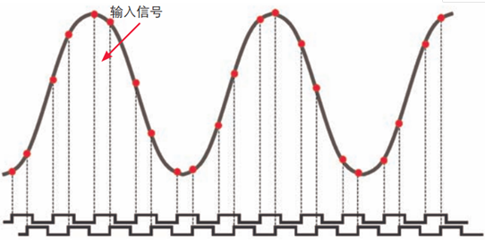

## 相关概念

### 视频编解码基础概念

#### 编码（codec）

用于压缩减少数字化文件大小或尺寸的算法技术。

#### 压缩比（compression ratio）

压缩比是用于表示一幅图像被压缩后占到之前存储空间的比值，比如将1   MB的图像压缩为128KB，则压缩比即为8：1。对于同一种压缩算法，压缩比越高，图像看起来清晰度越差。

#### 比特率（Bit Rate）

比特率是指每秒传送的比特(bit)数。单位为bps(Bit Per Second)，比特率越高，传送的数据越大。在视频领域。比特率是指将数字声音、视频由模拟格式转化成数字格式的采样率，采样率越高，还原后的音质、画质就越好。

比特率表示经过编码（压缩）后的音、视频数据每秒钟需要用多少个比特来表示，而比特就是二进制里面最小的单位，要么是0，要么是1。比特率与音、视频压缩的关系，简单的说就是比特率越高，音、视频的质量就越好，但编码后的文件就越大；如果比特率越少则情况刚好相反。

#### 码率/码流（Data Rate）

数据传输时单位时间传送的数据位数，一般我们用的单位是kbps即千位每秒。同分辨率下，视频文件的码流越大，压缩比就越小，画面质量就越高。（一般视频领域所谓的比特率可等同于码率或叫码流）

码流（Data Rate）是指视频文件在单位时间内使用的数据流量，也叫码率或码流率，通俗一点的理解就是取样率，是视频编码中画面质量控制中最重要的部分，一般我们用的单位是 kb/s或者Mb/s。一般来说同样分辨率下，视频文件的码流越大，压缩比就越小，画面质量就越高。码流越大，说明单位时间内取样率越大，数据流，精度就越高，处理出来的文件就越接近原始文件，图像质量越好，画质越清晰，要求播放设备的解码能力也越高。

**码率设置时，一般需考虑三个因素：**

1. 分辨率 ：分辨率是决定位率（码率）的主要因素，不同的分辨率要采用不同的位率。总体而言，录像的分辨率越高，所要求的位率（码率）也越大，但并不总是如此，不同分辨率有对应合理的码率选择范围。所谓“合理的范围”指的是，如果低于这个范围，图像质量看起来会变得不可接受；如果高于这个范围，则显得没有必要，对于网络资源以及存储资源来说是一种浪费。
2. 场景：监控的场景是设置码率时要考虑的第二个因素。在视频监控中，图像的运动剧烈程度还与位率有一定的关系，运动越剧烈，编码所要求的码率就越高。反之则越低。因此在同样的图像分辨率条件下，监控人多的场景和人少的场景，所要求的位率也是不同的。
3. 存储空间：最后需要考量的因素是存储空间，这个因素主要是决定了录像系统的成本。位率设置得越高，画质相对会越好，但所要求的存储空间就越大。所以在工程实施中，设置合适的位率即可以保证良好的回放图像质量，又可以避免不必要的资源浪费。

**kbps：**

首先要了解的是，ps指的是/s，即每秒。Kbps指的是网络速度，也就是每秒钟传送多少个千位的信息（K表示千位，Kb表示的是多少千个位），为了在直观上显得网络的传输速度较快，一般公司都使用kb（千位）来表示，如果是KBps，则表示每秒传送多少千字节。1KBps＝ 8Kbps。ADSL上网时的网速是512Kbps，如果转换成字节，就是512/8＝64KBps(即64千字节每秒）。

**计算文件体积的公式：**

码流越大，文件体积也越大，其计算公式是：文件体积 = 时间 X 码率 / 8。

例如，网络上常见的一部 90 分钟 1Mbps 码流的720P RMVB文件，其体积就 = 5400秒 × 1Mb/8 = 675MB。

MP4文件的索引大小与码率有关。

通常来说，一个视频文件包括了画面及声音，例如一个 RMVB 的视频文件，里面包含了视频信息和音频信息，音频及视频都有各自不同的采样方式和比特率， 也就是说，同一个视频文件音频和视频的比特率并不是一样的。而我们所说的一个视频文件码流率大小，一般是指视频文件中音频及视频信息码流率的总和。

以国内最流行，大家最熟悉的RMVB视频文件为例，RMVB中的VB，指的是VBR，即Variable Bit Rate的缩写，中文含义是可变比特率，它表示RMVB采用的是动态编码的方式，把较高的采样率用于复杂的动态画面(歌舞、飞车、战争、动作等)，而把较低的采样率用于静态画面，合理利用资源，达到画质与体积可兼得的效果。

#### 分辨率（resolution）

它是衡量一幅图像中有多少信息是可见的一种量度，一般表示为 h * v，h表示水平分辨率（显示器的横向），v为垂直分表率（显示器的上下向）。分辨率越大意味着图像肉眼能看到的细节越多。

就是帧大小每一帧就是一副图像。640*480分辨率的视频，建议视频的码率设置在700以上，音频采样率44100就行了。一个音频编码率为128Kbps，视频编码率为800Kbps的文件，其总编码率为928Kbps，意思是经过编码后的数据每秒钟需要用928K比特来表示。

**计算输出文件大小公式**：

[音频编码率（Kbps）/8 +视频编码率（Kbps）/8] × 影片总长度（秒）= 文件大小（MB）

#### 采样率（sample rate）

表示每秒从连续信号中提取并组成离散信号的采样个数，它用赫兹（Hz）来表示。通俗的讲采样频率是指计算机每秒钟采集多少个声音样本，是描述声音文件的音质、音调，衡量声卡、声音文件的质量标准。

指将模拟信号转换成数字信号时的采样频率，也就是单位时间内采样多少点。一个采样点数据有多少个比特。比特率是指每秒传送的比特(bit)数。单位为 bps(Bit Per Second)，比特率越高，传送的数据越大，音质越好。比特率 = 采样率 × 采用位数 × 声道数

#### 像素（Pixel）

像素就是分辨率中的最小样本，也就是组成扫描线的最小单元。比如我们说横向分辨率为640，那就意味着显示器的横向上有640个独立的小样本（正方形或长方形）。

#### 宽高比（aspect ratio）

图像的宽度和高度之比。一般显示器的宽高比为 4:3 或 16:9。

#### 1080P/700P/1080i

均为视频的显示格式，其中阿拉伯数字代表垂直方向上有多少条水平扫描线，而字母P表示逐行扫描，字母i表示隔行扫描。需要主要的是，1080P不是分辨率，可以简单的认为它是一般所谓的清晰度的一种量度。通常1080p的画面分辨率为1920×1080。

#### 逐行扫描/隔行扫描

显示器显示图像是靠电子束按一行一行顺序扫描而显示的，不同的扫描方式对应不同的应用。

* 逐行扫描（progressive scanning）：显示图像进行扫描时，从屏幕左上角的第一行开始逐行进行，整个图像扫描一次完成。

* 隔行扫描（Interlace Scanning）：隔行扫描就是每一帧都被分割为两个场，每一场中包含了一帧中所有的奇数行或者偶数行，通常是先扫描奇数行得到第一场，然后扫描偶数行得到第二场。

#### 信噪比（SNR,single-to-noise ratio ）

指的是信号幅度与噪声（会对信号产生烦扰的其它信号）之间的比值，比值越大，信号越清楚。

#### 对比度（contrast）

视频术语，是指在视频的波形中，最白的白色和最黑的黑色之间差值。对比度越大，视频看起来越明亮，对比度小，看起来越灰暗。

#### 亮度：（luminance）

视频信号中黑色和白色的分量。

#### 色度（chrominance）

视频信号的彩色分量。

#### 字幕（subtitle）

加在画面上的文本，有的字幕是直接编码到视频文件中或者直播流中的，有的是外挂到字幕轨道上的。

#### 元数据（metadata）

描述数据本身属性的数据，比如视频的标题、标签、文件大小等等。

#### 数字版权管理(DRM, Digital Rights Management)

DRM是一套管理方法或系统，它能够决定视频在什么条件下，谁可以观看、下载视频等。

#### h.264/h.265

这些都是视频压缩标准，除了这些还有很多标准和算法，不同的编码标准本质上都是在压缩比和视频质量间取得平衡和竞争。

#### HDMI/SDI/AV

这些都是用于消费类设备上的音视频接口，有数字接口，有模拟接口，主要是有清晰度的差异。

#### RTMP/RTSP/HLS

均为流媒体传输协议

#### 音视频单位

视频码率单位 Mbps ，Mbps是megabits per second的缩写，是一种传输速率单位，指每秒传输的位（比特）数量。

8Mbps = 1MBs

8bits=1byte

1Mbps=0.125MB/s

音频码率单位 Kbps

### 网络传输相关概念

#### 域名/子域名/二级域名/泛域名

* bravovcloud.com（顶级）
* bravovcloud.com/product（二级域名）
* bravovcloud.com/product/live（三级域名）
* www.bravovcloud.com（子域名） 
* *.bravovcloud.com（泛域名） 

#### 域名解析系统（DNS）

简单说就是通过域名得到IP地址的系统。

#### A记录

将域名指向一个ip地址

#### CNAME记录

将域名指向另一个域名，再由另一个域名提供ip地址，就需要添加CNAME记录。

#### 域名备案

* ICP备：ICP备案就是网站备案，域名备案；所有网站都要有ICP备案

* ICP证：增值电信业务经营许可证；只有提供有偿信息服务的网站才需要申请ICP许可证

#### 源站/边缘节点

* 源站（Origin）：网站内容发布的原始站点，增删改查都在源站进行，CDN边缘获取资源也是通过源站获取。

* 边缘节点（Edge）：缓存内容的节点设备组

#### 回源域名/回源IP/回源率

* IP回源：CDN回源时直接按IP回，客户一般会提供多个IP地址进行轮询

* 域名回源：回源时通过域名查询DNS找到对应IP

* 回源率：「访问未缓存、缓存过期、不可缓存的资源所导致的回源站拉取资源的请求数」与「总访问请求数」的比值，该值为静态加速重要指标，一般越小越好

#### CDN加速类型

* 静态页面：为图片及网页等静态小文件

* 下载加速：一般来说30M以上的静态大文件，有些特殊下载协议和安全要求

* 点播加速：若大文件为视频文件，一般会有拖拽等功能，所以需要视频点播加速

* 直播加速：视频直播加速

* 动态加速：需要与后台数据库交互产生动态内容，实时性极高的数据更新网站如股票

* https加速：针对基于SSL/TLS证书私钥等安全性要求高的网站

缓存/缓存期限/缓存刷新/缓存配置/预推预取预热：

* 缓存（cache）：高频访问的热点对象内容保存在边缘节点设备上，以此实现就近访问，提高网站访问的速度和质量

* 缓存期限：资源在缓存节点上的最长保存时间，达到此时间后资源会被从CDN系统中移除。

* 缓存刷新：通过工具、控制台、API等刷新指定资源，强迫 CDN 边缘节点回源站获取最新的同名资源内容。通常用在清除不再需要的内容或源站内容有更新的时候。一般有目录刷新、路径刷新、全路径刷新等

* 缓存配置规则：针对不同内容设置不同的缓存过期时间

* 预推（预取/预热/预加载等不同称呼）：将源站需要预推的文件强制缓存到边缘节点。它和缓存刷新的区别在于刷新是对已经缓存的内容刷新，而预推是没有被缓存的。

#### Range回源/播放拖拽

* Range回源：指客户端通知源站服务器只返回部分内容，一般用于大文件的分发。Range回源，可以减少回源流量消耗，提升资源响应时间，需要注意的是该功能需要源站支持range请求,即对于http请求头中包含 Range 字段。

* 拖拽：点播拖拽播放进度时，客户端会向server端发送带参数的请求，server端会向客户端响应指定部分的内容

#### WAF防护/CC防护/DDos/防盗链

* WAF：Web应用防护系统，WAF对来自Web的各类请求进行内容检测和验证，避免站点受到SQL注入、网页篡改、网页挂马等安全侵入

* Ddos:向服务器提交大量请求，使服务器超负荷,干扰甚至阻断正常的网络通讯

* CC攻击：对一些消耗资源较大的应用页面（如数据库）不断地发起正常的请求，以达到消耗服务端资源的目的

* 防盗链：IP黑白名单/域名黑白名单/Token防盗链/referer防盗链/客户端防盗链

#### 拉流/推流/录制/转码

* 拉流：CDN主动去源站（编码器等）拉取音视频流

* 推流：终端主动将音视频流推送至CDN

* 录制：在CDN中为客户进行直播流的录制服务，再通过协定方式将文件返给客户

* 转码：在CDN中为客户提供直播流实时转码服务，如一路RTMP，进行不同码率输出。如果是码率不动仅转协议，如将RTMP转为HLS，一般称为转封装

上行加速/下行加速：

* 上行加速：直播中指推流先推到最近的边缘节点，节点再转发到源站；静态中也有文件上传加速

* 下行加速：网民访问数据（播放视频）走的常规CDN分发过程

#### 推流/播流鉴权认证

* 推流认证：为保证推流频道不被非法的占用，防止非法推流，一般有token或有效期限等方式来认证

* 播流认证：同推流

#### 峰值带宽计费/95峰值计费/第四峰值计费/流量计费

CDN计费系统每 5 分钟取一次带宽峰值，则一个月约有 8640 个数值点，一天有 288 个数据值点；从大到小排列：

* 峰值带宽计费：第一峰值为计费点

* 95峰计费：去掉最大的 5% 个数值点（约 432 个），余下数值点中最大值为计费点；

* 第四峰（去三峰）计费：第 4 个日峰值为计费点

* 流量计费：按实际下行流量计费（一般上行不收费）

#### 带宽流量换算关系

10Mbps/8 = 1.25MB/秒 (理论值)，即每秒种能产生1.25MB的流量；1天产生流量=24小时 * 3600秒 * 1.25MB = 108000MB,即约105GB流量；也就是说1Mbps100%利用率下，每日产生流量10.54GB。带宽利用率大于31%（30%）的适合带宽计费，不足30%的使用流量计费更合适

#### 可用性(Availability)/性能/SLA

* 可用性：域名加速正常工作的时间比例，域名服务周期内正常服务时间 / 域名服务周期内可服务总时间

* 性能：域名加速各指标（如DNS解析时间、首包时间等）的响应时间

* SLA：承诺客户的服务保障等级，未达到会涉及赔偿（指标一般包括服务可用性、数据持久性/可清除性/可迁移、故障恢复能力、计量准确性等10余项硬指标。

## 相关内容

### 音频的采样率

**音频三元组（采样率，采样大小和通道数）**

任何一个元素改变都叫音频重采样

采样率是指在单位时间的采样数。采样速率为 44KHZ，说明每秒采样数量为 44K 个，这是也就是用 44000 个数据来描述 1 秒内的声音波形。也就是说采样率越高音质也是越好。但是他同比特率是完全不同的两个概念。

比特率越高音质越高，文件大小也越大，但是源音文件的质量决定最终质量
 从高往低转，音质会变差，但从低往高转音质最多不变 但是文件却会变大很多

一般mp3在128比特率左右为益，也大概在3-4 MB左右的大小

### 音频44.1KHZ的采样率和48KHZ采样率的区别

音质区别在于不一样的音频、不一样的音色、不一样的采样率。

#### 区别一：不一样的高频

1. 44.1KHZ采样率：原始信号的频率越高，就不能保持真实。 不能保证高频信号会被很好地记录下来。 需要更高的采样率来更好地记录高频信号。
2. 48KHZ采样率：分量的44.1KHZ高频在原始保真信号。 人耳不能分辨出频率高于一定值的声音，因此采样率过高。

#### 区别二：不一样的采样率

1. 44.1KHZ采样率：以44.1khz的采样率和16bit的采样大小存储pcm编码的音频信号。 双通道要求空间176.4KB，每分钟约10.34m。
2. 48KHZ采样率：存储pcm编码的音频信号，采样率为44.1khz，采样大小为22bit，双通道，空间为208KB，每分钟约14.23m。

#### 区别三：不一样的音色

1. 44.1KHZ采样率：不能保证信号的绝对保真度，PCM只能达到最大程度的无限接近。音色不如48 KHZ采样率音色好。
2. 48KHZ采样率：码率越高，音质越好，但编码的文件越大；如果比特率更小，情况就反过来了。

### 码率对音频的影响

码率，选择他直接影响到你的mp3文件尺寸大小和听感，压缩比高的失真大，压缩比小的失真小，但是怎么才能找到一个我们自己两方面都能接受的平衡点呢？这就需要在实验里仔细摸索，考虑到低码率的文件声音素质不太适合播放音乐，所以**最低定为128kbps**，依次使用128、192、256、320共四种固定码率的文件来进行对比和测试。

128kbps的压缩比还是比较粗糙的，高频部分压缩后失真非常明显，听起来空洞，干瘪、刺耳，还时常有忽悠忽悠的声音，乐器的质感很差，部分乐器都变了味道，甚至可能会听错，3分39的一段乐曲压缩后的体积是3414kb，体积虽然不大但是声音不能让人满意，存在比较大的缺陷。

192kbps码率的压缩效果比起128来说可是要好多了，首先声音扎实，至少没有那种空洞感，高频失真也小了很多，声音紧凑，杂音小，干净，达到了相对比较理想的听音效果，只是由于压缩还是比较厉害，细节的表现仍旧不是很好，乐器尤其是管乐器的质感还是很硬，不真实，缺乏乐感，压缩后的尺寸是5123kb，我觉得这个压缩比例在128~~256m容量的mp3播放器上使用比较好，既可以满足基本的听感，也在尺寸上合适，128m大约能存储95分钟的音乐，256m则翻倍为190分钟的音乐。

256kbps的压缩率比起192自然是在音质上更上了一个台阶，就拿曲目刚开始的10秒钟说，大提琴部的低频明显颗粒感就小了很多，声音更加顺滑自然，质感和纹理也更加清楚一些，细节方面多了不少，气氛的渲染比较突出，后面的曲子进行中的声部轮换也表现力起来许多，大信号小信号的清晰度也提升一些，声音更加细致耐听，但是与此同时，文件的体积也一下子增加到了6831kb，这对于256m的mp3播放器来说还是可以承受的，计算一下不难知道，按照256的码率可以存放约135分钟的音乐，一般来说也是够用了，128m就有点少了，只能支持一个小时多一点，所以推荐128m的使用192码率。

320kbps是lame能够提供的最大码率了，最终的生成文件是8592kb，大概就是8.4M，对比wav文件的37M来说，压缩比基本为4.5：1，但是生成的mp3文件听起来已经失真非常小了，对比其他码率320的自然优势明显，音色，细节等等都非常细腻，基本是达到了原样复制了cd的声音素质，特别在带有mp3播放功能的cd播放器上上听起来，基本没有什么区别。

### 相关音频格式

1、APE

APE格式：Monkey""s Audio([www.monkeysaudio.com](http://www.monkeysaudio.com/))，简单的说ape是一种音频的无损压缩格式，大小只有wav文件的一半，但是音质没有丝毫降低。能够在最大程度上还原CD的音质，当然这也取决于抓轨的质量 。如果抓轨的质量好，ape的音质就会和CD差不多这是mp3等有损压缩无法达到的，当然无损的代价就是体积的增大，1CD从200mb到400不等所以如果有足够的带宽的保证，ape给网友交流CD带来了更多的方便，解决了许多古典音乐爱好者传送高音质CD的需求。一张80分钟的音乐CD大小大约700M，这么大尺寸的传输，显然是非常不方便的，这时用Monkey""s Audio—能把WAV文件压缩成一半大小(甚至更小)的APE文档，并且在理想状态下，当你把APE解压成WAV，音质没有丝毫损失。

优点：压缩率高；音质无损；装载插件后，可以用Winamp直接播放，音质比任何参数的Mp3或Mp3 Pro更好。

缺点：压缩及解压时间过长。

2、 MP3 Pro

为了减低失真程度，MP3 Pro这种新MP3格式出现了。它将整个音频频段分离成中低频和高频两个信道，由传统MP3编码器负责中低频部分，而另一个采用SBR技术的(Spectral Band Replication/频段复制)的译码器则负责高频部分，最后两者在MP3 Pro播放软件中同时播放，从而得到显著超过相同Bitrate的MP3之音质。不但高频细节丰富，颤抖的现象亦已不易觉察，与原始WAV文件非常接近。

MP3 Pro采用的SBR技术，并非直接将音乐中的高频分离出来并编码那么简单，而是根据对原来编码器所传输的低频讯号进行分析，从而重新构建出高频讯号。

3、Real Audio
 Real Audio，扩展名RA：这种格式真可谓是网络的灵魂，强大的压缩量和极小的失真使其在众多格式中脱颖而出。和MP3相同，它也是为了解决网络传输带宽资源而设计的，因此主要目标是压缩比和容错性，其次才是音质。所以我们一般在网上遇到的新音乐试听都是使用这中格式的。

4、 WMA

WMA就是Windows Media Audio编码后的文件格式，由微软开发，WMA针对的不是单机市场，是网络！竞争对手就是网络媒体市场中著名的Real Networks。微软声称，在只有64kbps的码率情况下，WMA可以达到接近CD的音质。和以往的编码不同，WMA支持防复制功能，她支持通过Windows Media Rights Manager 加入保护，可以限制播放时间和播放次数甚至于播放的机器等等。WMA支持流技术，即一边读一边播放，因此WMA可以很轻松的实现在线广播，由于是微软的杰作，因此，微软在Windows中加入了对WMA的支持，WMA有着优秀的技术特征，在微软的大力推广下，这种格式被越来越多的人所接受。比起ra来说，版权恐怕是所用用户最讨厌它的地方了。

5、 ACC：

AAC(高级音频编码技术，Advanced Audio Coding)是杜比实验室为音乐社区提供的技术。AAC号称「最大能容纳48通道的音轨，采样率达96 KHz，并且在320Kbps的数据速率下能为5.1声道音乐节目提供相当于ITU-R广播的品质」。和MP3比起来，它的音质比较好，也能够节省大约30%的储存空间与带宽。它是遵循MPEG-2的规格所开发的技术。松下的mp3产品都采用了这种编码方式，当然也兼容mp3格式，我自己使用时发现aac是非常好用的音频格式，128kbps的aac足以和224kbps的mp3抗衡，空间却小了差不多一半，但是在空间上和结构上aac和mp3编码出来后的风格不太一样，喜欢与否属于仁者见仁智者见智的事情。

6、 ATRAC 3/ATRAC 3 plus：

ATRAC3(AdaptiveTransformAcousticCoding3)由日本索尼公司开发，是MD所采用的ATRAC的升级版，其压缩率(约为ATRAC的2倍)和音质均与MP3相当。压缩原理包括同时掩蔽、时效掩蔽和等响度曲线等，与MP3大致相同。ATRAC3的版权保护功能采用的是OpenMG。目前，对应ATRAC3的便携式播放机主要是索尼公司自己的产品。不过，该公司已于2000年2月与富士通、日立、NEC、Rohm、三洋和TI等半导体制造商签署了制造并销售ATRAC3用LSI的专利许可协议。在mdlp压缩中录制cd和mp3相比，ATRAC3还是有一定的声音优势的，但是版权问题使得使用不是很方便，ATRAC 3 plus由于算法先进，在音质上得到了更一步的提高，但是只在sony的产品上有比较广泛的应用，这个让人比较郁闷。

7、 VQF：

所谓VQF，是指TwinVQ(Transform-domain Weighted INterleave Vector Quantization)，它是日本NTT(Nippon Telegraph and Telephone)集团属下的NTT Human Interface Laboratories开发的一种音频压缩技术。该技术受到著名的YAMAHA公司的支持。VQF是其文件的扩展名。它和MP3的实现方法相似，都是通过采用有失真的算法来将声音进行压缩，不过它与MP3的压缩技术相比却有着本质上的不同：VQF的目的是对音乐而不是声音进行压缩，因此，VQF所采用的是一种称为“矢量化编码(Vector Quantization)”的压缩技术。该技术先将音频数据矢量化，然后对音频波形中相类似的波形部分统一与平滑化，并强化突出人耳敏感的部分，最后对处理后的矢量数据标量化再进行压缩而成。我自己使用中感觉在低码率情况下，还是vqf好用很多，比同等音质的mp3体积小30%左右，但是高比特率就不太好了，所以也少有人使用它。

### 常见的音频编码器

OPUS、ASS、Ogg、Speex、iLBC、AMR、G.711

ACC在直播系统中应用的比较广泛，取代了MP3；OPUS是较新的因编码器，WebRTC默认使用OPUS；固话一般使用的G.711系列

网上评测结果：OPUS > AAC > Ogg

| 无损 | 有损 |
| ---- | ---- |
| wav  | mp3  |
| aiff | aac  |

### 视频格式

| 格式    | 开发           | 备注             |
| ------- | -------------- | ---------------- |
| avi     |                | 旧，不支持新编码 |
| wmv     | 微软           | 兼容性低下       |
| mov     | 苹果           | 优良             |
| mkv/ogg | 开源           | 软件支持不足     |
| AVCHD   | 松下/索尼      | 结构复杂         |
| mp4     | 动态图像专家组 | 最佳             |

### 常见的编码格式

| 帧间压缩     |                  | 帧内压缩       |                             |
| ------------ | ---------------- | -------------- | --------------------------- |
| H.264(mpeg4) | **网络传播最佳** | Prores(苹果)   | 高效&优良，更适合苹果的系统 |
| mpeg2(DVD)   | 过时             | DNxHD/HR(Avid) | WIn支持更佳                 |
| H.265(HEVC)  | 未普及           | GoPro Cineform | **最佳**                    |
